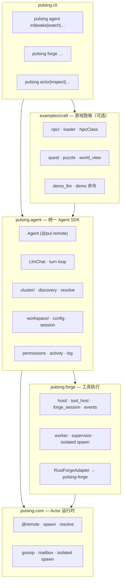

# pulsing.craft → pulsing.agent 官方迁移计划

> **目标**：将 `pulsing.craft` 重构为 `pulsing.agent`（统一 Agent SDK），`pulsing.forge` 吸收 Host 集成层，`pulsing.cli` 吸收工作区 CLI；Craft 品牌与 `pcraft` 命令进入弃用期。
>
> **给实现 AI 的指令**：严格按本计划分阶段执行。每阶段独立可验收；未列出的细节参考 [`craft-agent-refactor.md`](./craft-agent-refactor.md)、[`craft-npc-refactor.md`](./craft-npc-refactor.md)、[`docs/src/design/forge/craft-architecture.zh.md`](../src/design/forge/craft-architecture.zh.md)。不修改 `crates/pulsing-actor/` 核心语义，Rust Forge 改动限于 Host 集成所需接口。

---

## 1. 背景与目标

### 1.1 为什么要去掉 Craft 品牌

| 问题 | 现状 | 迁移后 |
|------|------|--------|
| **命名误导** | `pulsing.craft` 暗示「游戏/手工」产品，但核心已是通用多 Agent SDK | `pulsing.agent` 直接表达定位 |
| **职责重叠** | Craft 的 `agent/forge_*`、`runtime/split_tools` 与 `pulsing.forge` 重复实现 Host 集成 | Forge 管执行，Agent 管编排 |
| **CLI 碎片化** | `pcraft`、`pulsing craft`、`python -m pulsing.craft` 三套入口 | 统一 `pulsing agent` |
| **Gossip 前缀混乱** | `craft/ws/<id>/…` 与 Forge `naming.py` 的 `DEFAULT_WORKSPACE_PREFIX = "craft/ws"` 绑定 Craft 品牌 | 统一 `agent/ws/<id>/…` |
| **包名冲突** | 轻量 `pulsing.agent`（`@agent` 装饰器、`runtime()`）与即将成为主 SDK 的 Agent 层同名 | 轻量工具箱迁至 `pulsing.agentkit` |

### 1.2 迁移目标

1. **Pulsing core 保持薄** — 仅分布式 Actor 运行时（`pulsing.core`、`crates/pulsing-actor`）。
2. **`pulsing.forge` = 工具执行层** — 吸收 Craft 的 Host 集成：工具路由、`ForgeSession`、事件 `tell`、审批桥接。
3. **`pulsing.agent` = 统一 Agent SDK** — 吸收 Craft 的 `agent/`、`runtime/`（LLM turn loop）、`cluster/`、`workspace/`（配置与发现）。
4. **`pulsing.cli` 增加 `agent` 子命令** — 吸收 `craft/commands/` 与 `craft/cli.py`。
5. **`examples/craft/` = 游戏隐喻层** — NPC class、puzzle/quest、demo LLM、`Summon`/`QuestReport` 等产品向工具。
6. **弃用 `pulsing.craft`、`pcraft`、`pulsing craft`** — 保留 shim 与 deprecation warning，两个 minor 版本后删除。

### 1.3 不在本次范围

- HubActor 对等 Agent 重构（见 [`craft-agent-refactor.md`](./craft-agent-refactor.md)，可与 Phase 2 并行）。
- Forge Rust handler 新增（已有 `pulsing-forge` crate，仅搬 Python Host 胶水）。
- `.pulsing/` 工作区目录结构变更（`cluster.json` 格式保持兼容，仅更新文档中的命令示例）。

---

## 2. 目标架构

### 2.1 三层分工



### 2.2 职责边界

| 层 | 包 / 路径 | 职责 | 不应包含 |
|----|-----------|------|----------|
| **Pulsing** | `pulsing.core`, `crates/pulsing-actor` | 分布式 Actor、mailbox、gossip、隔离 spawn | LLM、工具 handler、工作区 CLI |
| **Forge** | `pulsing.forge`, `crates/pulsing-forge` | 沙箱内工具执行、ToolSession、事件投递、MCP hub | LLM turn loop、NPC 隐喻、puzzle |
| **Agent** | `pulsing.agent` | Agent actor、LLM 编排、集群发现、工作区配置、权限 | 重复实现 Read/Bash/patch |
| **CLI** | `pulsing.cli` | 顶层命令分发、`pulsing agent` 子命令 | 业务逻辑（委托给 agent/examples） |
| **Examples** | `examples/craft/` | NPC class、quest、demo、TUI 文案 | 核心 SDK API |

### 2.3 目标目录结构（迁移完成后）

```
python/pulsing/
├── core/                    # 不变
├── forge/
│   ├── host/                # ★ 新增：自 craft/agent/forge_*.py 迁入
│   │   ├── events.py
│   │   ├── runtime.py
│   │   ├── session.py
│   │   └── tool_host.py
│   ├── naming.py            # DEFAULT_WORKSPACE_PREFIX → "agent/ws"
│   └── …                    # 现有 worker/backend/session 等
├── agent/                   # ★ 扩展为统一 SDK（吸收 craft）
│   ├── agent.py             # Agent actor（原 CraftAgent）
│   ├── actor.py             # 基类 CraftActor → AgentActor
│   ├── bootstrap.py
│   ├── config.py            # AgentConfig（原 NpcConfig）
│   ├── session.py
│   ├── activity.py
│   ├── log.py
│   ├── permissions.py       # 自 craft/runtime/permissions.py
│   ├── llm/                 # 自 craft/runtime/llm_*.py
│   │   ├── chat.py
│   │   ├── client.py
│   │   └── blocks.py
│   ├── cluster/
│   │   ├── constants.py     # agent/ws/ 前缀
│   │   ├── discovery.py
│   │   ├── resolve.py
│   │   └── activity.py
│   ├── workspace/
│   │   ├── config.py
│   │   ├── root.py
│   │   ├── session.py
│   │   └── tool_pool.py
│   └── tools/               # Agent 层本地工具（FetchUrl 等）
│       └── fetch_url.py
├── agentkit/                # ★ 原轻量 pulsing.agent 迁至此处
│   ├── __init__.py          # @agent 装饰器、runtime()、llm()
│   └── …
├── cli/
│   ├── __main__.py          # 增加 agent 子命令路由
│   └── agent/               # ★ 自 craft/commands/ 迁入
│       ├── __init__.py
│       ├── world.py
│       ├── watch.py
│       ├── dashboard.py
│       ├── npc.py
│       ├── puzzle.py
│       ├── demo.py
│       └── agent_cmd.py
└── craft/                   # ⚠ 弃用 shim（Phase 4 删除）
    └── …                    # re-export + DeprecationWarning

examples/craft/              # ★ 游戏隐喻
├── npc/
│   ├── loader.py
│   └── classes/             # 默认 NPC class 定义
├── quest.py
├── tools/
│   ├── summon.py
│   └── quest_report.py
├── demo_llm.py
└── README.md
```

---

## 3. 命名映射

### 3.1 类型与符号

| 旧 (craft) | 新 (agent) | 说明 |
|------------|------------|------|
| `CraftAgent` | `Agent` | `@pul.remote` 主 actor，`python/pulsing/agent/agent.py` |
| `NpcAgent` | `Agent` | 别名删除，统一 `Agent` |
| `CraftActor` | `AgentActor` | 基类，`python/pulsing/agent/actor.py` |
| `NpcConfig` | `AgentConfig` | `python/pulsing/agent/config.py` |
| `setup_agent(agent, NpcConfig)` | `setup_agent(agent, AgentConfig)` | `bootstrap.py` |
| `spawn_npc(...)` | `spawn_agent(...)` | `helpers.py` → `pulsing.agent.spawn` |
| `resolve_craft_agent` | `resolve_agent` | `cluster/resolve.py` |
| `build_tools_for_agent` | `pulsing.forge.host.build_tools` | 工具表构建下沉 Forge Host |
| `init_forge_host` | `pulsing.forge.host.init_runtime` | Host 初始化 |
| `build_craft_forge_session` | `pulsing.forge.host.build_session` | Session 构建 |
| `make_host_emit` | `pulsing.forge.host.make_emit` | 事件 emit |
| `NpcClass` | 保留于 `examples/craft/npc/` | 仅游戏隐喻层 |
| `SummonTool` | `examples/craft/tools/summon.py` | 产品向工具 |
| `QuestReportTool` | `examples/craft/tools/quest_report.py` | 产品向工具 |

### 3.2 Gossip 与路径前缀

| 旧 | 新 | 定义位置 |
|----|-----|----------|
| `craft/ws/<workspace_id>/<name>` | `agent/ws/<workspace_id>/<name>` | `pulsing/agent/cluster/constants.py` |
| `craft/ws/<id>/_tools` | `agent/ws/<id>/_tools` | `pulsing/forge/naming.py` |
| `craft/ws/<id>/_mcp_hub` | `agent/ws/<id>/_mcp_hub` | `pulsing/forge/naming.py` |
| `<host>/events` | 不变 | `forge_event_inbox_name()` |
| metadata `craft.kind` | `agent.kind` | Agent.metadata() |
| metadata `craft.npc_class` | `agent.npc_class`（可选，examples 层） | 仅 demo/NPC 场景 |

**双前缀兼容期**（Phase 1–3）：`resolve()` 依次尝试 `agent/ws/…` 与 `craft/ws/…`；新 spawn 仅注册 `agent/ws/…`。

### 3.3 包与入口

| 旧 | 新 |
|----|-----|
| `from pulsing.craft.agent import CraftAgent` | `from pulsing.agent import Agent` |
| `from pulsing.craft.npc.config import NpcConfig` | `from pulsing.agent import AgentConfig` |
| `from pulsing.craft.workspace.config import WorkspaceConfig` | `from pulsing.agent.workspace import WorkspaceConfig` |
| `from pulsing.craft.cluster.constants import full_agent_name` | `from pulsing.agent.cluster import full_agent_name` |
| `pcraft` | `pulsing agent` |
| `pulsing craft` | `pulsing agent`（shim 转发） |
| `python -m pulsing.craft` | `python -m pulsing.cli agent` 或 `pulsing agent` |
| `pip install pulsing[craft]` | `pip install pulsing[agent]`（`[craft]` 保留为 alias） |
| 轻量 `from pulsing.agent import agent, runtime, llm` | `from pulsing.agentkit import agent, runtime, llm` |

### 3.4 文件路径对照（核心搬迁）

| 源 (`python/pulsing/craft/`) | 目标 |
|------------------------------|------|
| `agent/npc.py` | `agent/agent.py` |
| `agent/actor.py` | `agent/actor.py` |
| `agent/bootstrap.py` | `agent/bootstrap.py` |
| `agent/session.py` | `agent/session.py` |
| `agent/activity.py` | `agent/activity.py` |
| `agent/log.py` | `agent/log.py` |
| `agent/tool_host.py` | `forge/host/tool_host.py` |
| `agent/forge_runtime.py` | `forge/host/runtime.py` |
| `agent/forge_session.py` | `forge/host/session.py` |
| `agent/forge_events.py` | `forge/host/events.py` |
| `agent/summon_tool.py` | `examples/craft/tools/summon.py` |
| `npc/config.py` | `agent/config.py` |
| `npc/loader.py` | `examples/craft/npc/loader.py` |
| `runtime/llm_chat.py` | `agent/llm/chat.py` |
| `runtime/llm_client.py` | `agent/llm/client.py` |
| `runtime/llm_blocks.py` | `agent/llm/blocks.py` |
| `runtime/permissions.py` | `agent/permissions.py` |
| `runtime/split_tools.py` | `forge/host/tools.py`（+ examples 注册 hook） |
| `runtime/cluster_tools.py` | `agent/cluster/tools.py` |
| `runtime/quest_tools.py` | `examples/craft/tools/quest_report.py` |
| `runtime/demo_llm.py` | `examples/craft/demo_llm.py` |
| `runtime/constants.py` | 拆分 → `agent/constants.py` + `forge/host/constants.py` |
| `runtime/tools_pkg.py` + `tools_impl.py` | `agent/tools/` + `forge/`（FetchUrl → agent，FS → forge） |
| `cluster/constants.py` | `agent/cluster/constants.py` |
| `cluster/discovery.py` | `agent/cluster/discovery.py` |
| `cluster/resolve.py` | `agent/cluster/resolve.py` |
| `cluster/activity.py` | `agent/cluster/activity.py` |
| `workspace/config.py` | `agent/workspace/config.py` |
| `workspace/root.py` | `agent/workspace/root.py` |
| `workspace/session.py` | `agent/workspace/session.py` |
| `workspace/tool_pool.py` | `agent/workspace/tool_pool.py` |
| `workspace/quest.py` | `examples/craft/quest.py` |
| `workspace/world_view.py` | `examples/craft/world_view.py` |
| `commands/*.py` | `cli/agent/*.py` |
| `cli.py` | `cli/agent/parser.py` + `cli/__main__.py` 路由 |
| `helpers.py` | `agent/helpers.py` |
| `paths.py` | `agent/paths.py` |
| `payload/full_tool_worker.py` | `forge/payload/full_tool_worker.py`（或保持 re-export） |

---

## 4. 分阶段迁移计划

### Phase 0：准备与命名空间清理

**目标**：为 `pulsing.agent` 腾出包名；建立新目录骨架；不破坏现有用户。

| 类别 | 文件 / 动作 |
|------|-------------|
| 新建 | `python/pulsing/agentkit/` — 将现有 `python/pulsing/agent/{base,runtime,llm,utils}.py` 原样迁入 |
| 新建 | `python/pulsing/agent/` 子包骨架：`agent.py`、`config.py`、`cluster/`、`workspace/`、`llm/`（空 `__init__.py`） |
| 新建 | `python/pulsing/forge/host/` 骨架 |
| 新建 | `examples/craft/` 目录 |
| 修改 | `python/pulsing/agent/__init__.py` — 改为导出 SDK 符号（暂从 craft re-export） |
| 修改 | `python/pulsing/agentkit/__init__.py` — 保持原 `pulsing.agent` 公开 API |
| 修改 | `README.md`、`README.zh.md`、`docs/src/agent/*.md` — `@agent` / `runtime()` 示例改为 `pulsing.agentkit` |
| 修改 | `pyproject.toml` — 增加 `[project.optional-dependencies] agent = [...]`（与 `craft` 相同依赖） |

**验收标准**

- [ ] `from pulsing.agentkit import agent, runtime, llm` 与迁移前 `pulsing.agent` 行为一致
- [ ] `pytest tests/python/agent/` 通过（改 import 后）
- [ ] `ruff check python/pulsing` 无新增错误
- [ ] CI 文档构建不 broken link

**风险**

| 风险 | 缓解 |
|------|------|
| 外部用户仍 `import pulsing.agent` 轻量 API | `pulsing.agent` 顶层暂 re-export agentkit 符号 + `DeprecationWarning` |
| 文档/示例大量引用旧路径 | 脚本批量替换 + CI grep 门禁 |

---

### Phase 1：Forge Host 集成下沉

**目标**：将 Craft 的 Forge 胶水层迁入 `pulsing.forge.host`；`Agent` 通过 Forge 公开 API 初始化 Host，不再依赖 `pulsing.craft.agent.forge_*`。

| 类别 | 文件 / 动作 |
|------|-------------|
| 搬迁 | `craft/agent/forge_events.py` → `forge/host/events.py` |
| 搬迁 | `craft/agent/forge_runtime.py` → `forge/host/runtime.py` |
| 搬迁 | `craft/agent/forge_session.py` → `forge/host/session.py` |
| 搬迁 | `craft/agent/tool_host.py` → `forge/host/tool_host.py` |
| 搬迁 | `craft/runtime/split_tools.py` 中 Forge 相关部分 → `forge/host/tools.py` |
| 修改 | `forge/naming.py` — 增加 `AGENT_WORKSPACE_PREFIX = "agent/ws"`，`DEFAULT_WORKSPACE_PREFIX` 暂保留 `craft/ws` |
| 修改 | `forge/p2p_transport.py` — 注释/类型中的 `CraftAgent` → `HostAgent` |
| 修改 | `craft/agent/bootstrap.py` — 改为 `from pulsing.forge.host import init_runtime` |
| 新建 | `tests/python/forge/test_host_integration.py` — 从 `tests/python/craft/test_forge_events.py` 提炼 |

**验收标准**

- [ ] `pytest tests/python/craft/test_forge_events.py` 通过（craft 仍可用，内部走 forge.host）
- [ ] `pytest tests/python/test_forge_integrated.py` 通过
- [ ] `CraftAgent` spawn 后 `_forge_host` 类型为 `ForgeHostLink` 或 `RustForgeAdapter`
- [ ] 无 `pulsing.craft` → `pulsing.forge` 的循环 import

**风险**

| 风险 | 缓解 |
|------|------|
| `split_tools` 同时依赖 NPC class 与 Forge 常量 | 拆为 `forge/host/tools.py` + `examples/craft/register_tools.py` 回调 |
| 事件 sink 名称仍用 `craft/ws/…` | Phase 1 不改 gossip 名，仅搬代码；命名在 Phase 2 切换 |

---

### Phase 2：Agent SDK 核心搬迁

**目标**：`pulsing.agent` 成为可独立 import 的 SDK；`CraftAgent`/`NpcConfig` 的新实现就位；craft 包 re-export。

| 类别 | 文件 / 动作 |
|------|-------------|
| 搬迁 | `craft/agent/{actor,bootstrap,session,activity,log}.py` → `agent/` |
| 搬迁 | `craft/agent/npc.py` → `agent/agent.py`（类名 `CraftAgent` → `Agent`） |
| 搬迁 | `craft/npc/config.py` → `agent/config.py`（`NpcConfig` → `AgentConfig`） |
| 搬迁 | `craft/runtime/{llm_chat,llm_client,llm_blocks,permissions}.py` → `agent/llm/`、`agent/permissions.py` |
| 搬迁 | `craft/cluster/*.py` → `agent/cluster/` |
| 搬迁 | `craft/workspace/{config,root,session,tool_pool}.py` → `agent/workspace/` |
| 搬迁 | `craft/runtime/cluster_tools.py` → `agent/cluster/tools.py` |
| 修改 | `agent/cluster/constants.py` — `WS_AGENT_PREFIX = "agent/ws/"`；提供 `legacy_craft_prefix()` 用于双前缀 resolve |
| 修改 | `forge/naming.py` — `DEFAULT_WORKSPACE_PREFIX = "agent/ws"` |
| 修改 | `craft/agent/npc.py` — 薄 shim：`CraftAgent = Agent` + warning |
| 修改 | `craft/npc/config.py` — `NpcConfig = AgentConfig` + warning |
| 新建 | `agent/__init__.py` 导出：`Agent`, `AgentConfig`, `spawn_agent`, `full_agent_name`, … |

**验收标准**

- [ ] `from pulsing.agent import Agent, AgentConfig` 可 spawn 并 `run_turn` / `deliver_message`
- [ ] 新 spawn 的 gossip 名为 `agent/ws/<id>/<name>`
- [ ] `resolve("craft/ws/…")` 在兼容期内仍可找到旧 actor
- [ ] `pytest tests/python/craft/test_agent.py` 通过（经 shim 或更新 import）
- [ ] `pytest tests/python/craft/test_cluster.py` 通过

**风险**

| 风险 | 缓解 |
|------|------|
| 集群中混跑 craft 前缀与 agent 前缀 actor | `list_cluster_agents` 合并去重；文档说明需 `wake` 重启 |
| `Agent` 与 `@agent` 装饰器同名混淆 | 装饰器仅在 `agentkit`；文档强调 `Agent` 为 actor 类 |
| LLM 模块 import 链长 | `agent/llm/` 子包延迟 import 重型依赖（anthropic/openai） |

---

### Phase 3：CLI 与游戏隐喻分离

**目标**：`pulsing agent` 成为官方 CLI；游戏隐喻迁入 `examples/craft`；`pcraft` / `pulsing craft` 转发。

| 类别 | 文件 / 动作 |
|------|-------------|
| 搬迁 | `craft/commands/*.py` → `cli/agent/*.py` |
| 搬迁 | `craft/cli.py` 解析逻辑 → `cli/agent/parser.py` |
| 修改 | `cli/__main__.py` — `sys.argv[1] == "agent"` 路由至 `cli/agent` |
| 修改 | `cli/help_text.py` — 顶层帮助增加 `agent`，`craft` 标为 deprecated |
| 搬迁 | `craft/npc/loader.py`、`workspace/quest.py`、`workspace/world_view.py`、`runtime/demo_llm.py`、`agent/summon_tool.py`、`runtime/quest_tools.py` → `examples/craft/` |
| 修改 | `cli/agent/demo.py`、`npc.py`、`puzzle.py` — import `examples.craft` |
| 修改 | `pyproject.toml` — `[project.scripts]` 保留 `pcraft` 指向 shim；新增文档推荐 `pulsing agent` |
| 修改 | `examples/python/craft_demo.sh` — 命令改为 `pulsing agent demo` |
| 新建 | `examples/craft/README.md` |

**验收标准**

- [ ] `pulsing agent init` / `wake` / `watch` / `npc say` / `puzzle list` 与当前 `pcraft` 行为等价
- [ ] `pcraft` 运行打印一次 `DeprecationWarning`，功能正常
- [ ] `pulsing craft …` 转发至 `pulsing agent …` 且打印 warning
- [ ] `pulsing agent demo` 在无 API key 时可离线运行（demo_llm）
- [ ] `pytest tests/python/craft/test_cli.py` 通过（双入口各测一遍）

**风险**

| 风险 | 缓解 |
|------|------|
| `examples/craft` 不在 wheel 内 | `pyproject.toml` 用 `package-data` 或保持源码树路径；CLI 用 `importlib.resources` 加载默认 NPC |
| dashboard 脚本硬编码 `pcraft` | `cli/agent/dashboard.py` 统一 `agent_argv()` 生成命令 |
| 用户 shell 别名 `alias pcraft=…` | CHANGELOG 说明；shim 保留 ≥2 minor |

---

### Phase 4：删除 craft 包与旧前缀

**目标**：移除 `pulsing.craft`；移除 `craft/ws` 双前缀；清理 shim。

| 类别 | 文件 / 动作 |
|------|-------------|
| 删除 | `python/pulsing/craft/` 整个包（shim 除外可先保留一版） |
| 删除 | `pyproject.toml` 中 `pcraft` script、`[craft]` optional-dep（保留 `[agent]`） |
| 删除 | `cli/__main__.py` 中 `craft` 子命令转发 |
| 修改 | `agent/cluster/constants.py` — 移除 `craft/ws` 兼容 resolve |
| 修改 | `forge/naming.py` — 移除 `craft/ws` 常量 |
| 修改 | 全库 grep `pulsing.craft`、`pcraft`、`craft/ws` 清零 |
| 重命名 | `tests/python/craft/` → `tests/python/agent/` |
| 更新 | `docs/design/*.md`、`docs/src/design/pulsing-cli.md`、`python/pulsing/forge/README.md` |

**验收标准**

- [ ] `python -c "import pulsing.craft"` 失败或仅显示 removed 提示
- [ ] `rg 'pulsing\.craft|pcraft|craft/ws' python/ tests/` 无命中（除 CHANGELOG / 本迁移文档）
- [ ] 全量 `pytest tests/python/` 通过
- [ ] `maturin develop` + `pulsing agent demo` 端到端 smoke 通过

**风险**

| 风险 | 缓解 |
|------|------|
| 用户集群仍有 `craft/ws` 注册 actor | Phase 3 CHANGELOG 提前公告；提供 `pulsing agent migrate-names` 一次性工具（可选） |
| 下游 fork 依赖 `pulsing.craft` | Phase 2 起 shim 已 warning；Phase 4 主版本号 bump |

---

## 5. 兼容策略

### 5.1 Shim 与 re-export

**Phase 2 起**，`python/pulsing/craft/__init__.py`：

```python
import warnings

warnings.warn(
    "pulsing.craft is deprecated; use pulsing.agent",
    DeprecationWarning,
    stacklevel=2,
)

from pulsing.agent import Agent as CraftAgent
from pulsing.agent import AgentConfig as NpcConfig
from pulsing.agent import spawn_agent as spawn_npc

__all__ = ["CraftAgent", "NpcAgent", "NpcConfig", "spawn_npc"]
```

**CLI shim**（`python/pulsing/craft/cli.py` 保留至 Phase 4）：

```python
def main(...):
    warnings.warn("pcraft is deprecated; use `pulsing agent`", DeprecationWarning)
    from pulsing.cli.agent import main as agent_main
    agent_main(argv, prog="pcraft")
```

### 5.2 Gossip 双前缀（Phase 2–3）

```python
# pulsing/agent/cluster/resolve.py
_LEGACY_PREFIX = "craft/ws/"
_CURRENT_PREFIX = "agent/ws/"

async def resolve_agent(name: str, *, workspace_id: str, cls=Agent):
    for prefix in (_CURRENT_PREFIX, _LEGACY_PREFIX):
        full = f"{prefix}{workspace_id}/{name}"
        try:
            return await pul.resolve(full, cls=cls)
        except Exception:
            continue
    raise LookupError(name)
```

### 5.3 可选依赖别名

```toml
[project.optional-dependencies]
agent = ["anthropic>=0.40.0", "openai>=1.0.0"]
craft = ["pulsing[agent]"]  # deprecated alias，Phase 4 删除
```

### 5.4 弃用时间线

| 版本 | 行为 |
|------|------|
| v0.2.x | Phase 0–2；`pulsing.craft` + `pcraft` 可用，import 时 warning |
| v0.3.x | Phase 3；CLI warning；文档仅写 `pulsing agent` |
| v0.4.0 | Phase 4；删除 `pulsing.craft`、`pcraft`、`craft/ws` |

---

## 6. CLI 命令映射表

| 旧命令 | 新命令 | 实现文件（新） | 备注 |
|--------|--------|----------------|------|
| `pcraft` | `pulsing agent` | `cli/agent/parser.py` | 默认子命令 `look` |
| `pulsing craft` | `pulsing agent` | `cli/__main__.py` | shim 转发 |
| `pcraft init` | `pulsing agent init` | `cli/agent/world.py` | 创建 `.pulsing/` |
| `pcraft look` | `pulsing agent look` | `cli/agent/world.py` | 默认命令 |
| `pcraft wake` | `pulsing agent wake` | `cli/agent/world.py` | 启动节点 + spawn agents |
| `pcraft sleep` | `pulsing agent sleep` | `cli/agent/world.py` | 未实现保持 stub |
| `pcraft watch` | `pulsing agent watch` | `cli/agent/watch.py` | |
| `pcraft dashboard` | `pulsing agent dashboard` | `cli/agent/dashboard.py` | Zellij/tmux |
| `pcraft demo` | `pulsing agent demo` | `cli/agent/demo.py` | 依赖 `examples/craft/demo_llm.py` |
| `pcraft agent logs <name>` | `pulsing agent logs <name>` | `cli/agent/agent_cmd.py` | 子命令层级拉平 |
| `pcraft npc who` | `pulsing agent npc who` | `cli/agent/npc.py` | 游戏隐喻保留 `npc` 子命令 |
| `pcraft npc summon <name>` | `pulsing agent npc summon <name>` | `cli/agent/npc.py` | |
| `pcraft npc say <name> …` | `pulsing agent npc say <name> …` | `cli/agent/npc.py` | |
| `pcraft puzzle list` | `pulsing agent puzzle list` | `cli/agent/puzzle.py` | |
| `pcraft puzzle show <id>` | `pulsing agent puzzle show <id>` | `cli/agent/puzzle.py` | |
| `pcraft puzzle mark <id>` | `pulsing agent puzzle mark <id>` | `cli/agent/puzzle.py` | |
| `python -m pulsing.craft` | `pulsing agent` | — | 模块入口删除 |

**不变命令**（与 craft 无关）：

- `pulsing forge …` — Forge REPL / 工具调试
- `pulsing actor …` — 通用 actor 启动
- `pulsing inspect …` — 集群检视

---

## 7. 测试迁移策略

### 7.1 测试目录重组

| 当前 | 迁移后 | 阶段 |
|------|--------|------|
| `tests/python/craft/test_agent.py` | `tests/python/agent/test_agent.py` | Phase 2 复制 + Phase 4 删旧 |
| `tests/python/craft/test_cluster.py` | `tests/python/agent/test_cluster.py` | 同上 |
| `tests/python/craft/test_workspace.py` | `tests/python/agent/test_workspace.py` | 同上 |
| `tests/python/craft/test_forge_events.py` | `tests/python/forge/test_host_events.py` | Phase 1 |
| `tests/python/craft/test_cli.py` | `tests/python/cli/test_agent_cli.py` | Phase 3 |
| `tests/python/craft/test_demo.py` | `tests/python/examples/test_craft_demo.py` | Phase 3 |
| `tests/python/craft/test_npc.py` | `tests/python/examples/test_craft_npc.py` | Phase 3 |
| `tests/python/craft/test_*`（watch/dashboard/world/…） | `tests/python/cli/test_agent_*.py` 或 `tests/python/agent/` | 按职责拆分 |

**保留在 craft 目录的过渡测试**（Phase 2–3）：`test_craft_shim.py` — 验证 `from pulsing.craft import CraftAgent` 触发 warning 且行为一致。

### 7.2 测试分层

```
tests/python/
├── agent/           # SDK 单元 + 集成（spawn、resolve、turn、cluster）
├── forge/           # Host 集成、事件、工具路由（已有 + test_host_*）
├── cli/             # argparse、命令 dispatch（mock actor system）
└── examples/        # demo LLM、NPC class、quest（可选 metaphors）
```

### 7.3 门禁命令

每 Phase 合并前必须绿色：

```bash
# 单元 + 集成
pytest tests/python/agent/ tests/python/forge/ tests/python/cli/ -q

# 弃用 warning 回归
pytest tests/python/craft/test_craft_shim.py -W error::DeprecationWarning

# 全量（Phase 4）
pytest tests/python/ -q

# 静态检查
ruff check python/pulsing tests/python
```

### 7.4 关键测试用例（不可删）

| 用例 | 文件 | 验证点 |
|------|------|--------|
| Agent spawn + ping | `test_agent.py` | `Agent.spawn`、metadata、`full_agent_name` |
| 集群 discover | `test_cluster.py` | `list_cluster_agents`、`agent/ws/` 前缀 |
| Forge 事件 tell | `test_host_events.py` | `emit_forge_event` → `on_forge_event` |
| Workspace init/load | `test_workspace.py` | `.pulsing/cluster.json` |
| CLI 解析 | `test_agent_cli.py` | 子命令路由、默认 `look` |
| Demo 离线 | `test_craft_demo.py` | 无 API key 时 `demo_llm` 脚本 |

### 7.5 Import 批量替换（Phase 2 参考）

```bash
# 仅供参考，执行前人工 review
rg -l 'pulsing\.craft\.agent' tests/python python/pulsing \
  | xargs sed -i '' 's/pulsing\.craft\.agent/pulsing.agent/g'
rg -l 'NpcConfig' tests/python \
  | xargs sed -i '' 's/NpcConfig/AgentConfig/g'
```

---

## 8. 相关文档

| 文档 | 关系 |
|------|------|
| [`craft-agent-refactor.md`](./craft-agent-refactor.md) | HubActor → 对等 Agent；可与 Phase 2 并行 |
| [`craft-npc-refactor.md`](./craft-npc-refactor.md) | schedule_self 自主 NPC；examples 层参考 |
| [`docs/src/design/forge/craft-architecture.zh.md`](../src/design/forge/craft-architecture.zh.md) | Forge × Host 分层；迁移后改标题为 agent-architecture |
| [`docs/src/design/pulsing-cli.md`](../src/design/pulsing-cli.md) | 顶层 CLI 设计；补充 `agent` 子命令 |
| [`python/pulsing/forge/README.md`](../../python/pulsing/forge/README.md) | Forge 使用说明；更新 naming 示例 |

---

## 9. 总体验收清单（迁移完成）

- [ ] `pulsing agent init && pulsing agent wake --agents guide` 端到端可用
- [ ] `from pulsing.agent import Agent, AgentConfig, spawn_agent` 为官方公开 API
- [ ] `from pulsing.forge.host import init_runtime, build_tools` 为 Host 集成入口
- [ ] Gossip 新 actor 仅使用 `agent/ws/<workspace_id>/<name>`
- [ ] `examples/craft/` 可独立阅读，演示 NPC/puzzle 隐喻
- [ ] `pulsing.craft`、`pcraft`、`craft/ws` 已删除或 hard-deprecate
- [ ] `pulsing.agentkit` 承载原轻量 `@agent` / `runtime()` / `llm()` 工具箱
- [ ] 全量 pytest + ruff 绿色
