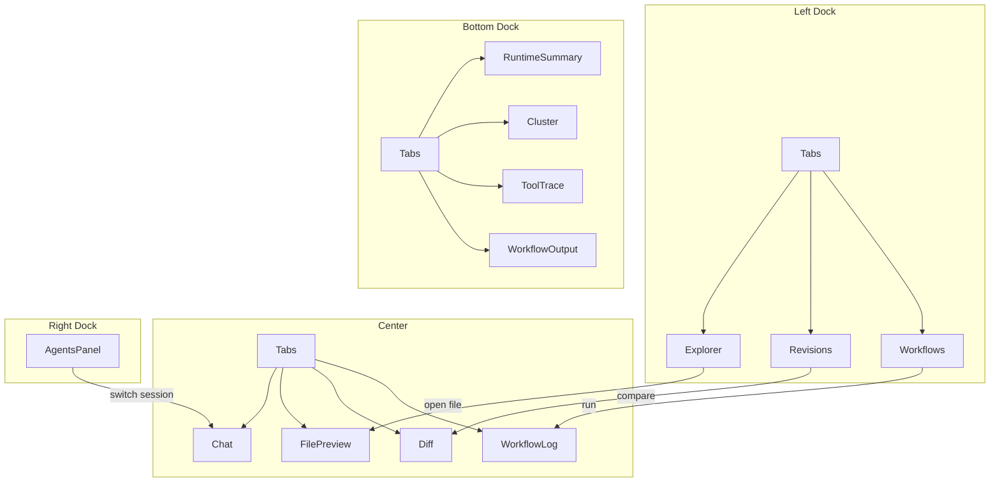

# Agent Workspace — Dock 骨架与面板梳理

> 配套：[agent-workspace-gui.md](./agent-workspace-gui.md)  
> **布局概念**：Zed 式 Left / Center / Right / Bottom 分区。  
> **当前实现**：`eframe` / `egui`（`SidePanel`、`CentralPanel`、`TopBottomPanel`），不再使用 GPUI / `gpui-component`。

---

## 1. 四区 anatomy（概念 → egui 映射）

原 GPUI `DockArea` 五挂载点，在 egui 中对应：

```
                    ┌─────────────────────────────────────┐
                    │  TitleBar（窗口级，非 Dock 内）        │
├──────────┬────────┴─────────────────────────┬──────────┤
│          │                                  │          │
│  LEFT    │           CENTER                 │  RIGHT   │
│  dock    │     （主工作区 TabPanel）          │  dock    │
│          │                                  │          │
│ 260px    │                                  │  240px   │
│ 可折叠    │                                  │  可折叠   │
│          │                                  │          │
├──────────┴──────────────────────────────────┴──────────┤
│  BOTTOM dock（Runtime，默认 28px 条，可拉高到 200px）      │
└────────────────────────────────────────────────────────┘
```

| 区域 | egui API | 默认 |
|------|----------|------|
| Left | `egui::SidePanel::left` | 开，220px；内嵌 Files / History / Workflows Tab |
| Center | `egui::CentralPanel` | Chat + 文件预览 Tab |
| Right | `egui::SidePanel::right` | 开，220px；Sessions + Cluster |
| Bottom | `egui::TopBottomPanel::bottom` | 状态条（Ready / counts） |
| TitleBar | 窗口原生标题 | — |

Left 内 Tab 用 `ui.horizontal` + `selectable_label` 实现，等价于原 `DockItem::Tabs`。

---

## 2. 默认布局（已实现）

```text
WorkspaceApp (eframe)
├── SidePanel::left  → app/left.rs   (Explorer | Revisions | Workflows)
├── CentralPanel     → app/mod.rs    (Chat tab + 文件预览 tab)
├── SidePanel::right → app/right.rs  (Sessions | Cluster 占位)
└── TopBottomPanel   → 状态栏        (files / revs / workflows counts)
```
│   └── (预留) Panel: Search 或 Outline               size: 45%  ← Phase 2+
└── TopBottomPanel   → 状态栏        (files / revs / workflows counts)
```

Center 内 Chat / 文件预览 Tab 由 `CenterTab` 枚举管理；后续可扩展 Diff、WorkflowLog。

**Mermaid（逻辑关系）**



---

## 3. 面板分类（两类）

### A. 侧栏面板（`Panel` trait，固定在 Left / Right / Bottom）

长期停靠、有 `panel_name()`、可折叠/拖拽（Dock 管理）。

| `panel_name` | 中文 | 位置 | 职责 |
|--------------|------|------|------|
| `explorer` | 资源管理器 | Left Tab | 工作区文件树 |
| `revisions` | 版本快照 | Left Tab | checkpoint 时间线 |
| `workflows` | 工作流 | Left Tab | `.pulsing/workflows/*.py` |
| `agents` | Agent 会话 | Right | duo-agent / 多会话 |
| `runtime` | 运行时 | Bottom Tab | 集群与进程状态 |

### B. 中央文档（Center `Tabs` 里的条目，动态开闭）

类似 Zed 的 editor tab，由用户操作打开，可关闭。

| Tab 类型 | 标识 | 打开方式 |
|----------|------|----------|
| `ChatTab` | `chat:{session_id}` | 默认 / Agents 侧栏切换 |
| `FileTab` | `file:{rel_path}` | Explorer 单击 |
| `DiffTab` | `diff:{rev_id}` | Revisions 双击 |
| `WorkflowLogTab` | `wf-log:{run_id}` | Workflows 点 Run |

---

## 4. 各面板规格

### 4.1 Explorer（`explorer`）

| 项 | 内容 |
|----|------|
| **职责** | 展示 `WorkspaceLayout.root` 文件树；脏文件标记 |
| **组件** | `Tree` / `VirtualList` |
| **数据** | `FileIndex::scan(layout)` → `Vec<FileNode>` |
| **事件出** | `OpenFile(path)` → Center 开 `FileTab` |
| **事件入** | `RevisionCreated` → 刷新 dirty 标记 |
| **不做什么** | 不编辑文件、不跑 agent |

```rust
pub struct FileNode {
    pub rel_path: PathBuf,
    pub is_dir: bool,
    pub dirty: bool,  // 相对 HEAD checkpoint
}
```

---

### 4.2 Revisions（`revisions`）

| 项 | 内容 |
|----|------|
| **职责** | workspace journal 时间线；checkpoint / rollback |
| **组件** | `VirtualList` + `Button` + `Dialog` |
| **数据** | `list_revisions(&layout)`, `current_head(&layout)` |
| **事件出** | `OpenDiff(rev_id)`, `RequestRollback(rev_id)` |
| **事件入** | `RevisionCreated`, `HeadChanged` |

```rust
pub struct RevisionRow {
    pub id: String,
    pub message: String,
    pub created_at: String,
    pub file_count: usize,
    pub is_head: bool,
}
```

---

### 4.3 Workflows（`workflows`）

| 项 | 内容 |
|----|------|
| **职责** | 列出并运行 workflow 脚本 |
| **组件** | `List` + Run/Stop `Button` |
| **数据** | `list_workflow_scripts()` → `Vec<WorkflowEntry>` |
| **事件出** | `RunWorkflow(script)`, `StopWorkflow(run_id)` → Bottom `WorkflowOutput` |
| **事件入** | `WorkflowStarted/Finished/Output` |

```rust
pub enum WorkflowState { Idle, Running { run_id, pid }, Failed }
pub struct WorkflowEntry {
    pub path: PathBuf,
    pub name: String,
    pub state: WorkflowState,
}
```

---

### 4.4 Agents（`agents`）— Right dock

| 项 | 内容 |
|----|------|
| **职责** | 多 Agent 会话管理（Local + Remote craft） |
| **组件** | `VirtualList` + `Button`（New / Spawn） |
| **数据** | `SessionStore::list()` + `list_cluster_agents()` (Phase 3) |
| **事件出** | `FocusSession(id)` → Center 切 `ChatTab` |
| **事件入** | `AgentEvent`, `CraftAgentStatus` |

```rust
pub enum SessionKind {
    LocalForge,
    RemoteNamed { path: String },  // craft/ws/{cluster_id}/coder
}
pub struct AgentSessionMeta {
    pub id: SessionId,
    pub title: String,
    pub kind: SessionKind,
    pub busy: bool,
}
```

**与 Center Chat 的关系**：每个 session 对应一个 `ChatTab`；Agents 面板是会话**目录**，Chat 是**内容**。

---

### 4.5 Center Tabs（主工作区）

#### ChatTab（核心，迁移自现有 `app.rs`）

| 项 | 内容 |
|----|------|
| **职责** | 单 session 对话 + Composer |
| **组件** | `list` 消息流 + `Input` + Mode/Model `DropdownButton` |
| **数据** | `SessionStore::chat(session_id)` |
| **事件** | `AgentEvent` → `ChatState::apply` |

#### FileTab

| 项 | 内容 |
|----|------|
| **职责** | 只读文件预览 |
| **组件** | `TextView` + `SyntaxHighlighter` |
| **数据** | `std::fs::read_to_string` |

#### DiffTab

| 项 | 内容 |
|----|------|
| **职责** | revision 与工作区 diff |
| **组件** | 双栏 `TextView` 或 unified diff |
| **数据** | `revision_dir(id)/files/` vs 工作区 |

#### WorkflowLogTab

| 项 | 内容 |
|----|------|
| **职责** | 单次 workflow 运行的 stdout |
| **组件** | 滚动 `VirtualList` |
| **数据** | `WorkflowRunner` 的 log channel |

---

### 4.6 Runtime（`runtime`）— Bottom dock

Bottom 默认显示 **RuntimeSummary**（一行），双击或拖高展开 Tabs。

| Tab | 职责 | 数据源 |
|-----|------|--------|
| **Summary** | 一行：节点数、actor 数、当前工具 | 聚合 |
| **Cluster** | SWIM 成员 + named actors 表 | HTTP `/cluster/members`, `all_named_actors` |
| **ToolTrace** | 当前 session 的 ToolStart/End 时间线 | `AgentEvent` |
| **WorkflowOutput** | workflow 子进程输出 | `WorkflowRunner` |

```rust
pub struct RuntimeSummary {
    pub nodes_alive: usize,
    pub nodes_total: usize,
    pub named_actors: usize,
    pub active_tool: Option<String>,
    pub workflow_running: bool,
}
```

---

## 5. 状态边界：什么不属于 Panel

Panel **只负责渲染 + 发意图**；共享状态进 `WorkspaceModel`（未来 `pulsing-workspace-gui`）：

```rust
pub struct WorkspaceModel {
    pub layout: WorkspaceLayout,
    pub files: FileIndex,
    pub revisions: Vec<RevisionRow>,
    pub head: Option<String>,
    pub workflows: Vec<WorkflowEntry>,
    pub sessions: SessionStore,
    pub runtime: RuntimeSnapshot,
    pub center_tabs: CenterTabState,   // 打开哪些 File/Diff/Chat tab
}
```

**跨面板事件**（`WorkspaceAction`）：

```rust
pub enum WorkspaceAction {
    OpenFile(PathBuf),
    OpenDiff { revision_id: String },
    OpenChat(SessionId),
    RunWorkflow(PathBuf),
    Checkpoint { message: Option<String> },
    Rollback { revision_id: String },
    FocusAgent(SessionId),
}
```

Panel 发 `WorkspaceAction` → `WorkspaceApp::dispatch` 更新状态 → 下一帧重绘。

---

## 6. 代码模块映射（`pulsing-gui`）

```text
crates/pulsing-gui/src/
├── app/
│   ├── mod.rs             # WorkspaceApp：布局 + dispatch
│   ├── left.rs            # Explorer / Revisions / Workflows
│   ├── chat.rs            # 消息流 + Composer
│   └── right.rs           # Sessions / Cluster
├── model/                 # WorkspaceModel, SessionStore, actions
├── controller/            # agent turn 后台任务
├── settings.rs
└── state.rs               # ChatState
```

---

## 7. 面板实现约定（egui）

各区域为独立 `render(app, ui)` 函数，通过 `WorkspaceAction` 与 `WorkspaceApp::dispatch` 通信，无需 GPUI `Panel` trait。

---

## 8. 默认尺寸与初始状态

| 区域 | 默认尺寸 | 默认开关 |
|------|----------|----------|
| Left | 220px | open |
| Right | 220px | open |
| Bottom | 状态条一行 | open |
| Center | 占满剩余 | — |

Left 内 Tabs 默认 active：**Explorer**  
Center 默认 active：**Chat**  
Right 默认 active：**Sessions**

---

## 9. 迁移状态（GPUI → egui）

| 原 GPUI 计划 | 当前 egui 实现 |
|--------------|----------------|
| `WorkspaceShell` + `DockArea` | `WorkspaceApp` + `SidePanel` / `CentralPanel` |
| `panels/*` 模块 | `app/{left,chat,right}.rs` |
| Composer Mode/Model | `app/chat.rs` |
| Explorer 文件树 | `app/left.rs` |
| Revisions / Workflows | `app/left.rs`（列表占位，待交互） |

**Phase 0 已完成**：三栏布局 + Explorer + Chat + Sessions + 状态栏。

---

## 10. 面板一览表（速查）

| 面板 | 区域 | 模块 | 核心 API |
|------|------|------|----------|
| Explorer | Left | `app/left.rs` | `WorkspaceLayout`, walkdir |
| Revisions | Left | `app/left.rs` | `pulsing_workspace::journal` |
| Workflows | Left | `app/left.rs` | `session::workspace::list_workflow_scripts` |
| Chat | Center | `app/chat.rs` | `pulsing_forge::AgentEvent` |
| File preview | Center | `app/mod.rs` | fs read |
| Sessions | Right | `app/right.rs` | `SessionStore` |
| Cluster | Right | `app/right.rs` | 占位（Phase 3） |
| Status | Bottom | `app/mod.rs` | workspace counts |
