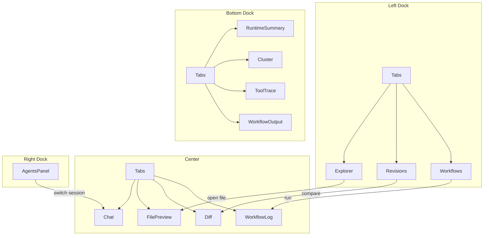

# Agent Workspace — Dock 骨架与面板梳理

> 配套：[agent-workspace-gui.md](./agent-workspace-gui.md)  
> 基于 `gpui-component::dock::DockArea`（与 Zed 同源 GPUI 生态）

---

## 1. Dock 四区 anatomy

`DockArea` 固定五个挂载点：

```
                    ┌─────────────────────────────────────┐
                    │  TitleBar（窗口级，非 Dock 内）        │
├──────────┬────────┴─────────────────────────┬──────────┤
│          │                                  │          │
│  LEFT    │           CENTER                 │  RIGHT   │
│  dock    │     （主工作区 TabPanel）          │  dock    │
│          │                                  │          │
│ 260px    │                                  │  240px   │
│ 可折叠    │                                  │  可折叠   │
│          │                                  │          │
├──────────┴──────────────────────────────────┴──────────┤
│  BOTTOM dock（Runtime，默认 28px 条，可拉高到 200px）      │
└────────────────────────────────────────────────────────┘
```

| 挂载 API | 角色 | 默认 |
|----------|------|------|
| `set_left_dock` | 工作区工具（文件、版本、workflow） | 开，260px |
| `set_center` | 主内容（Chat / 文件 / Diff） | 始终 |
| `set_right_dock` | 多 Agent 会话 | 开，240px |
| `set_bottom_dock` | 运行时观测 | 开，28px（可展开） |

**`DockItem` 三种组合方式**（布局树节点）：

| 类型 | 用途 |
|------|------|
| `DockItem::Panel { view }` | 单面板 |
| `DockItem::Tabs { items, active_ix }` | 多 Tab（Explorer / Revisions 等） |
| `DockItem::Split { axis, items, sizes }` | 上下或左右分栏 |

---

## 2. 默认布局树（`DockItem`）

```text
DockArea
├── left_dock: Split(Vertical)
│   ├── Tabs [Explorer | Revisions | Workflows]     size: 55%
│   └── (预留) Panel: Search 或 Outline               size: 45%  ← Phase 2+
│
├── center: Tabs
│   ├── ChatSession(local)          ← 默认 active
│   ├── FilePreview(path)           ← 从 Explorer 打开
│   ├── RevisionDiff(rev_id)        ← 从 Revisions 打开
│   └── WorkflowLog(run_id)         ← 从 Workflows 打开
│
├── right_dock: Panel
│   └── AgentsPanel（多会话列表 + 详情）
│
└── bottom_dock: Tabs
    ├── RuntimeSummary（默认，单行摘要）
    ├── Cluster（节点 + named actors）
    ├── ToolTrace（当前 session 工具流）
    └── WorkflowOutput（workflow stdout）
```

**Mermaid（逻辑关系）**



---

## 3. 面板分类（两类）

### A. 侧栏面板（`Panel` trait，固定在 Left / Right / Bottom）

长期停靠、有 `panel_name()`、可折叠/拖拽（Dock 管理）。

| `panel_name` | 中文 | 位置 | 职责 |
|--------------|------|------|------|
| `explorer` | 资源管理器 | Left Tab | 工作区文件树 |
| `revisions` | 版本快照 | Left Tab | checkpoint 时间线 |
| `workflows` | 工作流 | Left Tab | `.pulsing/workflows/*.py` |
| `agents` | Agent 会话 | Right | duo-agent / 多会话 |
| `runtime` | 运行时 | Bottom Tab | 集群与进程状态 |

### B. 中央文档（Center `Tabs` 里的条目，动态开闭）

类似 Zed 的 editor tab，由用户操作打开，可关闭。

| Tab 类型 | 标识 | 打开方式 |
|----------|------|----------|
| `ChatTab` | `chat:{session_id}` | 默认 / Agents 侧栏切换 |
| `FileTab` | `file:{rel_path}` | Explorer 单击 |
| `DiffTab` | `diff:{rev_id}` | Revisions 双击 |
| `WorkflowLogTab` | `wf-log:{run_id}` | Workflows 点 Run |

---

## 4. 各面板规格

### 4.1 Explorer（`explorer`）

| 项 | 内容 |
|----|------|
| **职责** | 展示 `WorkspaceLayout.root` 文件树；脏文件标记 |
| **组件** | `Tree` / `VirtualList` |
| **数据** | `FileIndex::scan(layout)` → `Vec<FileNode>` |
| **事件出** | `OpenFile(path)` → Center 开 `FileTab` |
| **事件入** | `RevisionCreated` → 刷新 dirty 标记 |
| **不做什么** | 不编辑文件、不跑 agent |

```rust
pub struct FileNode {
    pub rel_path: PathBuf,
    pub is_dir: bool,
    pub dirty: bool,  // 相对 HEAD checkpoint
}
```

---

### 4.2 Revisions（`revisions`）

| 项 | 内容 |
|----|------|
| **职责** | workspace journal 时间线；checkpoint / rollback |
| **组件** | `VirtualList` + `Button` + `Dialog` |
| **数据** | `list_revisions(&layout)`, `current_head(&layout)` |
| **事件出** | `OpenDiff(rev_id)`, `RequestRollback(rev_id)` |
| **事件入** | `RevisionCreated`, `HeadChanged` |

```rust
pub struct RevisionRow {
    pub id: String,
    pub message: String,
    pub created_at: String,
    pub file_count: usize,
    pub is_head: bool,
}
```

---

### 4.3 Workflows（`workflows`）

| 项 | 内容 |
|----|------|
| **职责** | 列出并运行 workflow 脚本 |
| **组件** | `List` + Run/Stop `Button` |
| **数据** | `list_workflow_scripts()` → `Vec<WorkflowEntry>` |
| **事件出** | `RunWorkflow(script)`, `StopWorkflow(run_id)` → Bottom `WorkflowOutput` |
| **事件入** | `WorkflowStarted/Finished/Output` |

```rust
pub enum WorkflowState { Idle, Running { run_id, pid }, Failed }
pub struct WorkflowEntry {
    pub path: PathBuf,
    pub name: String,
    pub state: WorkflowState,
}
```

---

### 4.4 Agents（`agents`）— Right dock

| 项 | 内容 |
|----|------|
| **职责** | 多 Agent 会话管理（Local + Remote craft） |
| **组件** | `VirtualList` + `Button`（New / Spawn） |
| **数据** | `SessionStore::list()` + `list_cluster_agents()` (Phase 3) |
| **事件出** | `FocusSession(id)` → Center 切 `ChatTab` |
| **事件入** | `AgentEvent`, `CraftAgentStatus` |

```rust
pub enum SessionKind {
    LocalForge,
    RemoteNamed { path: String },  // craft/ws/{cluster_id}/coder
}
pub struct AgentSessionMeta {
    pub id: SessionId,
    pub title: String,
    pub kind: SessionKind,
    pub busy: bool,
}
```

**与 Center Chat 的关系**：每个 session 对应一个 `ChatTab`；Agents 面板是会话**目录**，Chat 是**内容**。

---

### 4.5 Center Tabs（主工作区）

#### ChatTab（核心，迁移自现有 `app.rs`）

| 项 | 内容 |
|----|------|
| **职责** | 单 session 对话 + Composer |
| **组件** | `list` 消息流 + `Input` + Mode/Model `DropdownButton` |
| **数据** | `SessionStore::chat(session_id)` |
| **事件** | `AgentEvent` → `ChatState::apply` |

#### FileTab

| 项 | 内容 |
|----|------|
| **职责** | 只读文件预览 |
| **组件** | `TextView` + `SyntaxHighlighter` |
| **数据** | `std::fs::read_to_string` |

#### DiffTab

| 项 | 内容 |
|----|------|
| **职责** | revision 与工作区 diff |
| **组件** | 双栏 `TextView` 或 unified diff |
| **数据** | `revision_dir(id)/files/` vs 工作区 |

#### WorkflowLogTab

| 项 | 内容 |
|----|------|
| **职责** | 单次 workflow 运行的 stdout |
| **组件** | 滚动 `VirtualList` |
| **数据** | `WorkflowRunner` 的 log channel |

---

### 4.6 Runtime（`runtime`）— Bottom dock

Bottom 默认显示 **RuntimeSummary**（一行），双击或拖高展开 Tabs。

| Tab | 职责 | 数据源 |
|-----|------|--------|
| **Summary** | 一行：节点数、actor 数、当前工具 | 聚合 |
| **Cluster** | SWIM 成员 + named actors 表 | HTTP `/cluster/members`, `all_named_actors` |
| **ToolTrace** | 当前 session 的 ToolStart/End 时间线 | `AgentEvent` |
| **WorkflowOutput** | workflow 子进程输出 | `WorkflowRunner` |

```rust
pub struct RuntimeSummary {
    pub nodes_alive: usize,
    pub nodes_total: usize,
    pub named_actors: usize,
    pub active_tool: Option<String>,
    pub workflow_running: bool,
}
```

---

## 5. 状态边界：什么不属于 Panel

Panel **只负责渲染 + 发意图**；共享状态进 `WorkspaceModel`（未来 `pulsing-workspace-gui`）：

```rust
pub struct WorkspaceModel {
    pub layout: WorkspaceLayout,
    pub files: FileIndex,
    pub revisions: Vec<RevisionRow>,
    pub head: Option<String>,
    pub workflows: Vec<WorkflowEntry>,
    pub sessions: SessionStore,
    pub runtime: RuntimeSnapshot,
    pub center_tabs: CenterTabState,   // 打开哪些 File/Diff/Chat tab
}
```

**跨面板事件**（`WorkspaceAction`）：

```rust
pub enum WorkspaceAction {
    OpenFile(PathBuf),
    OpenDiff { revision_id: String },
    OpenChat(SessionId),
    RunWorkflow(PathBuf),
    Checkpoint { message: Option<String> },
    Rollback { revision_id: String },
    FocusAgent(SessionId),
}
```

Panel 发 `WorkspaceAction` → `WorkspaceModel` 更新 → 各 Panel `observe` 刷新。

---

## 6. 代码模块映射（`pulsing-gui`）

```text
crates/pulsing-gui/src/
├── app.rs                 # WorkspaceApp：持有 DockArea + WorkspaceModel
├── dock/
│   ├── mod.rs             # build_default_layout() -> DockItem 树
│   └── layout.rs          # 默认宽度、panel_name 常量
├── panels/
│   ├── mod.rs             # Panel trait 统一导出
│   ├── explorer.rs        # ExplorerPanel
│   ├── revisions.rs       # RevisionsPanel
│   ├── workflows.rs       # WorkflowsPanel
│   ├── agents.rs          # AgentsPanel
│   ├── runtime.rs         # RuntimePanel（bottom tabs）
│   └── center/
│       ├── mod.rs         # CenterTabBar 管理
│       ├── chat.rs        # ← 现有 app.rs 聊天逻辑迁入
│       ├── file.rs
│       ├── diff.rs
│       └── workflow_log.rs
├── model/                 # Phase 0 可先放 gui 内，后抽 crate
│   ├── mod.rs
│   ├── workspace.rs
│   ├── sessions.rs
│   └── actions.rs
└── state.rs               # ChatState（不变）
```

---

## 7. `Panel` 实现约定

每个侧栏面板实现 `gpui_component::dock::Panel`：

```rust
impl Panel for ExplorerPanel {
    fn panel_name(&self) -> &'static str { "explorer" }
    fn title(&mut self, _, cx) -> impl IntoElement {
        Label::new("Explorer")
    }
    fn tab_name(&self, _) -> Option<SharedString> {
        Some("Files".into())
    }
}
```

注册到 `DockArea` 时使用 `Entity<ExplorerPanel>`（自动 impl `PanelView`）。

**`panel_name` 必须稳定**（用于布局序列化 / 恢复）。

---

## 8. 默认尺寸与初始状态

| 区域 | 默认尺寸 | 默认开关 |
|------|----------|----------|
| Left | 260px | open |
| Right | 240px | open |
| Bottom | 28px（Summary）/ 180px（展开） | open |
| Center | 占满剩余 | — |

Left 内 Tabs 默认 active：**Explorer**  
Center 默认 active：**ChatTab(local)**  
Bottom 默认 active：**RuntimeSummary**

---

## 9. 与现有 `pulsing-gui` 的迁移路径

| 现有 | 迁移目标 |
|------|----------|
| `app.rs` 整窗 `ChatApp` | `WorkspaceApp` + `DockArea` |
| 左侧 `New Chat` 列表 | **Agents** 面板（Right）+ Center ChatTab |
| Composer Mode/Model | 留在 `panels/center/chat.rs` |
| 无文件树 | **Explorer** 面板（Left） |
| 无版本 | **Revisions** 面板（Left） |

**Phase 0 最小骨架**：只实现 `DockArea` + 空 `ExplorerPanel` + 迁入 `ChatPanel` + 占位 `AgentsPanel` + `RuntimeSummary` 一行。

---

## 10. 面板一览表（速查）

| 面板 | Dock 位 | 类型 | 核心 API |
|------|---------|------|----------|
| Explorer | Left | 侧栏 Tab | `WorkspaceLayout`, walkdir |
| Revisions | Left | 侧栏 Tab | `pulsing_workspace::journal` |
| Workflows | Left | 侧栏 Tab | `session::workspace::list_workflow_scripts` |
| Chat | Center | 文档 Tab | `pulsing_forge::AgentEvent` |
| File / Diff / WfLog | Center | 文档 Tab | fs / journal / subprocess |
| Agents | Right | 侧栏 Panel | `SessionStore`, craft discovery |
| Runtime | Bottom | 侧栏 Tab | actor HTTP, AgentEvent |
