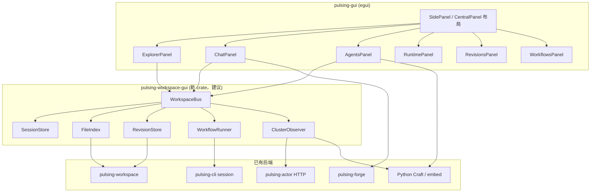
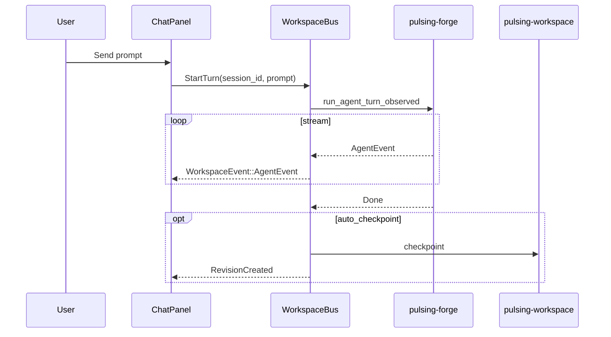

# Agent Workspace GUI — 设计文档

> **状态更新（2026-07-26）**：GUI 的目标边界以 [`Forge 核心架构`](../src/design/forge/core-architecture.zh.md) 为准。GUI 是 `ForgeClient`，只发送命令并投影事件；Session、Turn、取消、工作区 revision 和演化状态都由 Forge 拥有。本文其余内容保留为布局与迁移参考，凡涉及 GUI 自有 worker、事件 receiver 或执行状态的设计均被该边界取代。
>
> 目标：类似 **Zed** 的现代化 Agent 工作空间——文件管理、工作流版本、Duo-Agent 会话、Pulsing 多进程/Actor 运行时可视。  
> **实现栈**：`eframe` / `egui`（`pulsing gui` 桌面窗口）。

## 1. 设计原则

| 原则 | 说明 |
|------|------|
| **Zed 式布局** | 左侧 Explorer + 中央编辑/对话 + 底部/右侧 Dock（终端、工作流、运行时） |
| **单一工作区根** | 以 `WorkspaceLayout`（`.pulsing/`）为真相源，GUI 不另建配置 |
| **事件驱动 UI** | 通过 `ForgeClient.subscribe(session_id, after_seq)` 投影版本化 Forge Event |
| **执行状态外置** | GUI 不拥有 worker、取消 token 或 busy 真相；状态来自 Forge Session 投影 |
| **Safe / Extension 分层** | Safe 模式纯 Rust；Extension 模式通过 embed Python 接 Craft 多 Agent |
| **渐进交付** | Phase 0→3，每阶段可独立 `pulsing gui` 可用 |

## 2. 总体布局

```
┌──────────┬────────────────────────────────────────────┬─────────────┐
│ EXPLORER │              EDITOR / CHAT                 │  AGENTS     │
│          │  ┌──────────────────────────────────────┐  │             │
│ 📁 src/  │  │ Tab: Chat · README · diff@0003       │  │ ○ coder     │
│ 📁 .pul..│  │                                      │  │ ● reviewer  │
│          │  │  [消息流 / 文件预览 / diff]            │  │ ○ planner   │
│ REVISIONS│  │                                      │  │             │
│ * 0003   │  └──────────────────────────────────────┘  │ + Spawn     │
│   0002   │                                              │             │
│ WORKFLOWS│──────────────────────────────────────────────│             │
│ ▶ example│  Composer: [Agent▾][model▾]  @file  ↑       │             │
└──────────┴────────────────────────────────────────────┴─────────────┘
┌───────────────────────────────────────────────────────────────────────┐
│ RUNTIME  Nodes:2  Actors:14  │  workflow:example.py RUNNING  │  Logs  │
│ node-A ● Alive  node-B ● Alive  │  craft/ws/abc/coder ● busy          │
└───────────────────────────────────────────────────────────────────────┘
```

### 区域职责

| 区域 | 功能 | 主要数据源 |
|------|------|------------|
| **Explorer** | 工作区文件树、`.pulsing/` 折叠显示 | `WorkspaceLayout::root` + `walkdir` |
| **Revisions** | Checkpoint 时间线、回滚、与 HEAD diff | `pulsing_workspace::{list_revisions, current_head}` |
| **Workflows** | `.pulsing/workflows/*.py` 列表、运行/停止、日志 | `session::workspace::list_workflow_scripts` |
| **Editor/Chat** | 多 Tab：对话、文件只读、revision diff | `ChatState` + 文件内容 |
| **Agents** | Duo / 多 Agent 列表、spawn、切换会话 | `list_cluster_agents()` / `craft/ws/{id}/*` |
| **Runtime Bar** | 集群节点、命名 Actor、workflow 进程状态 | HTTP observer + `SystemActor` |

## 3. 架构分层



### 新 crate：`pulsing-workspace-gui`（推荐）

把 **UI 无关** 的状态与轮询放在独立 crate，供 `pulsing-gui` 与未来 TUI 复用：

```rust
// 统一事件总线
pub enum WorkspaceEvent {
    FileChanged { path: PathBuf },
    RevisionCreated { info: RevisionInfo },
    HeadChanged { id: String },
    WorkflowStarted { script: PathBuf, pid: u32 },
    WorkflowOutput { line: String },
    WorkflowFinished { exit_code: i32 },
    ClusterMembers { members: Vec<MemberInfo> },
    NamedActors { actors: Vec<NamedActorInfo> },
    CraftAgent { name: String, status: AgentStatus },
    AgentEvent(AgentEvent),           // safe-mode forge
    ForgeEvent { kind: String, .. },  // extension craft
}

pub struct WorkspaceModel {
    pub layout: WorkspaceLayout,
    pub sessions: SessionStore,      // 多 chat / 多 agent 会话
    pub revisions: Vec<RevisionInfo>,
    pub head: Option<String>,
    pub workflows: Vec<WorkflowEntry>,
    pub cluster: ClusterSnapshot,
}
```

## 4. 面板详细设计

### 4.1 Explorer（文件管理）

- **egui 组件**：`CollapsingHeader` 文件树 + `ScrollArea`
- **根节点**：`WorkspaceLayout.root`（隐藏 `.git` 等，`.pulsing` 可折叠子树）
- **交互**：
  - 单击 → 中央 Tab 打开只读预览（`Read` 工具同源）
  - 右键 → Open in Chat（`@path` 填入 composer）
  - 与 **HEAD revision** 对比 → 高亮未 checkpoint 的修改文件（`git status` 或 journal diff）

```rust
pub struct FileNode {
    pub path: PathBuf,
    pub kind: FileNodeKind,  // File | Dir | PulsingMeta
    pub dirty: bool,         // 相对 last checkpoint
}
```

### 4.2 Revisions（工作流版本管理）

复用 `pulsing-workspace` journal，**不是 git**，是 workspace 级快照：

| 操作 | API | GUI |
|------|-----|-----|
| 列表 | `list_revisions(&layout)` | 左侧时间线，`*` 标记 HEAD |
| 创建 | `checkpoint(&layout, CheckpointOptions { message })` | 按钮 / 发送后自动 checkpoint（可配置） |
| 回滚 | `rollback(&layout, RollbackOptions { revision_id })` | 确认 Dialog |
| Diff | 读 `revision_dir(id)/files/` vs 工作区 | 中央 diff Tab |

```rust
pub struct RevisionRow {
    pub info: RevisionInfo,
    pub is_head: bool,
    pub parent: Option<String>,
}
```

### 4.3 Workflows（工作流）

| 项 | 说明 |
|----|------|
| 发现 | `list_workflow_scripts()` → `.pulsing/workflows/*.py` |
| 运行 | `embed::run_workflow_script` 或子进程 `pulsing run -s script.py` |
| 状态 | `WorkflowEntry { script, state: Idle \| Running \| Failed, pid?, log_rx }` |
| UI | 列表 + Run/Stop；日志在底部 Dock `Workflow` tab |

与 **Revisions** 联动：workflow 关键步骤完成后可自动 `checkpoint(message="after workflow step N")`。

### 4.4 Duo-Agent 会话管理

命名空间：`craft/ws/{cluster_id}/{agent_name}`（`cluster_id` = `WorkspaceManifest.cluster_id`）。

```rust
pub struct AgentSession {
    pub id: SessionId,
    pub kind: SessionKind,
    pub title: String,
    pub target: AgentTarget,
    pub chat: ChatState,
    pub busy: bool,
}

pub enum SessionKind {
    LocalForge,           // 当前 pulsing-gui 单 agent
    RemoteNamed(String),  // craft/ws/.../coder
    Workflow,             // workflow 驱动的一次性 run
}

pub enum AgentTarget {
    Local { config: AgentConfig },
    NamedActor { path: String },
}
```

**Agents 侧栏**（类似 Cursor 多 Chat）：
- `Local` — 默认 Forge agent（已实现）
- `+ Spawn` — 调 `pulsing agent spawn <name>`（extension）
- 每个 remote agent 独立 `ChatState` + 可选 `P2PToolSession` 事件流

**Python API（extension）**：
```python
rows = await list_cluster_agents(system, workspace_id=cluster_id)
await message_cluster_agent(system, name, payload)
```

### 4.5 Runtime（多进程 / 多 Actor 状态）

三层观测，合并到 **Runtime Bar** + **Runtime Dock**：

| 层级 | 来源 | 展示 |
|------|------|------|
| **SWIM 集群** | `GET /cluster/members` 或 `system.members()` | 节点列表、Alive/Suspect/Dead |
| **命名 Actor** | `system.all_named_actors()` / `GET /actors` | `craft/ws/...` 实例数、所在节点 |
| **本地 System** | `SystemActorProxy.health_check()` | actors_count、uptime |
| **Workflow 子进程** | GUI 自己 spawn 的 pid | Running/退出码 |
| **Forge 工具** | `AgentEvent::ToolStart/End` | 当前 agent 的工具时间线 |

```rust
pub struct ClusterSnapshot {
    pub nodes: Vec<MemberInfo>,
    pub named_actors: Vec<NamedActorInfo>,
    pub local_health: Option<HealthInfo>,
    pub updated_at: Instant,
}

pub struct AgentRuntimeRow {
    pub path: String,
    pub node_id: String,
    pub status: ActorStatus,  // Idle | Busy | Error
    pub current_tool: Option<String>,
}
```

轮询策略：集群 2s、Forge 事件 50ms（已有）、workflow stdout 阻塞读。

## 5. 中央区域：Tab 模型

使用 `egui::SidePanel` / `CentralPanel` 与顶部 Tab 栏：

| Tab 类型 | 内容 |
|----------|------|
| `Chat(session_id)` | 现有 ChatPanel |
| `File(path)` | `TextView` + `SyntaxHighlighter` |
| `Diff { base, head }` | 双栏或 unified diff |
| `WorkflowLog(run_id)` | 滚动日志 |
| `Plan` | `Accordion` 展示 `PlanItem` / `PLAN_UPDATED` |

## 6. Composer 增强（Cursor 风格）

在现有 `[Mode▾][Model▾]` 基础上：

| 控件 | 行为 |
|------|------|
| `@` | Popover + `Tree` 选文件，插入 context |
| `/` | 命令：checkpoint、rollback、workflow run、agent spawn |
| 目标 Agent | 当前 session 为 remote 时显示 agent 名 |

## 7. 数据流（单轮对话）



## 8. Crate / 模块规划

```
crates/
  pulsing-workspace-gui/     # 新建：WorkspaceModel, Bus, 轮询
    src/
      model.rs
      bus.rs
      files.rs
      revisions.rs
      workflows.rs
      cluster.rs
      sessions.rs

  pulsing-gui/               # 现有：egui 视图
    src/
      app/
        mod.rs               # WorkspaceApp：布局 + dispatch
        left.rs              # Explorer / Revisions / Workflows
        chat.rs              # 消息流 + Composer
        right.rs             # Sessions / Cluster
      model/                 # WorkspaceModel, SessionStore, actions
      controller/            # agent turn 后台任务
      settings.rs
      state.rs

  pulsing-cli/src/gui/
    mod.rs                   # 启动 workspace model + gui
```

**依赖关系**：
```
pulsing-gui → pulsing-workspace-gui → pulsing-workspace, pulsing-forge
pulsing-workspace-gui → pulsing-actor (HTTP client, optional)
pulsing-cli gui → 初始化 WorkspaceLayout，传 cluster_id
```

## 9. 分阶段交付

### Phase 0 — 骨架（1–2 周）
- [x] `WorkspaceModel` + `list_revisions` + 文件 walk
- [x] egui 三栏布局：Left Explorer | Center Chat | Right Sessions
- [x] Explorer 文件树只读

### Phase 1 — 版本 + 工作流（1–2 周）
- [ ] Revisions 面板：timeline、checkpoint、rollback、Dialog 确认
- [ ] Workflows 面板：列表、Run、底部日志 Tab
- [ ] 文件 Tab 预览

### Phase 2 — 多会话（2 周）
- [ ] `SessionStore`：多 Local chat tab
- [ ] Composer `@` 文件引用
- [ ] `TextView::markdown` 渲染助手回复

### Phase 3 — Duo-Agent + Runtime（2–3 周）
- [ ] Extension mode：embed Python `list_cluster_agents`
- [ ] Agents 侧栏：spawn、切换 remote session
- [ ] Runtime Bar：集群成员 + named actors 轮询
- [ ] `ForgeEvent` / `P2PToolSession` 接入 extension agent

## 10. 与现有代码映射

| 已有 | 新 GUI 用法 |
|------|-------------|
| `pulsing-gui/src/app/` | `WorkspaceApp` + `left` / `chat` / `right` 模块 |
| `session/workspace.rs` | `RevisionsPanel` / `WorkflowsPanel` 直接调用 |
| `session/commands.rs` `InputAction` | Composer `/` 命令同语义 |
| `pulsing_workspace::journal` | Revision 全流程 |
| `AgentEvent` | Local session 流式 UI |
| `python/.../cluster/discovery.py` | Agents 面板 |
| `crates/pulsing-actor` observer HTTP | Runtime 面板 |

## 11. 非目标（首版不做）

- 完整代码编辑器（Monaco 级）— 先只读 + 外链编辑器
- Git 集成 — 用 workspace journal 代替
- 云端同步会话
- WebView 面板

---

**下一步建议**：继续 **Phase 1**（Revisions 交互、Workflows 运行、diff Tab），在现有 `pulsing gui` egui 布局上渐进增强。

**布局与面板细节**见：[agent-workspace-dock-panels.md](./agent-workspace-dock-panels.md)（概念布局；实现为 egui）。
