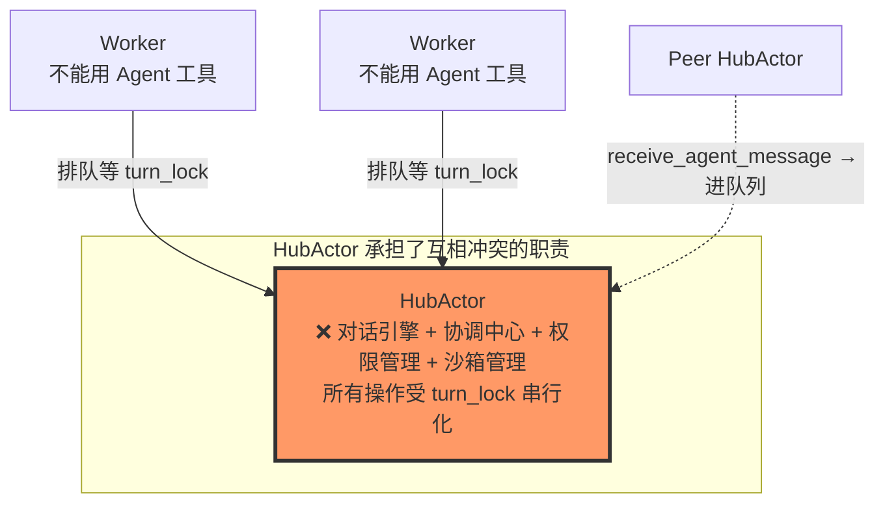
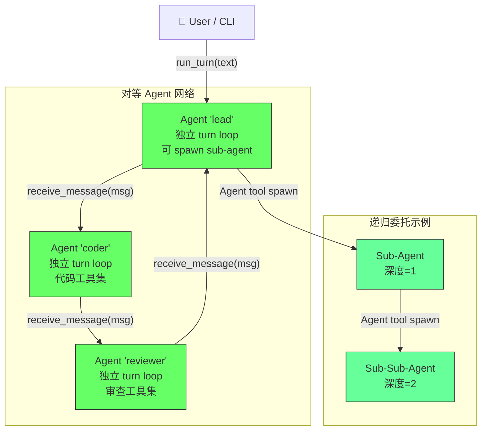

# Craft Agent Refactor: From HubActor to Peer-to-Peer Agents

> **目标**: 去掉 HubActor 作为中心瓶颈，将所有 Agent 变成对等节点，释放真正的多 Agent 并发能力。
>
> **给实现 AI 的指令**: 严格按本设计文档实现。如遇未覆盖的细节，参考现有 `hub_actor.py` / `coordinator.py` / `cluster_tools.py` 的代码，保持兼容风格。改动集中在 `python/pulsing/craft/` 目录，不修改 `crates/` 下的 Rust 代码。

---

## 1. 问题诊断

### 1.1 当前架构的核心矛盾



### 1.2 具体问题

| 问题 | 证据 | 影响 |
|---|---|---|
| **turn_lock 全局串行化** | `hub_actor.py:L493` `async with self._turn_lock:` | 其他 agent 的消息必须等当前 turn 完成 |
| **Worker 不能 spawn sub-agent** | `coordinator.py:L44-48` `_worker_tool_table` 排除了 `COORDINATOR_TOOL_NAMES` | 无法递归委托复杂任务 |
| **消息排队不透明** | `hub_actor.py:L234-244` `receive_agent_message` 进队列，sender 不知道何时处理 | 无法构建可靠的多 agent 协作 |
| **Coordinator task notification 也是排队** | `coordinator.py:L197-206` worker 结果通过 `enqueue_coordinator_notification` | hub 空闲时才被 drain |
| **Agent 角色是装饰性的** | `agent_role` / `agent_description` 存在但只用于 `get_cluster_info()` 返回 | 所有 agent 用同一套 system prompt 和工具 |
| **四种概念混在一起** | HubActor / CoordinatorRuntime / ClusterRuntime / SessionActor | 心智负担重，代码重复 |

---

## 2. 目标架构



### 核心原则

1. **每个 Agent 都是对等节点** — 没有 hub/worker 之分，每个 agent 拥有完整的 `AsyncTurnRunner`
2. **Agent 直接通信** — `receive_message(from_agent, message)` 而非经过中心 hub 排队
3. **递归委托** — 任何 Agent 都可以使用 `Agent` 工具 spawn sub-agent，sub-agent 也可以再 spawn
4. **可选工具集** — 每个 Agent 可以有不同的 system prompt 和工具白名单
5. **独立 turn loop** — 每个 Agent 在自己的 `asyncio.Task` 中处理消息，不阻塞其他 Agent

---

## 3. 新 Agent 类设计

### 3.1 完整 API

```python
# 文件: python/pulsing/craft/agent.py

@pul.remote
class Agent:
    """
    对等 Agent — 每个实例拥有独立的 turn loop、工具集和 system prompt。

    Spawn:   await Agent.spawn(name="craft/agent/lead", ...)
    Resolve: await pul.resolve("craft/agent/lead", cls=Agent)

    消息入口:
      - receive_message(from_agent, message) -> dict        # 非阻塞，放入 inbox
      - receive_message_and_wait(from_agent, message, timeout) -> dict  # 阻塞等待结果
      - run_turn(text) -> dict                              # 用户直接对话 (兼容旧 API)
      - run_turn_stream(text) -> AsyncGenerator             # 流式对话 (兼容旧 API)
    """

    def __init__(
        self,
        *,
        # --- identity ---
        name: str,                              # agent 短名 (如 "lead", "coder")
        workspace_id: str | None = None,        # workspace 隔离
        role: str = "",                         # 角色描述 (用于 discovery)
        description: str = "",                  # 描述 (用于 discovery)

        # --- LLM config ---
        model: str,
        provider: str = "anthropic",
        api_key: str | None = None,
        base_url: str | None = None,
        max_tokens: int = 8192,

        # --- prompt ---
        system_prompt: str | None = None,       # None = 使用内置默认值
        prompt_callback: Any | None = None,      # 权限回调

        # --- tools ---
        tool_allowlist: list[str] | None = None, # None = 全部工具; 否则按名称过滤
        tool_denylist: list[str] | None = None,  # 排除特定工具

        # --- delegation ---
        max_delegation_depth: int = 3,          # Agent 工具最大递归深度
        delegation_default_model: str | None = None,  # sub-agent 默认模型

        # --- sandbox ---
        sandbox_policy: str = "off",
        dangerously_disable_sandbox: bool = False,

        # --- permissions ---
        auto_approve: bool = False,

        # --- session ---
        cwd: str = ".",
        resume_id: str | None = None,
        cost_log: bool = True,
        stream_assistant: bool = True,
    ) -> None:
        ...
```

### 3.2 内部状态

```python
    def __init__(self, ...):
        # === identity ===
        self._name: str
        self._workspace_id: str | None
        self._role: str
        self._description: str

        # === LLM ===
        self._provider: str
        self._model: str
        self._api_key: str | None
        self._base_url: str | None
        self._max_tokens: int

        # === prompt ===
        self._system_prompt: str
        self._prompt_callback: Any | None

        # === tools ===
        self._tool_allowlist: set[str] | None
        self._tool_denylist: set[str] | None
        self._tools: dict[str, Tool]           # 最终生效的工具表

        # === delegation ===
        self._delegation_depth: int = 0         # 当前 agent 的深度 (0 = root)
        self._max_delegation_depth: int
        self._delegation_default_model: str
        self._sub_agent_refs: dict[str, str]    # task_id -> actor_name (用于 TaskStop)

        # === sandbox ===
        self._sandbox_policy: str
        self._dangerously_disable_sandbox: bool

        # === permissions ===
        self._checker: PermissionChecker       # 去掉 plan workspace 耦合
        self._mode: str = "default"            # "default" | "plan" | "dream"

        # === session ===
        self._cwd: str
        self._session: SessionStore

        # === runner ===
        self._runner: AsyncTurnRunner | None

        # === inbox + concurrency ===
        self._inbox: asyncio.Queue[Message]     # 所有入站消息
        self._processor_task: asyncio.Task | None  # 后台消息处理循环
        self._active_turns: set[asyncio.Task]   # 正在运行的 turn (用于 graceful shutdown)
        self._turn_semaphore: asyncio.Semaphore # 限制并发 turn 数 (默认 1，即串行)

        # === isolated worker ===
        self._worker_lock: asyncio.Lock
        self._worker_handle: pul.IsolatedSpawnHandle | None
        self._worker_proxy: pul.ActorProxy | None

        # === lifecycle ===
        self._on_start_done: bool
        self._on_start_lock: asyncio.Lock

        # === buddy ===
        self._buddy: BuddyState
```

### 3.3 消息协议 (Message)

```python
# 文件: python/pulsing/craft/message.py

from __future__ import annotations

import dataclasses
import asyncio
import uuid
from typing import Any


@dataclasses.dataclass
class Message:
    """Agent 间通信的统一消息格式。"""

    # 元数据
    id: str = dataclasses.field(default_factory=lambda: uuid.uuid4().hex[:12])
    from_agent: str = ""          # 发送方短名
    to_agent: str = ""            # 接收方短名 (冗余，用于日志)
    kind: str = "user"            # "user" | "agent_message" | "task_notification" | "system"

    # 内容
    content: str = ""

    # 回复机制
    reply_future: asyncio.Future | None = None  # 设置后，turn 完成时 set_result
    reply_timeout: float = 600.0

    # 委托链 (用于日志和调试)
    delegation_chain: list[str] = dataclasses.field(default_factory=list)  # ["lead", "coder"]
    delegation_depth: int = 0
```

### 3.4 消息处理循环

```python
    async def on_start(self, actor_id) -> None:
        """启动时：创建 runner + 启动消息处理循环。"""
        async with self._on_start_lock:
            if self._on_start_done:
                return
            await self._init_runner()
            self._processor_task = asyncio.create_task(self._process_loop())
            self._on_start_done = True

    async def on_stop(self) -> None:
        """关闭时：取消循环 + 等待活跃 turn + 清理 worker。"""
        if self._processor_task:
            self._processor_task.cancel()
            try:
                await self._processor_task
            except asyncio.CancelledError:
                pass
        # 等待活跃 turn 完成 (最多 10 秒)
        for task in list(self._active_turns):
            task.cancel()
        if self._active_turns:
            await asyncio.wait(self._active_turns, timeout=10.0)
        # 清理 isolated worker
        if self._worker_handle is not None:
            proc = self._worker_handle.process
            if proc.returncode is None:
                proc.terminate()

    async def _process_loop(self) -> None:
        """后台循环：持续从 inbox 取消息，semaphore 控制并发。"""
        while True:
            msg = await self._inbox.get()
            # 每次取一条消息，acquire semaphore 后创建 task 处理
            await self._turn_semaphore.acquire()
            task = asyncio.create_task(self._handle_one_message(msg))
            self._active_turns.add(task)
            task.add_done_callback(lambda t: self._on_turn_done(t))

    def _on_turn_done(self, task: asyncio.Task) -> None:
        self._active_turns.discard(task)
        self._turn_semaphore.release()

    async def _handle_one_message(self, msg: Message) -> None:
        """处理一条消息：调用 runner.run_turn，管理 reply_future。"""
        try:
            # 准备 user-level 文本
            if msg.kind == "agent_message":
                user_text = f"[message from {msg.from_agent}]\n{msg.content}"
            elif msg.kind == "task_notification":
                user_text = msg.content  # 已经是 XML 格式
            else:
                user_text = msg.content

            self._maybe_inject_pending_notifications()
            result = await self._runner.run_turn(user_text)

            # 回复 sender (如果有 reply_future)
            if msg.reply_future and not msg.reply_future.done():
                msg.reply_future.set_result(result)

        except asyncio.CancelledError:
            if msg.reply_future and not msg.reply_future.done():
                msg.reply_future.set_exception(
                    asyncio.CancelledError("turn cancelled")
                )
        except Exception as e:
            if msg.reply_future and not msg.reply_future.done():
                msg.reply_future.set_exception(e)
```

### 3.5 公网 API (与旧 API 兼容)

```python
    # === 兼容 run_hub.py 的 API ===

    def ping(self) -> dict[str, Any]:
        """健康检查 (兼容旧 controller_repl)。"""
        return {
            "ok": True,
            "agent": self._name,
            "role": self._role,
            "workspace_id": self._workspace_id,
            "session_id": self._session.session_id,
            "cwd": self._cwd,
            "delegation_depth": self._delegation_depth,
        }

    def get_cluster_info(self) -> dict[str, Any]:
        """元数据卡片 (兼容旧 /info)。"""
        return {
            "name": self._name,
            "full_name": full_agent_name(self._name, workspace_id=self._workspace_id),
            "workspace_id": self._workspace_id,
            "role": self._role,
            "description": self._description,
            "session_id": self._session.session_id,
            "cwd": self._cwd,
            "model": self._model,
            "provider": self._provider,
            "delegation_depth": self._delegation_depth,
            "max_delegation_depth": self._max_delegation_depth,
        }

    async def receive_message(
        self,
        from_agent: str,
        message: str,
        *,
        wait: bool = False,
        timeout: float = 600.0,
    ) -> dict[str, Any]:
        """
        接收来自其他 Agent 的消息。

        wait=False: 放入 inbox 后立即返回 {"ok": True, "accepted": True}
        wait=True:  阻塞等待 turn 完成并返回完整结果
        """
        ...

    def get_session_id(self) -> str:
        return self._session.session_id

    def get_role_prompt(self) -> str: ...
    def set_role_prompt(self, text: str) -> str: ...
    def reset_role_prompt(self) -> str: ...
    def set_role_prompt_from_file(self, path: str) -> str: ...

    async def run_turn(self, text: str) -> dict[str, Any]:
        """用户对话入口 (兼容旧 run_turn RPC)。"""
        ...

    async def run_turn_stream(self, text: str) -> AsyncGenerator:
        """流式对话入口 (兼容旧 run_turn_stream RPC)。"""
        ...
```

---

## 4. Agent 工具 (递归委托)

### 4.1 工具 Schema

```python
# 文件: python/pulsing/craft/tools/agent_tool.py

class AgentTool(Tool):
    @property
    def name(self) -> str:
        return "Agent"

    @property
    def description(self) -> str:
        return (
            "Spawn a sub-agent to handle a task autonomously. "
            "The sub-agent runs in its own turn loop with a subset of tools. "
            "Results are reported as <task-notification> XML messages."
        )

    @property
    def input_schema(self) -> dict:
        return _json_schema_object(
            {
                "goal": {
                    "type": "string",
                    "description": "High-level objective. Be specific about expected output.",
                },
                "agent_name": {
                    "type": "string",
                    "description": "Short name for the sub-agent (e.g. 'researcher'). Auto-generated if omitted.",
                },
                "role": {
                    "type": "string",
                    "description": "System prompt override for sub-agent. If empty, inherits parent's prompt.",
                },
                "tool_allowlist": {
                    "type": "array",
                    "items": {"type": "string"},
                    "description": "Limit sub-agent to these tools. If omitted, inherits parent's tools minus Agent/TaskStop.",
                },
                "model": {
                    "type": "string",
                    "description": "Model override for sub-agent.",
                },
                "task_id": {
                    "type": "string",
                    "description": "Stable id for follow-up messages. Generated if omitted.",
                },
            },
            ["goal"],
        )

    def is_read_only(self) -> bool:
        return True

    def execute(self, **kwargs: Any) -> ToolResult:
        raise RuntimeError(
            "Agent tool is executed via Agent._execute_agent_tool, not in-process."
        )
```

### 4.2 执行逻辑 (在 Agent 类中)

```python
    async def _execute_agent_tool(self, **kwargs: Any) -> ToolResult:
        """在 Agent 的上下文中执行 Agent 工具 (spawn sub-agent)。"""
        goal = str(kwargs.get("goal", "")).strip()
        if not goal:
            return ToolResult(content="Agent: goal is required.", is_error=True)

        # 深度检查
        if self._delegation_depth >= self._max_delegation_depth:
            return ToolResult(
                content=(
                    f"Agent: max delegation depth ({self._max_delegation_depth}) "
                    f"reached at depth {self._delegation_depth}."
                ),
                is_error=True,
            )

        # 生成 agent 名和 task_id
        agent_name = str(kwargs.get("agent_name") or "").strip()
        if not agent_name:
            agent_name = f"sub-{uuid.uuid4().hex[:6]}"
        task_id = str(kwargs.get("task_id") or "").strip() or f"task-{uuid.uuid4().hex[:10]}"

        # 构建 sub-agent 的工具集
        allowlist = kwargs.get("tool_allowlist")
        if allowlist is None:
            # 默认：继承父 agent 的非 Agent/TaskStop 工具
            allowlist = [
                n for n in self._tools
                if n not in ("Agent", "TaskStop")
            ]

        # 构建 role (system prompt)
        role = str(kwargs.get("role") or "").strip()
        if not role:
            role = (
                f"You are a sub-agent of '{self._name}'. "
                f"Your parent's role: {self._role}. "
                f"Complete the assigned task and report results."
            )

        # Spawn sub-agent
        full_name = full_agent_name(agent_name, workspace_id=self._workspace_id)
        sub = await Agent.spawn(
            name=agent_name,
            workspace_id=self._workspace_id,
            role=role,
            description=f"Sub-agent of {self._name}",
            model=kwargs.get("model") or self._delegation_default_model or self._model,
            provider=self._provider,
            api_key=self._api_key,
            base_url=self._base_url,
            tool_allowlist=allowlist,
            max_delegation_depth=self._max_delegation_depth,
            sandbox_policy=self._sandbox_policy,
            dangerously_disable_sandbox=self._dangerously_disable_sandbox,
            auto_approve=self._checker._auto_approve,
            cwd=self._cwd,
            stream_assistant=False,  # sub-agent 不需要 stream
            cost_log=self._session is not None,
        )

        # 设置 delegation depth
        sub_proxy = pul.ActorProxy(sub.ref, Agent._methods, Agent._async_methods)
        # (通过 RPC 设置 depth，或者把 depth 作为 spawn 参数传入)

        # 记录 sub-agent reference
        self._sub_agent_refs[task_id] = full_name

        # 发送初始任务
        asyncio.create_task(
            self._run_sub_agent(task_id, goal, sub_proxy, agent_name)
        )

        return ToolResult(
            content=json.dumps({
                "task_id": task_id,
                "agent": agent_name,
                "full_name": full_name,
                "status": "started",
                "goal": goal,
            }, ensure_ascii=False),
        )

    async def _run_sub_agent(
        self,
        task_id: str,
        goal: str,
        sub_proxy: pul.ActorProxy,
        agent_name: str,
    ) -> None:
        """在后台驱动 sub-agent 的 turn loop。"""
        try:
            result = await sub_proxy.receive_message(
                from_agent=self._name,
                message=goal,
                wait=True,
            )
            # 格式化结果通知
            status = "completed" if result.get("ok") else "failed"
            summary = result.get("assistant_text", "")[:2000]
            notification = _format_task_notification(
                task_id=task_id,
                agent_name=agent_name,
                status=status,
                summary=summary,
                result=result.get("assistant_text", "")[:8000],
            )
            self._pending_notifications.append(notification)
        except Exception as e:
            notification = _format_task_notification(
                task_id=task_id,
                agent_name=agent_name,
                status="failed",
                summary=str(e)[:2000],
                result="",
            )
            self._pending_notifications.append(notification)
        finally:
            self._sub_agent_refs.pop(task_id, None)
```

### 4.3 Task Notification 注入

不同于旧 CoordinatorRuntime 的 "enqueue → 等 hub 空闲才 drain"，新设计在每次 turn 开始前注入：

```python
    # 在 Agent 类中
    _pending_notifications: list[str] = []

    def _maybe_inject_pending_notifications(self) -> None:
        """将积压的 sub-agent 完成通知注入到 runner 的消息历史中。"""
        for notification in self._pending_notifications:
            self._runner.append_synthetic_user_message(notification)
        self._pending_notifications.clear()
```

---

## 5. 工具系统重构

### 5.1 统一工具注册

```python
# 文件: python/pulsing/craft/tools/registry.py

"""
工具注册表 — 所有 Agent 从这里获取工具定义。

每个工具有一个 category:
  - "filesystem"  : Read, Glob, Grep, Edit, Write, Bash → 隔离执行
  - "memory"      : MemoryAppend, MemorySearch → 本地执行
  - "coordination": Agent, SendMessage, TaskStop → 在 Agent 上下文中执行
  - "cluster"     : ListClusterAgents, MessageClusterAgent → 在 Agent 上下文中执行
  - "ux"          : AskUserQuestion, BuddyStatus, SkillsList, McpCatalog → 本地执行
  - "mode"        : EnterDreamMode, ExitDreamMode, EnterPlanMode, ExitPlanMode → 本地执行
  - "web"         : FetchUrl → 本地执行
  - "skill"       : SkillRun → 本地执行
"""

from dataclasses import dataclass
from typing import Literal

ToolCategory = Literal[
    "filesystem", "memory", "coordination", "cluster", "ux", "mode", "web", "skill"
]

@dataclass
class ToolDef:
    """工具定义：类 + 元数据。"""
    tool_cls: type[Tool]
    category: ToolCategory
    requires_allowlist: bool = False    # 是否需要在 tool_allowlist 中显式指定

# 全局注册表
_REGISTRY: dict[str, ToolDef] = {}

def register(category: ToolCategory, requires_allowlist: bool = False):
    """装饰器：注册工具类。"""
    def decorator(cls: type[Tool]):
        instance = cls()  # 创建实例获取 name
        _REGISTRY[instance.name] = ToolDef(
            tool_cls=cls,
            category=category,
            requires_allowlist=requires_allowlist,
        )
        return cls
    return decorator

def build_tools(
    *,
    checker: PermissionChecker,
    tool_allowlist: set[str] | None = None,
    tool_denylist: set[str] | None = None,
    delegation_depth: int = 0,
    max_delegation_depth: int = 3,
    include_coordination_tools: bool = True,
    **kwargs,
) -> dict[str, Tool]:
    """
    根据配置构建工具表。

    - tool_allowlist 不为 None → 仅包含列表中指定的工具
    - tool_denylist → 排除列表中指定的工具
    - delegation_depth >= max_delegation_depth → 自动排除 Agent 工具
    """
    ...
```

### 5.2 现有工具迁移

将 `tools_pkg.py` 中的工具类用 `@register` 装饰：

```python
# 文件: python/pulsing/craft/tools/filesystem.py

from pulsing.craft.tools.registry import register

@register(category="filesystem")
class ReadTool(Tool):
    ...

@register(category="filesystem")
class BashTool(Tool):
    ...

# 文件: python/pulsing/craft/tools/coordination.py

@register(category="coordination", requires_allowlist=True)
class AgentTool(Tool):
    ...

@register(category="coordination")
class SendMessageTool(Tool):
    ...

@register(category="coordination")
class TaskStopTool(Tool):
    ...
```

---

## 6. 并发模型

### 6.1 Per-Agent 消息处理

```
inbox (asyncio.Queue)
    │
    ▼
_process_loop()  ← 后台 asyncio.Task
    │
    ├── await inbox.get()    ← 阻塞等待下一条消息
    ├── await semaphore      ← 限制并发 turn 数
    │
    ▼
_handle_one_message(msg)   ← asyncio.Task
    │
    ├── _maybe_inject_pending_notifications()
    ├── runner.run_turn(user_text)
    └── msg.reply_future.set_result(...)
```

### 6.2 并发控制选项

```python
    def __init__(self, ..., max_concurrent_turns: int = 1):
        # max_concurrent_turns=1: 串行处理 (安全默认，当前行为)
        # max_concurrent_turns=3: 最多同时处理 3 个 turn
        # max_concurrent_turns=0: 无限制 (⚠️ 需要文件锁保护)
        self._turn_semaphore = asyncio.Semaphore(max_concurrent_turns)
```

### 6.3 文件冲突保护

当 `max_concurrent_turns > 1` 时，需要对文件操作加锁：

```python
# 文件: python/pulsing/craft/tools/file_lock.py

class FileLockManager:
    """基于文件路径的 asyncio.Lock 管理器。"""

    def __init__(self):
        self._locks: dict[str, asyncio.Lock] = {}

    def get_lock(self, path: str) -> asyncio.Lock:
        key = str(Path(path).resolve())
        if key not in self._locks:
            self._locks[key] = asyncio.Lock()
        return self._locks[key]
```

---

## 7. 文件结构变更

### 7.1 删除的文件

```
python/pulsing/craft/runtime/hub_actor.py       → 合并到 agent.py
python/pulsing/craft/runtime/coordinator.py     → 合并到 agent.py
python/pulsing/craft/runtime/cluster_tools.py   → 合并到 tools/coordination.py
python/pulsing/craft/cluster/messaging.py       → Agent.receive_message 替代
python/pulsing/craft/runtime/split_tools.py     → tools/registry.py 替代
```

### 7.2 新增的文件

```
python/pulsing/craft/
├── agent.py                  # ★ 核心 Agent 类 (合并 HubActor + Coordinator + Cluster)
├── message.py                # ★ Message 协议定义
├── tools/
│   ├── __init__.py
│   ├── registry.py           # ★ 工具注册表 + build_tools
│   ├── base.py               # Tool / ToolResult (从 tool_base.py 移入)
│   ├── filesystem.py         # Read / Glob / Grep / Edit / Write / Bash
│   ├── memory.py             # MemoryAppend / MemorySearch
│   ├── coordination.py       # Agent / SendMessage / TaskStop / ListClusterAgents / MessageClusterAgent
│   ├── ux.py                 # AskUserQuestion / BuddyStatus / SkillsList / McpCatalog
│   ├── mode.py               # EnterDreamMode / ExitDreamMode / EnterPlanMode / ExitPlanMode
│   ├── web.py                # FetchUrl
│   └── skill.py              # SkillRun
├── engine_async.py           # 保留，不变
├── engine.py                 # 保留，不变
├── permissions.py            # 保留，去掉 plan workspace 耦合
├── sandbox.py                # 保留，不变
├── session.py                # 保留，session_store.py 重命名
├── memory_kairos.py          # 保留，不变
├── companion_buddy.py        # 保留，不变
├── isolated_worker.py        # 保留，FullToolWorker 封装
├── run.py                    # CLI: 启动单个 agent (原 run_hub.py 简化)
├── fleet.py                  # CLI: 启动 agent 集群 + 控制台
├── cli/
│   ├── __init__.py
│   ├── common.py             # 共享 argparse 参数
│   ├── agent.py              # `pulsing craft agent` 命令
│   ├── fleet.py              # `pulsing craft fleet` 命令
│   └── control.py            # control REPL (原 controller_repl.py)
└── ...
```

### 7.3 保留不变的文件

```
python/pulsing/craft/
├── paths.py                  # 保留
├── repl.py                   # 保留 (兼容 _print_hub_stream_event)
├── run.py                    # 保留 (minimal REPL)
├── session_actor.py          # 保留 (轻量 session, 独立用途)
├── normalize.py              # 保留
├── helpers.py                # 保留
├── dispatch.py               # 保留
├── parser.py                 # 保留
├── cli.py                    # 保留
├── payload/
│   ├── full_tool_worker.py   # 保留
│   └── tool_actor.py         # 保留
├── cluster/
│   ├── constants.py          # 保留
│   ├── discovery.py          # 保留
│   ├── controller_repl.py    # 更新：用 Agent 替代 HubActor
│   └── ...                   # run_cluster/run_agent/run_ctl 更新
├── workspace/                # 保留
├── commands/                 # 保留
```

---

## 8. 兼容性迁移

### 8.1 需要更新的调用方

| 文件 | 变更 |
|---|---|
| `runtime/run_hub.py` | `HubActor.spawn` → `Agent.spawn` |
| `cluster/run_agent.py` | `HubActor.spawn` → `Agent.spawn` |
| `cluster/run_cluster.py` | `HubActor.spawn` → `Agent.spawn` |
| `cluster/controller_repl.py` | `hub_proxy.run_turn` → `agent_proxy.run_turn` |
| `cluster/messaging.py` | `proxy.receive_agent_message` → `proxy.receive_message` |
| `cluster/discovery.py` | 不变 (gossip 查询机制不变) |
| `runtime/tui_app.py` | `hub_proxy.*` → `agent_proxy.*` |
| `runtime/slash_hub.py` | `_hub_send_agent` → `_agent_send_message` |
| `tests/*` | 更新 import 路径 + API 调用 |

### 8.2 API 兼容对照表

| 旧 API (HubActor) | 新 API (Agent) |
|---|---|
| `HubActor.spawn(name=..., ...)` | `Agent.spawn(name=..., ...)` |
| `hub.ping()` | `agent.ping()` |
| `hub.get_cluster_info()` | `agent.get_cluster_info()` |
| `hub.receive_agent_message(from, msg, wait=True)` | `agent.receive_message(from, msg, wait=True)` |
| `hub.run_turn(text)` | `agent.run_turn(text)` |
| `hub.run_turn_stream(text)` | `agent.run_turn_stream(text)` |
| `hub.call_tool(name, kwargs)` | *内部方法，不再暴露* |
| `hub.coordinator_tasks_text()` | `agent.list_sub_agents()` (新增) |
| `hub.coordinator_stop_task(tid)` | `agent.stop_sub_agent(tid)` (新增) |
| `pul.resolve(HUB_SPAWN_NAME, cls=HubActor)` | `pul.resolve("craft/agent/lead", cls=Agent)` |
| `from pulsing.craft.cluster.messaging import message_cluster_agent` | 直接用 `agent.receive_message(from, msg)` |

---

## 9. 实现步骤 (按顺序)

### Step 1: 创建 `message.py`

新建 `python/pulsing/craft/message.py`，定义 `Message` dataclass。**无依赖**，可以先写。

### Step 2: 创建 `tools/` 包

```
python/pulsing/craft/tools/
├── __init__.py        # 导出所有工具类
├── base.py            # Tool / ToolResult (从 tool_base.py 移入，保持 API 兼容)
├── registry.py        # 工具注册表 + build_tools 函数
├── filesystem.py      # Read / Glob / Grep / Edit / Write / Bash
├── memory.py
├── coordination.py    # Agent / SendMessage / TaskStop / ListClusterAgents / MessageClusterAgent
├── ux.py
├── mode.py
├── web.py
└── skill.py
```

每个工具类用 `@register` 装饰。**依赖**: `base.py`。**不依赖 Agent**。

### Step 3: 创建 `agent.py`

这是核心文件。实现顺序：

1. **`Agent.__init__`** — 初始化所有内部状态
2. **工具构建** — 调用 `registry.build_tools()`
3. **isolated worker 管理** — 从 `hub_actor.py` 搬 `_ensure_worker` / `_respawn_worker_locked` / `_isolated_tool_with_retry`
4. **`_init_runner`** — 创建 `AsyncTurnRunner`
5. **`on_start` / `on_stop`** — 生命周期
6. **`_process_loop` / `_handle_one_message`** — 消息处理
7. **`receive_message`** — 公网 API
8. **`run_turn` / `run_turn_stream`** — 用户对话 API
9. **`_execute_agent_tool` / `_run_sub_agent`** — sub-agent 委托
10. **`_execute_send_message_tool` / `_execute_task_stop_tool`** — 协调工具
11. **`call_tool`** — 工具路由
12. **Slash commands** — `/help`, `/tasks`, `/role`, `/agents` 等
13. **Ping / get_cluster_info / get_session_id** — 兼容 API

**依赖**: `message.py`, `tools/`, `engine_async.py`, `permissions.py`, `sandbox.py`, `session.py`, `isolated_worker.py`

### Step 4: 迁移工具文件

将 `tools_pkg.py` 中的工具类按 category 拆分到 `tools/` 子模块，添加 `@register` 装饰器。

将 `split_tools.py` 的 `_IsolatedSchemaTool` 逻辑合并到 `tools/registry.py` 的 `build_tools()` 中。

### Step 5: 更新 CLI 入口

更新 `run_hub.py` → `run.py`，使用 `Agent.spawn` 替代 `HubActor.spawn`。

### Step 6: 更新 cluster 相关文件

- `cluster/run_agent.py` — `HubActor.spawn` → `Agent.spawn`
- `cluster/run_cluster.py` — 同上
- `cluster/controller_repl.py` — `hub_proxy.*` → `agent_proxy.*`
- `cluster/messaging.py` — 删除或用 `agent.receive_message()` 替代

### Step 7: 更新 TUI

`runtime/tui_app.py` 和 `runtime/slash_hub.py` 中的 `hub` 引用改为 `agent`。

### Step 8: 更新测试

更新 `tests/python/test_craft_*.py` 中的 import 和 API 调用。

### Step 9: 删除旧文件

确认无引用后删除：
- `runtime/hub_actor.py`
- `runtime/coordinator.py`
- `runtime/cluster_tools.py`
- `runtime/split_tools.py`
- `cluster/messaging.py`

---

## 10. 关键设计决策 (FAQ)

### Q: 为什么保留 `turn_semaphore` 默认值=1 (串行)?

A: 安全默认。文件操作 (Edit/Write/Bash) 在并发时会冲突。后续可以通过 `max_concurrent_turns=3` + `FileLockManager` 逐步放开。

### Q: sub-agent 为什么不直接 spawn 在同一个 Pulsing node?

A: 它就是 spawn 在同一个 node。但通过 `pul.spawn` 创建的是独立的 Pulsing actor 实例，拥有独立的 mailbox。未来可以扩展到跨节点 spawn。

### Q: `Agent` 工具和 `MessageClusterAgent` 工具的区别?

A:
- **Agent 工具**: spawn 新的 Agent actor，给它一个 goal，等它完成
- **MessageClusterAgent**: 给已存在的 peer agent 发消息

两者都通过 `receive_message` 实现，但 Agent 工具多了 spawn 步骤。

### Q: delegation depth 怎么传递?

A: spawn 时通过构造参数传入 `_delegation_depth = parent._delegation_depth + 1`。在 `Agent.__init__` 中设置，不通过 RPC。

### Q: `_StubCoordinatorTool` 怎么办?

A: 删除。`registry.build_tools()` 根据 `include_coordination_tools` 参数和 `delegation_depth` 决定是否包含 Agent 工具。不需要 stub。

### Q: 旧 `SessionActor` (minimal REPL) 要改吗?

A: 不需要。`SessionActor` 是独立用途的轻量 session，不涉及 LLM 或多 agent。

---

## 11. 验收标准

- [ ] `python -m pulsing.craft agent` 可以启动单个 agent 并交互
- [ ] Agent 可以使用 `Agent` 工具 spawn sub-agent
- [ ] Sub-agent 完成后，结果注入到 parent agent 的对话中
- [ ] Sub-agent 可以在 `delegation_depth >= max_delegation_depth` 时被拒绝
- [ ] `python -m pulsing.craft fleet --agents lead,coder` 启动两个 agent
- [ ] Agent A 可以通过 `MessageClusterAgent` 向 Agent B 发消息
- [ ] `/agents` 命令可以列出集群中的 agent
- [ ] `/send coder "write a test"` 可以向指定 agent 发消息并等待回复
- [ ] 所有现有测试通过 (或等价更新后通过)
- [ ] `pcraft` / `pulsing craft` CLI 正常工作
