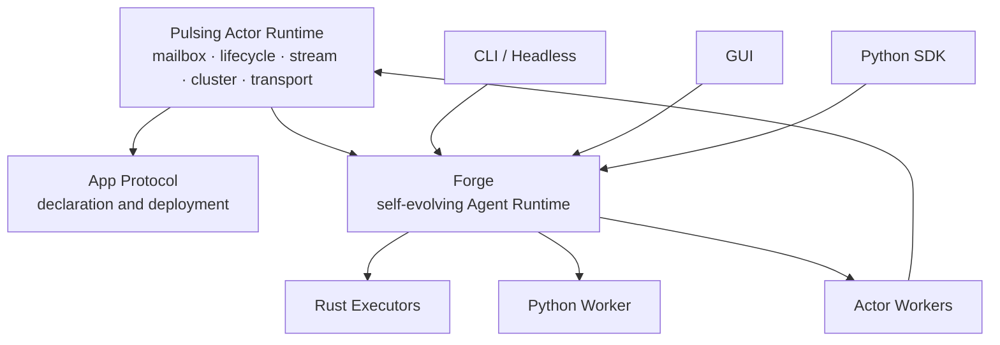
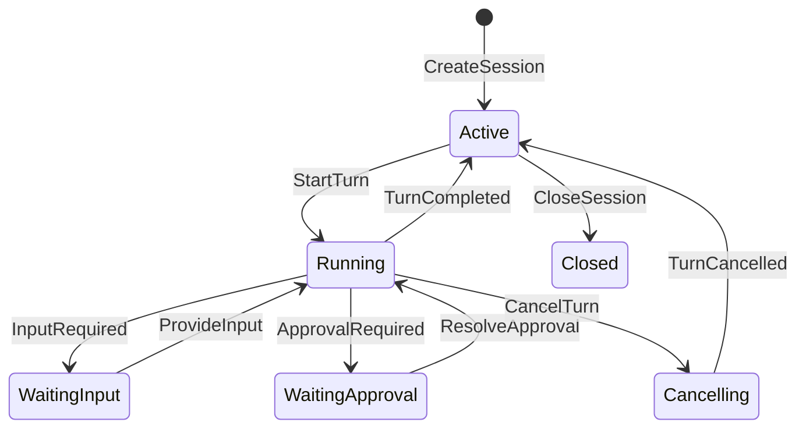
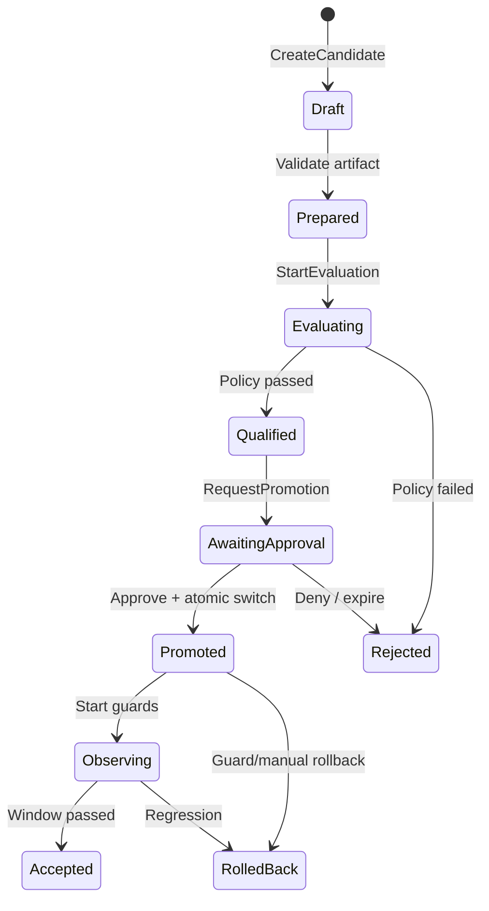

# Forge Core Architecture and Evolution Protocol

> **Status**: Accepted Target Architecture
>
> **Version**: 1.0 (2026-07-26)
>
> **Authority**: This document defines Forge's target product boundary, domain model, and protocols. It supersedes conflicting target-state statements in older Forge, Craft, Agent, and GUI design documents.
> **Implementation status**: Target design. Capability claims must continue to follow code and tests.

Normative terms are **MUST**, **SHOULD**, and **MAY**.

---

## 1. Decision

Pulsing has one infrastructure core: the **Actor Runtime**. Forge, the App Protocol, GUI, CLI, and Python SDK are built above it.



Decisions:

1. The Actor Runtime is the only infrastructure core and knows nothing about Forge, LLMs, workspaces, or UI.
2. The App Protocol compiles high-level declarations into Actor Runtime operations; it is not a second actor model.
3. Forge owns persistent sessions, the agent loop, events, governed tool execution, workspace versions, evaluation, promotion, and rollback.
4. Rust Forge is the control plane and normative implementation. Python is an SDK, adapter ecosystem, and governed execution backend.
5. GUI, CLI, Python SDK, and remote integrations are clients of one Forge API.
6. Forge is local-first and uses Actors at process, resource, or failure-domain boundaries—not for every internal object.

### 1.1 Implementation progress

As of 2026-07-26, the first local vertical slice is implemented:

| Capability | Status |
|------------|--------|
| Rust IDs and versioned Command/Event types | Initial implementation |
| Session/Turn reducer, one active Turn, contiguous sequence | Implemented |
| Command idempotency, in-memory EventStore, replay/subscription | Implemented |
| Persistent `ForgeAgent` conversation state | Connected to local Sessions |
| `LocalForgeClient` | Implemented |
| CLI reuses one Forge Session | Migrated |
| GUI routes by Session and sends `CancelTurn` | Initial migration |
| Turn-owned cancellation, Tool/Model resource tracking, shell/UnifiedExec/PTY process-tree cleanup | Initial implementation |
| File EventStore and restart recovery | Not implemented |
| Python `ForgeClient` and default `ForgeAgent` client projection | Initial implementation |
| Python Tool/Provider worker protocol | Not implemented |
| Evolution lifecycle | Not implemented |

This table reports implementation progress; it does not weaken the invariants below.

---

## 2. Product boundaries

### Actor Runtime

The Actor Runtime owns identity, mailbox, lifecycle, supervision, ask/tell/stream, backpressure, spawn, resolve, placement, membership, failure detection, transport, and observability.

It MUST NOT depend on Forge types, LLM providers, clients, or `.pulsing` workspace semantics.

### App Protocol

The App Protocol validates versioned `ApplicationSpec` / `ActorSpec` declarations and translates them to spawn, resolve, route, and expose operations.

It MUST NOT reimplement mailboxes, registries, placement, or cluster scheduling. Public terminology SHOULD use `App Protocol`, `ApplicationSpec`, or `ServiceSpec` to avoid confusion with the Actor Runtime.

### Forge

Forge owns:

- persistent `Session`, `Turn`, and agent-loop state;
- model orchestration contracts without binding to one provider;
- tool registry, capabilities, approval, sandbox, and execution;
- workspace revisions, immutable candidates, and audit events;
- evaluation, promotion, observation, and rollback;
- common semantics across local, Python, and Actor workers.

Forge MUST NOT use UI state as execution state, require a cluster for local use, or call unmeasured mutation “evolution.”

### Dependency rule

Allowed:

```text
client → forge → actor-runtime
app-protocol → actor-runtime
python-sdk → forge binding
python-worker → language-neutral Forge protocol
```

Forbidden:

```text
actor-runtime → forge
forge-core → gui or concrete CLI
Python-only object → control-plane source of truth
GUI state → execution ownership
```

---

## 3. Domain model

IDs are opaque and never reused.

| Entity | Purpose | Invariant |
|--------|---------|-----------|
| `Session` | Durable agent context | Own event sequence and policy snapshot |
| `Turn` | One goal-to-result execution | Belongs to one Session; one active Turn by default |
| `Event` | An observed fact | Append-only; monotonic Session sequence |
| `ToolCall` | Governed tool execution | Capability plus terminal result |
| `WorkspaceRevision` | Verifiable workspace state | Complete hash manifest or content address |
| `Candidate` | Immutable proposed change | Baseline, artifact, target, and policy |
| `EvaluationRun` | One controlled candidate evaluation | Auditable inputs, environment, and output |
| `EvaluationReport` | Aggregated verdict | Immutable evidence and thresholds |
| `Promotion` | Activation of a qualified candidate | Policy and approval constrained |
| `Rollback` | Restore a known-safe active version | Adds history; never rewrites it |
| `ClientCursor` | Projection position | Never controls execution |

Commands and events carry applicable `session_id`, `turn_id`, `candidate_id`, `command_id`, `correlation_id`, and `causation_id`. `command_id` is the idempotency key.

---

## 4. Versioned Session protocol



Session and Turn state are separate. Client disconnect, GUI navigation, or loss of a subscriber MUST NOT change execution state.

Required commands:

- `CreateSession`
- `StartTurn`
- `CancelTurn`
- `ProvideInput`
- `ResolveApproval`
- `UpdateSessionPolicy`
- `CloseSession`
- `GetSessionSnapshot`
- `SubscribeEvents`

State-changing commands use a versioned envelope:

```json
{
  "protocol": "forge.session",
  "version": {"major": 1, "minor": 0},
  "command_id": "opaque",
  "session_id": "opaque",
  "expected_seq": 42,
  "payload": {}
}
```

Session invariants:

1. A Session has at most one active Turn by default.
2. Retrying a `command_id` returns an equivalent result without repeating side effects.
3. `TurnStarted` is durable before model or tool side effects begin.
4. Tool intent is durable before dispatch; every call receives a terminal event.
5. `CancelTurn` is a request. Only `TurnCancelled` means execution has stopped.
6. A backend that cannot stop immediately remains `cancellation_pending`.
7. Recovery uses snapshot plus events, never client memory.

---

## 5. Versioned Event protocol

```json
{
  "protocol": "forge.event",
  "version": {"major": 1, "minor": 0},
  "event_id": "opaque",
  "session_id": "opaque",
  "seq": 43,
  "occurred_at": "RFC3339",
  "kind": "tool.completed",
  "turn_id": "opaque",
  "correlation_id": "opaque",
  "causation_id": "opaque",
  "payload": {},
  "redaction": {"class": "public"}
}
```

Guarantees:

- `seq` is strictly monotonic within one Session.
- There is no global cross-Session order.
- Subscriptions are at-least-once; clients deduplicate by `event_id` or `(session_id, seq)`.
- `SubscribeEvents(after_seq=N)` replays and then follows events with `seq > N`.
- Events become visible only after persistence.
- A sequence gap triggers replay, not inferred state.

Minimum event domains:

| Domain | Required events |
|--------|-----------------|
| Session | created, policy_updated, closed |
| Turn | started, output_delta, completed, failed, cancel_requested, cancelled |
| Model | requested, completed, failed, usage_recorded |
| Tool | requested, approval_required, started, output_delta, completed, failed, cancelled |
| Workspace | revision_created, restored |
| Evolution | candidate.created/prepared/qualified/rejected/promoted/rolled_back, evaluation.started/completed, promotion.requested |

Compatibility:

- A major change is breaking and unsupported majors are rejected.
- A minor change only adds optional fields or event kinds.
- Clients ignore unknown optional fields.
- Projection clients preserve and advance past unknown events.
- Command handlers never silently ignore unknown commands.
- Persisted history is not rewritten in place.

Events MUST NOT store plaintext secrets or unrestricted credentials. Large or binary values go to the artifact store; events carry hashes and controlled references.

---

## 6. Evolution protocol

A change is evolution only when it has:

1. an explicit baseline;
2. an immutable candidate;
3. a predeclared evaluation suite;
4. a policy comparison against the baseline;
5. independent approval and atomic promotion;
6. post-promotion observation and rollback.

Unmeasured modification is mutation, not evolution.

### Risk levels

| Level | Target | Default |
|-------|--------|---------|
| L0 | Prompt, Skill content, Workflow config | Automatic evaluation; configurable promotion |
| L1 | Tool schema, provider parameters, routing | Regression evaluation; human approval |
| L2 | User workspace code and deployment config | Sandbox, tests, human approval |
| L3 | Forge or evaluator code | Independent controller and dual approval |

The first implementation MUST be L0-only. L3 requires a separate security review.

An immutable Candidate records its target, baseline, artifact hash, producer Session/Turn, declared goal, evaluation suite version, promotion policy version, risk level, and timestamp. Any content change creates a new Candidate ID.

---

## 7. Candidate lifecycle



Transitions occur only through commands and durable events.

Every EvaluationRun records immutable candidate and baseline references, suite/runner versions, dependency lock, sandbox profile, dataset, seed, resource budget, raw artifact, metrics, thresholds, and verdict.

Candidate and baseline SHOULD run in equivalent environments. Non-reproducible external judgments are labeled and cannot independently trigger automatic promotion unless policy explicitly allows it.

A Promotion policy is frozen before evaluation and defines hard gates, minimum baseline improvement, allowed regressions, cost/latency/security limits, run count, aggregation, automatic-promotion permission, approvers, observation window, and rollback guards.

Promotion MUST:

1. verify Qualified state, approval, policy, artifact hash, and current baseline;
2. switch the active reference atomically;
3. retain the old active version as rollback target;
4. enter an observation phase;
5. never overwrite an artifact.

Rollback is a new audited operation. It restores and verifies a complete known-safe state, cancels or isolates affected executions, records its cause, and enters an explicit degraded state if restoration fails.

The Evolution Controller, policy, artifact verifier, and rollback implementation MUST be outside the Candidate's mutation boundary. A Forge process being replaced cannot certify its own replacement.

---

## 8. Rust control plane and Python execution plane

Rust owns:

- Session/Turn reducers;
- command idempotency and optimistic concurrency;
- event ordering and persistence interfaces;
- tool registry and capability gate;
- sandbox policy contract;
- workspace manifest and hash verification;
- Candidate/Evaluation/Promotion reducers;
- cancellation ownership.

Python owns:

- SDK bindings;
- model-provider adapters;
- governed Python-tool adapters;
- evaluator and dataset adapters;
- framework integrations;
- user extensions.

Python MUST change state through Forge commands and MUST NOT become the Session or Event source of truth.

Rust types are the normative implementation, but schemas are language-neutral. PyO3, direct calls, and Actor RPC may use different encodings while preserving command, event, cancellation, and error semantics.

Production Python providers and tools SHOULD run behind cancellable worker boundaries. Workers handshake protocol versions and capabilities, accept deadlines and cancellation, never write the Session store, return large values through artifacts, and produce terminal events when they crash.

---

## 9. Unified clients

Every client uses the same logical API:

```text
ForgeClient
  create_session(...)
  start_turn(session_id, input, command_id)
  cancel_turn(session_id, turn_id, command_id)
  provide_input(...)
  resolve_approval(...)
  get_snapshot(session_id)
  subscribe(session_id, after_seq)
```

Implementations:

- `LocalForgeClient`: typed in-process Rust service;
- `ActorForgeClient`: Pulsing ask/tell/stream;
- `RemoteForgeClient`: future authenticated network transport.

All implementations pass the same contract suite.

GUI is a projection plus command sender. It does not spawn detached agent owners, treat a receiver as ownership, route events by the active tab, or report stopped before `TurnCancelled`.

CLI creates or attaches to Sessions. Terminal exit explicitly chooses detach, cancel, or wait.

Python SDK no longer owns a stateful `HybridForgeRuntime`; it drives Rust Forge through `ForgeClient` and registers Python execution adapters.

In the current implementation, `pulsing.forge.ForgeAgent` is that client projection: Rust owns Session, Turn, the agent loop, tool runtime, event sequencing, and cancellation. The former Python loop remains only as the explicit `LegacyPythonForgeAgent` compatibility entry point, while `HybridForgeRuntime` is a transitional mixed-tool adapter. Default entry points and new code MUST NOT select either implicitly. The Python Tool/Provider worker protocol remains Phase 3 work.

---

## 10. Deployment, persistence, and security

Forge is local by default:

```text
GUI/CLI/Python → Local Forge control plane → Rust executor / Python worker
```

Isolation or distribution uses Actor boundaries:

```text
Forge control plane → Actor Runtime → ToolExecutorActor / EvaluatorActor / ProviderActor
```

Only components needing a separate lifecycle, failure domain, or remote resource become Actors.

Forge depends on `EventStore`, `SnapshotStore`, `ArtifactStore`, `WorkspaceRevisionStore`, and `ActiveVersionStore`. A local-file implementation is acceptable only with atomic writes, path confinement, hash verification, and crash recovery.

Every ToolCall and evolution action binds a capability decision to subject, resource scope, argument digest, Session/Turn, expiry, and decision source. Python fallback cannot bypass the Rust capability gate.

Recovery loads a snapshot, replays events, marks unterminated external calls unknown, reconciles supported executors, and never silently retries non-idempotent effects.

---

## 11. Errors and cancellation

Structured errors contain `code`, `message`, `retryable`, `origin`, related IDs, and details.

Categories include validation, conflict, unsupported_version, permission_denied, sandbox_violation, deadline_exceeded, cancelled, worker_lost, provider_error, storage_error, and internal.

Only explicitly idempotent operations are automatically retried. Model requests, shell commands, and external writes are not silently retried by default.

Cancellation propagates through model requests, tools, Python workers, Actor workers, and subprocesses. Resources that cannot be confirmed stopped remain cancelling or unknown.

---

## 12. Migration

### Phase 0 — Freeze boundaries

- Make this document the target-state authority.
- Label existing Forge docs as the current tool runtime.
- Stop defining independent Session semantics in Craft, Agent, and GUI docs.
- Add protocol compatibility tests.

### Phase 1 — Rust Session and Event

- Implement Session/Turn reducers and versioned envelopes.
- Add local EventStore, snapshot, and replay.
- Preserve state across prompts.
- Implement real cancellation ownership. (Initial local process and in-process future ownership is complete; Python and Actor workers remain.)

### Phase 2 — Unified clients

- Move CLI and GUI to `ForgeClient`.
- Expose the client through Python.
- Remove GUI detached workers and global event receivers.

### Phase 3 — Python execution adapters

- Move Hybrid routing decisions into the Rust registry.
- Run Python-only tools/providers through workers.
- Move duplicate Agent loop, permission, and sandbox state into Forge.
- Reduce `pulsing.agent` to compatibility APIs or a reference application.

### Phase 4 — L0 evolution

- Implement Candidate, Evaluation, Promotion, and stores.
- Support Prompt/Skill/Workflow only.
- Require fixed suites, auditable evidence, atomic active pointers, and complete rollback.

### Phase 5 — Code evolution

- Add L1/L2 after hermetic evaluation and observation guards.
- Require a separate design review before L3 self-hosting.

---

## 13. Acceptance criteria

Session/Event:

- Replaying a command does not duplicate a Turn or Tool side effect.
- A client can disconnect at any event and recover without state loss.
- Stop tests detect surviving subprocesses.
- Rust, Python, GUI, and CLI pass one protocol contract suite.

Evolution:

- Candidate content changes create new IDs.
- Evaluation policy cannot change after a run starts.
- Environment drift between baseline and candidate is detected.
- Failed atomic promotion leaves the active version unchanged.
- Rollback restores complete hash-verified state.
- Candidate code cannot modify the Controller, policy, or verifier.
- L0 automatic promotion is fully replayable and auditable.

Language boundary:

- Disabling Python fallback does not change Rust-tool semantics.
- Python-worker failure produces a terminal event.
- Unsupported majors are rejected.
- Unknown minor events do not crash clients.

---

## 14. Non-goals and open ADRs

Non-goals:

- automatic self-modification of Forge code in the first release;
- mandatory clustering;
- GUI layout in the core protocol;
- global event ordering;
- exactly-once external effects;
- Python-memory control state;
- calling overlay copy a complete rollback.

Open ADRs:

1. EventStore format and compaction;
2. ArtifactStore addressing;
3. explicit parallel Turns;
4. provider streaming and usage accounting;
5. statistical evaluation method;
6. default L0 auto-promotion policy;
7. ActorForgeClient leases and recovery;
8. independent trust root for L3 self-hosting.
