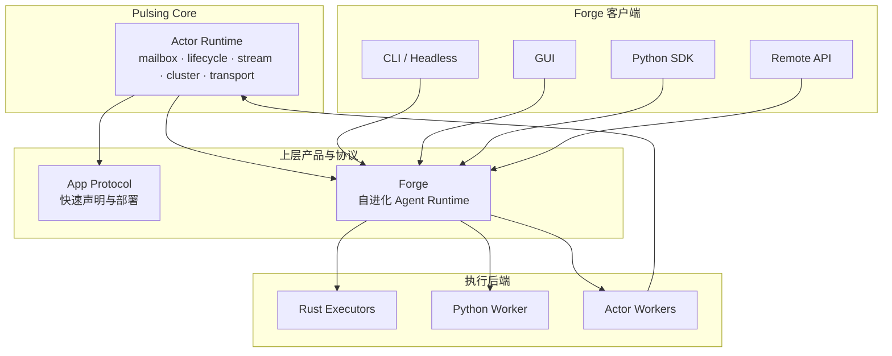
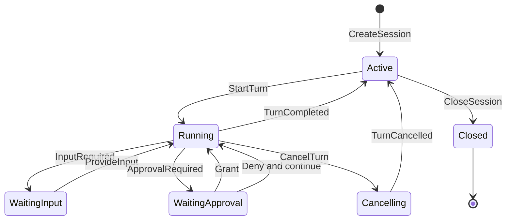
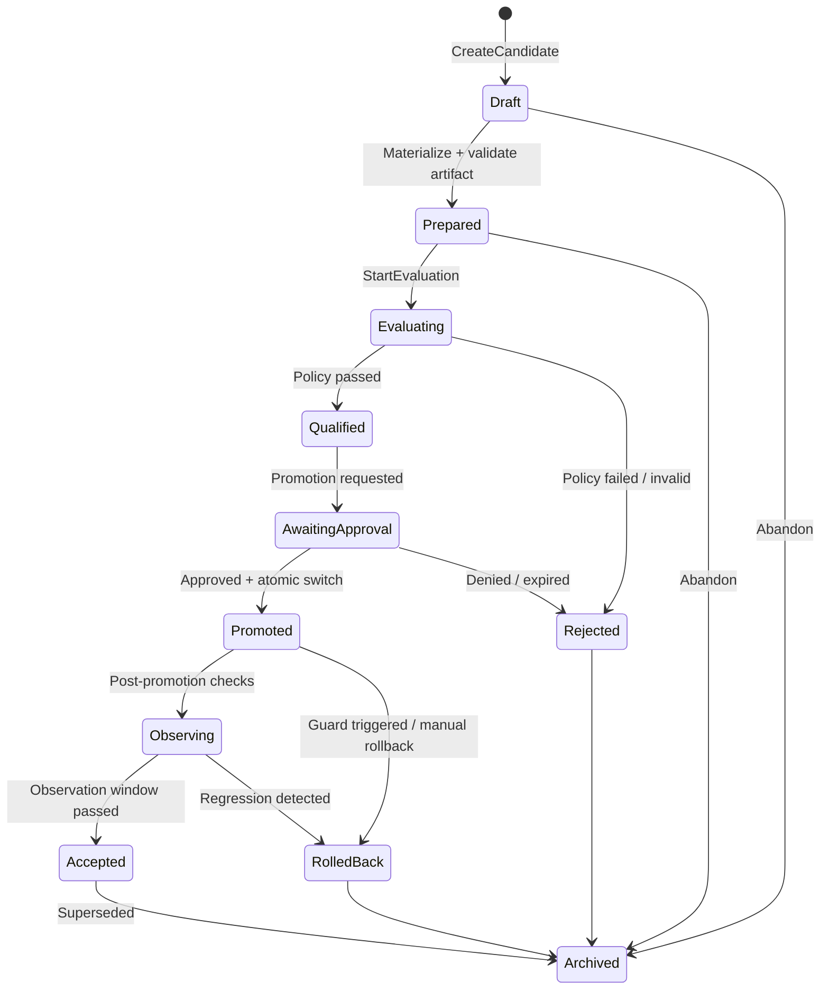

# Forge 核心架构与演化协议

> **状态**：Accepted Target Architecture
>
> **版本**：1.0（2026-07-26）
>
> **规范源**：本文件定义 Forge 的目标产品边界、领域模型和协议。与旧 Forge、Craft、Agent、GUI 文档冲突时，以本文件为准。
> **实现状态**：目标设计，不能据此宣称功能已经落地；公开能力仍以代码和测试为准。

本文使用以下规范词：

- **必须（MUST）**：违反即破坏协议或产品边界。
- **应该（SHOULD）**：默认遵循；偏离时必须记录理由。
- **可以（MAY）**：兼容协议的可选实现。

---

## 1. 决策摘要

Pulsing 只有一个核心：**Actor Runtime**。Forge、应用协议、GUI、CLI 和 Python SDK 都建立在它之上。



核心决策：

1. **Actor Runtime 是唯一基础设施核心**，不知道 Forge、LLM、GUI 或工作区。
2. **App Protocol 是快捷部署协议**，把高级应用声明编译为 Actor Runtime 操作，不形成第二套 Actor 模型。
3. **Forge 是自进化 Agent Runtime**，拥有会话、Agent loop、事件、工具治理、工作区版本、评估与晋升语义。
4. **Rust Forge 是控制面和规范实现**；Python 是 SDK、Provider/Tool 适配器和受控执行后端。
5. **GUI、CLI、Python SDK 是同一 Forge API 的客户端**，不得各自拥有另一套 Agent 状态机。
6. **本地优先、按边界 Actor 化**；不是每个 Forge 内部对象都必须成为 Actor。

### 1.1 实现进度

截至 2026-07-26，第一条本地垂直链路已经落地：

| 能力 | 状态 |
|------|------|
| Rust `SessionId` / `TurnId` / `CommandId` 与版本化 Command/Event | 已实现初版 |
| Session/Turn reducer、单活跃 Turn、连续事件序号 | 已实现 |
| `command_id` 幂等、in-memory EventStore、replay/subscription | 已实现 |
| 持久 `ForgeAgent` 对话状态 | 已接入本地 Session |
| `LocalForgeClient` | 已实现 |
| CLI 复用同一个 Forge Session | 已迁移 |
| GUI 按 Session 路由事件并通过 `CancelTurn` 停止 | 已迁移首版 |
| Turn 级取消所有权、Tool/Model 资源登记、shell/UnifiedExec/PTY 进程树回收 | 已实现首版 |
| 文件 EventStore、snapshot/restart recovery | 未实现 |
| Python `ForgeClient` + 默认 `ForgeAgent` 客户端投影 | 已实现初版 |
| Python Tool/Provider worker protocol | 未实现 |
| Candidate/Evaluation/Promotion/Rollback | 未实现 |

该表只描述实现进度，不降低本文其余不变量。

---

## 2. 产品边界与依赖规则

### 2.1 Actor Runtime

Actor Runtime 负责：

- Actor 身份、邮箱、生命周期和 supervision；
- `ask`、`tell`、stream 与背压；
- spawn、resolve、placement、集群成员和故障检测；
- Message/Tensor 传输；
- 可观测性和 Rust/Python 绑定。

Actor Runtime **不得**依赖：

- Forge Session、Tool 或 Evolution 类型；
- LLM Provider；
- GUI/CLI；
- `.pulsing` 工作区产品语义。

### 2.2 App Protocol

App Protocol 负责把用户声明转换为版本化 `ApplicationSpec` / `ActorSpec`：

```text
decorator / YAML / CLI
  → validate ApplicationSpec
  → derive ActorSpec + routes + resources
  → spawn / resolve / expose
```

App Protocol **不得**重新实现 mailbox、registry、placement 或 cluster scheduler。对外命名应该使用 `App Protocol`、`ApplicationSpec` 或 `ServiceSpec`，避免与底层 Actor Runtime 混淆。

### 2.3 Forge

Forge 负责：

- 持久 `Session`、`Turn` 和 Agent loop；
- 模型调用的编排协议，但不强绑定某家 Provider；
- Tool registry、capability、审批、sandbox 和执行；
- 工作区 revision、candidate artifact 和审计事件；
- Evaluation、Promotion、Observation 和 Rollback；
- 本地、Python worker 与 Actor worker 的统一执行语义。

Forge **不得**把 UI 状态作为执行状态，不得要求集群才能本地运行，也不得把未经评估的“自动修改”称为“演化”。

### 2.4 依赖方向

允许：

```text
client → forge → actor-runtime
app-protocol → actor-runtime
python-sdk → forge binding
python-worker → language-neutral Forge protocol
```

禁止：

```text
actor-runtime → forge
forge-core → gui
forge-core → concrete CLI
rust control state → Python-only source of truth
gui state → execution ownership
```

---

## 3. Forge 领域模型

所有 ID 都是不可复用的 opaque identifier。调用方不得从字符串格式推导语义。

| 对象 | 作用 | 不变量 |
|------|------|--------|
| `Session` | 持久 Agent 工作上下文 | 独立事件序列和策略快照 |
| `Turn` | 一次用户目标到最终结果的执行 | 属于一个 Session；默认同 Session 单活跃 Turn |
| `Event` | 已发生事实 | append-only；Session 内单调序号 |
| `ToolCall` | 一次受治理的工具调用 | 有 capability、输入摘要、结果或终止原因 |
| `WorkspaceRevision` | 可验证的工作区状态 | 内容寻址或包含完整 hash manifest |
| `Candidate` | 待评估的不可变变更提案 | 指向 baseline、artifact 和 evolution target |
| `EvaluationRun` | Candidate 在固定条件下的一次评估 | 输入、环境、结果可审计 |
| `EvaluationReport` | 多个评估运行的归并结论 | 不可变；包含通过条件和证据 |
| `Promotion` | 将 Qualified Candidate 设为活动版本 | 受 policy 和 approval 约束 |
| `Rollback` | 从已晋升版本恢复到已知安全版本 | 产生新事件，不改写历史 |
| `ClientCursor` | 客户端的消费位置 | 只影响投影，不影响执行状态 |

### 3.1 标识与关联

每个命令和事件必须携带以下关联字段中的适用部分：

```text
session_id
turn_id
candidate_id
command_id
correlation_id
causation_id
```

`command_id` 是幂等键；`correlation_id` 串起一次用户操作；`causation_id` 指向直接导致当前事件的命令或事件。

---

## 4. 版本化 Session 协议

### 4.1 Session 状态



Session 状态与 Turn 状态必须分开存储。客户端断开、GUI 切换页面或订阅者消失不得改变这两个状态。

### 4.2 命令

协议至少定义：

| 命令 | 语义 |
|------|------|
| `CreateSession` | 创建 Session，并冻结初始 policy/provider/workspace 引用 |
| `StartTurn` | 在 Session 中开始一个 Turn |
| `CancelTurn` | 请求取消指定 Turn |
| `ProvideInput` | 响应结构化用户输入请求 |
| `ResolveApproval` | 批准或拒绝 capability 请求 |
| `UpdateSessionPolicy` | 对后续操作更新策略；不能追溯修改历史 |
| `CloseSession` | 不再接受新 Turn；按策略取消或等待当前 Turn |
| `GetSessionSnapshot` | 获取当前投影和最后事件序号 |
| `SubscribeEvents` | 从指定 `after_seq` 订阅事件 |

所有改变状态的命令必须包含：

```json
{
  "protocol": "forge.session",
  "version": {"major": 1, "minor": 0},
  "command_id": "opaque",
  "session_id": "opaque",
  "expected_seq": 42,
  "payload": {}
}
```

`expected_seq` 用于乐观并发控制；不需要强一致检查的幂等命令可以省略。

### 4.3 Session 不变量

1. 默认每个 Session 最多一个 Running/Waiting/Cancelling Turn。
2. 同一 `command_id` 重试必须返回等价结果，不能重复产生副作用。
3. `StartTurn` 被接受后必须先持久化 `TurnStarted`，再发起模型或工具副作用。
4. 工具调用必须先记录 intent，再 dispatch；完成、失败和取消都必须有终止事件。
5. `CancelTurn` 是请求，不是假定完成；只有 `TurnCancelled` 才表示执行已停止。
6. 无法立即终止的后端必须标记 `cancellation_pending`，禁止向客户端报告已停止。
7. Session 恢复必须从 snapshot + events 重建，不能依赖 GUI/CLI 内存。

---

## 5. 版本化 Event 协议

### 5.1 Event envelope

```json
{
  "protocol": "forge.event",
  "version": {"major": 1, "minor": 0},
  "event_id": "opaque",
  "session_id": "opaque",
  "seq": 43,
  "occurred_at": "RFC3339",
  "kind": "tool.completed",
  "turn_id": "opaque",
  "correlation_id": "opaque",
  "causation_id": "opaque",
  "payload": {},
  "redaction": {"class": "public"}
}
```

### 5.2 顺序与投递保证

- Forge 保证 **单 Session 内** `seq` 严格单调且无重复。
- Forge 不保证跨 Session 全局顺序。
- 订阅采用 **at-least-once delivery**；客户端必须按 `event_id` 或 `(session_id, seq)` 去重。
- `SubscribeEvents(after_seq=N)` 返回 `seq > N` 的历史和实时事件。
- 事件持久化后才能对订阅者可见。
- 客户端发现序号缺口时必须重新读取，不得自行猜测缺失状态。

### 5.3 最小事件集合

| 域 | 事件 |
|----|------|
| Session | `session.created`, `session.policy_updated`, `session.closed` |
| Turn | `turn.started`, `turn.output_delta`, `turn.completed`, `turn.failed`, `turn.cancel_requested`, `turn.cancelled` |
| Model | `model.requested`, `model.completed`, `model.failed`, `model.usage_recorded` |
| Tool | `tool.requested`, `tool.approval_required`, `tool.started`, `tool.output_delta`, `tool.completed`, `tool.failed`, `tool.cancelled` |
| Workspace | `workspace.revision_created`, `workspace.restored` |
| Evolution | `candidate.created`, `candidate.prepared`, `evaluation.started`, `evaluation.completed`, `candidate.qualified`, `candidate.rejected`, `promotion.requested`, `candidate.promoted`, `candidate.rolled_back` |

### 5.4 兼容性

- `major` 变化表示破坏兼容；不支持时必须明确拒绝。
- `minor` 变化只能增加 optional field 或新 event kind。
- 客户端必须忽略未知 optional field。
- 投影客户端可以忽略未知 event kind，但必须推进 cursor 并保留原始 envelope。
- 命令处理器不得静默忽略未知命令。
- 持久事件不得原地迁移；升级通过新 projector 或显式 migration event 完成。

### 5.5 敏感数据

事件默认不得保存明文 secret、完整环境变量或未经限制的模型凭据。大输出和二进制内容应进入 artifact store，事件只记录 hash、size、media type 和受控引用。

---

## 6. Evolution 协议

### 6.1 什么是演化

只有满足以下条件的变更才称为 Evolution：

1. 有明确 baseline；
2. 产生不可变 candidate；
3. 在预先声明的 evaluation suite 上运行；
4. 根据 promotion policy 比较 candidate 与 baseline；
5. 有独立的批准和原子晋升；
6. 晋升后持续观察并可以回滚。

不经过评估的代码、Prompt 或 Tool 修改只是 mutation，不是 evolution。

### 6.2 Evolution target 风险级别

| 级别 | Target | 默认策略 |
|------|--------|----------|
| L0 | Prompt、Skill 内容、Workflow 配置 | 可自动评估；满足 policy 后可配置自动晋升 |
| L1 | Tool schema、Provider 参数、路由策略 | 需要回归评估；默认人工批准 |
| L2 | 用户工作区代码、依赖和部署配置 | 必须 sandbox + 测试；人工批准 |
| L3 | Forge 或评估器自身代码 | 独立控制器、双重批准、禁止直接原地替换 |

第一阶段必须只支持 L0。L2 稳定后才可以设计 L3 self-hosting。

### 6.3 Candidate

Candidate 创建后必须不可变，至少包含：

```text
candidate_id
target_kind
target_ref
baseline_ref
artifact_ref + content_hash
producer_session_id + producer_turn_id
declared_goal
evaluation_suite_ref + version
promotion_policy_ref + version
risk_level
created_at
```

任何内容变化都必须产生新 `candidate_id`，不能覆盖旧 Candidate。

---

## 7. Candidate → Evaluation → Promotion → Rollback

### 7.1 状态机



状态只能通过命令和持久事件转换。状态字段不能被客户端直接修改。

### 7.2 Evaluation

每次 EvaluationRun 必须记录：

- candidate 与 baseline 的不可变引用；
- suite 名称、版本和 hash；
- runner 版本、依赖锁和 sandbox profile；
- 输入数据集或样本版本；
- 随机种子；
- wall time、成本和资源上限；
- 原始结果 artifact；
- 指标、阈值和最终 verdict。

Candidate 与 baseline 应该在等价环境运行。无法重现的外部评价必须标记 `non_reproducible`，promotion policy 可以禁止其单独触发自动晋升。

### 7.3 Promotion policy

Policy 必须在 Evaluation 开始前冻结，至少定义：

- 必须通过的 hard gates；
- 相对 baseline 的最低提升；
- 允许退化的指标和最大幅度；
- 最大成本、延迟和安全违规；
- 最少运行次数和统计聚合方式；
- 是否允许自动晋升；
- 所需批准角色；
- observation window 和 rollback guards。

评估完成后修改阈值不能让同一份报告变为通过；必须创建新的 Evaluation。

### 7.4 Promotion

Promotion 必须：

1. 验证 Candidate 为 `Qualified`；
2. 验证 approval、policy、artifact hash 和当前 baseline；
3. 使用 compare-and-swap 或等价原子操作切换活动引用；
4. 记录旧活动版本，作为 rollback target；
5. 发出 `candidate.promoted` 后进入 observation；
6. 不得直接覆盖 artifact。

### 7.5 Rollback

Rollback 是一次新的受审计操作，不删除 Promotion 历史。它必须：

- 指向明确的已知安全 revision；
- 验证恢复 artifact 的 hash；
- 恢复完整状态，而不是只覆盖旧文件；
- 取消或隔离仍在使用被回滚版本的执行；
- 记录触发原因、操作者和受影响 Session；
- 在恢复失败时进入显式 degraded state，不能报告成功。

### 7.6 信任边界

Evolution Controller、Evaluation policy、artifact verifier 和 rollback implementation 必须位于 Candidate 不能修改的信任边界。

L3 自修改必须通过独立 Forge Controller 或外部 supervisor 完成。正在被 Candidate 替换的 Forge 进程不能自行证明替换成功。

---

## 8. Rust 控制面与 Python 执行面

### 8.1 Rust 必须拥有

| 能力 | 原因 |
|------|------|
| Session/Turn 状态机 | 唯一执行语义 |
| Event envelope、排序、持久化接口 | 所有客户端一致 |
| Command 幂等和并发控制 | 防止重复副作用 |
| Tool registry 与 capability gate | 安全决策不能由 fallback 绕过 |
| Sandbox policy 解析和 enforcement contract | 跨语言同一策略 |
| Workspace revision manifest 和 hash 验证 | Promotion/Rollback 基础 |
| Candidate/Evaluation/Promotion 状态机 | 演化控制面 |
| Cancellation ownership | GUI/CLI 不得伪造停止 |

### 8.2 Python 可以拥有

| 能力 | 约束 |
|------|------|
| Python SDK | 只能通过 ForgeClient 命令和事件协议改变状态 |
| Model Provider adapter | 返回版本化响应；不得持有 Session 真相 |
| Python Tool adapter | 在声明 capability 和 sandbox profile 后注册 |
| 数据集/Evaluator adapter | 必须输出可审计 EvaluationRun |
| Framework integration | LangChain 等只做映射，不复制 Forge loop |
| 用户扩展 | 默认在 worker 进程；进程内仅用于显式开发模式 |

### 8.3 绑定协议

Rust 类型是规范实现，但协议 schema 必须语言中立。PyO3、本地 direct call 和 Actor RPC 可以使用不同编码，必须保持相同命令、事件和错误语义。

Python callback 抛出的异常必须转换成结构化 Forge error 和终止事件，不能穿过边界后让 Session 留在 Running。

### 8.4 Python worker

生产环境中的 Python Tool/Provider 应运行在可取消、可回收的 worker 边界。Worker 必须：

- 进行 protocol handshake；
- 声明支持的 major/minor 和 capabilities；
- 接受 deadline/cancellation；
- 不直接写 Session/Event store；
- 通过 artifact API 返回大结果；
- 崩溃后由 Forge 记录明确终止事件。

---

## 9. 统一客户端模型

GUI、CLI、Python SDK 和 Remote API 必须只依赖同一个逻辑接口：

```text
ForgeClient
  create_session(...)
  start_turn(session_id, input, command_id)
  cancel_turn(session_id, turn_id, command_id)
  provide_input(...)
  resolve_approval(...)
  get_snapshot(session_id)
  subscribe(session_id, after_seq)
```

实现可以是：

- `LocalForgeClient`：同进程调用 Rust service；
- `ActorForgeClient`：通过 Pulsing ask/tell/stream；
- `RemoteForgeClient`：未来的受认证网络接口。

三者必须通过同一 contract test。

### 9.1 GUI

GUI 是事件投影和命令发送器：

- 不创建 detached Agent worker；
- 不把 `event_rx` 当成任务所有权；
- 不因切换 tab 改变事件路由；
- Stop 必须发送 `CancelTurn`，并等待取消完成事件；
- 重启后通过 snapshot + `after_seq` 恢复；
- Session/Turn busy 状态来自 Forge 投影。

### 9.2 CLI

CLI 的交互模式和一次性模式都创建或附着 Forge Session。退出终端不等于取消；CLI 必须明确选择 detach、cancel 或 wait。

### 9.3 Python SDK

Python SDK 不再构造独立 `HybridForgeRuntime` 作为状态所有者。它通过 `ForgeClient` 操作 Rust Forge，并把 Python Provider/Tool 注册为执行适配器。

当前实现中，`pulsing.forge.ForgeAgent` 已经是上述客户端投影：Session、Turn、Agent loop、Tool runtime、事件序号与取消所有权都在 Rust。原 Python loop 仅以显式的 `LegacyPythonForgeAgent` 兼容入口保留，`HybridForgeRuntime` 仅作为待迁移的混合 Tool adapter；两者不得被默认入口或新代码隐式选择。Python Tool/Provider worker protocol 仍属于 Phase 3，不能把兼容入口的存在误记为该阶段已经完成。

---

## 10. 部署模型

Forge 默认本地运行，不要求集群：

```text
GUI/CLI/Python
  → Local Forge Control Plane
  → local Rust executor / Python worker
```

需要隔离或分布式时：

```text
Forge Control Plane
  → Actor Runtime
  → ToolExecutorActor / EvaluatorActor / ProviderActor
```

只有跨故障域、需要独立生命周期或需要远程资源的组件应该 Actor 化。领域值对象和控制面内部 reducer 保持普通 Rust 对象。

---

## 11. 持久化、安全与恢复

### 11.1 Stores

Forge 通过接口依赖以下 stores：

- `EventStore`
- `SnapshotStore`
- `ArtifactStore`
- `WorkspaceRevisionStore`
- `ActiveVersionStore`

首个实现可以是本地文件，但必须满足原子写、hash 校验、路径约束和崩溃恢复。GUI 目录或内存 channel 不是 store。

### 11.2 Capability

每个 ToolCall 和 Evolution action 必须绑定 capability。审批决定包含：

```text
subject
capability
resource scope
argument digest
session/turn
expiry
decision source
```

审批不能只按工具名无限复用。Python fallback 不得绕过 Rust capability gate。

### 11.3 恢复

进程重启后：

1. 加载最近 snapshot；
2. replay 后续事件；
3. 将没有终止事件的外部调用标记为 `unknown`；
4. 查询支持 reconciliation 的执行器；
5. 无法确认时安全失败，不自动重复非幂等操作。

---

## 12. 错误、重试与取消

统一错误至少包含：

```text
code
message
retryable
origin
session_id / turn_id / tool_call_id
details
```

错误类别包括 validation、conflict、unsupported_version、permission_denied、sandbox_violation、deadline_exceeded、cancelled、worker_lost、provider_error、storage_error 和 internal。

只有明确标记幂等或携带执行幂等键的操作可以自动重试。模型调用、shell 和外部写操作默认不得静默重试。

取消必须从 Session 传播到模型调用、tool call、Python worker、Actor worker 和子进程。不能终止的资源必须继续显示为 cancelling/unknown，直到 reconciliation 完成。

---

## 13. 迁移计划

### Phase 0：冻结边界

- 本文成为目标架构规范源；
- 旧 Forge 文档标记为 Current Tool Runtime；
- Craft/Agent/GUI 文档不再定义独立 Session 语义；
- 建立 protocol compatibility 测试目录。

### Phase 1：Rust Session + Event

- 在 `pulsing-forge` 实现 Session/Turn reducer；
- 实现版本化 Command/Event envelope；
- 本地 EventStore、snapshot、replay；
- ForgeAgent 不再每个 prompt 清空状态；
- 实现真实 cancellation ownership。（首版本地进程与 in-process future 已完成；Python/Actor worker 待后续阶段接入）

### Phase 2：统一客户端

- CLI 迁移到 `LocalForgeClient`；
- GUI 迁移到 snapshot/subscription；
- Python 暴露 `ForgeClient`；
- 删除 GUI detached worker 和全局 event receiver。

### Phase 3：Python 执行适配器

- 把 Hybrid routing 决策移入 Rust registry；
- Python-only Tool/Provider 使用 worker protocol；
- Agent 包中的 loop、permission、sandbox 状态迁入 Forge；
- `pulsing.agent` 收敛为兼容 API 或参考应用。

### Phase 4：L0 Evolution

- Candidate、Evaluation、Promotion stores；
- 只支持 Prompt/Skill/Workflow；
- 固定 suite、人工批准、原子 active pointer、完整 rollback；
- GUI 展示 Candidate 与评估证据，但不拥有状态。

### Phase 5：代码演化

- 支持 L1/L2；
- hermetic evaluator、资源预算和 observation guards；
- L3 必须另立安全设计评审，不自动继承 L2 能力。

---

## 14. 验收条件

### Session/Event

- 同一命令重放不会重复启动 Turn 或 Tool；
- GUI 在任意事件点断开后能够无损恢复；
- 同 Session 事件顺序稳定，跨 Session 不做虚假保证；
- Stop 后仍运行的子进程会被测试捕获；
- Rust、Python、GUI、CLI 通过同一协议 contract suite。

### Evolution

- Candidate 内容修改会得到新 ID；
- Evaluation policy 在运行开始后不可改变；
- baseline 与 candidate 的环境差异可被检测；
- promotion 原子失败时 active version 不改变；
- rollback 恢复完整状态并校验 hash；
- Candidate 无法修改 Controller、policy 或 verifier；
- L0 自动晋升可全程 replay 和审计。

### 语言边界

- 关闭 Python fallback 不影响 Rust 支持工具的语义；
- Python worker 崩溃会产生终止事件，Session 不会永久 Running；
- 不支持的 major version 被明确拒绝；
- 未知 minor event 不会导致 GUI/CLI 崩溃。

---

## 15. 非目标

- 第一阶段不实现 Forge 自身代码的自动自修改；
- 不要求所有 Forge 部署都使用集群；
- 不把 GUI 布局写入核心协议；
- 不保证跨 Session 全局事件顺序；
- 不承诺任意外部副作用 exactly-once；
- 不用 Python 内存对象作为持久控制状态；
- 不将工作区 overlay copy 称为完整 rollback。

---

## 16. 尚待 ADR 决定

以下问题不得由实现代码偶然决定：

1. EventStore 初始格式和 compaction 策略；
2. ArtifactStore 的本地与远程寻址格式；
3. Session 是否允许显式并行 Turn；
4. Model Provider 的流式协议和 usage 计费模型；
5. Evaluation 的统计比较方法；
6. L0 自动晋升的默认 policy；
7. ActorForgeClient 的命名、租约和故障恢复协议；
8. L3 self-hosting 的独立信任根。
