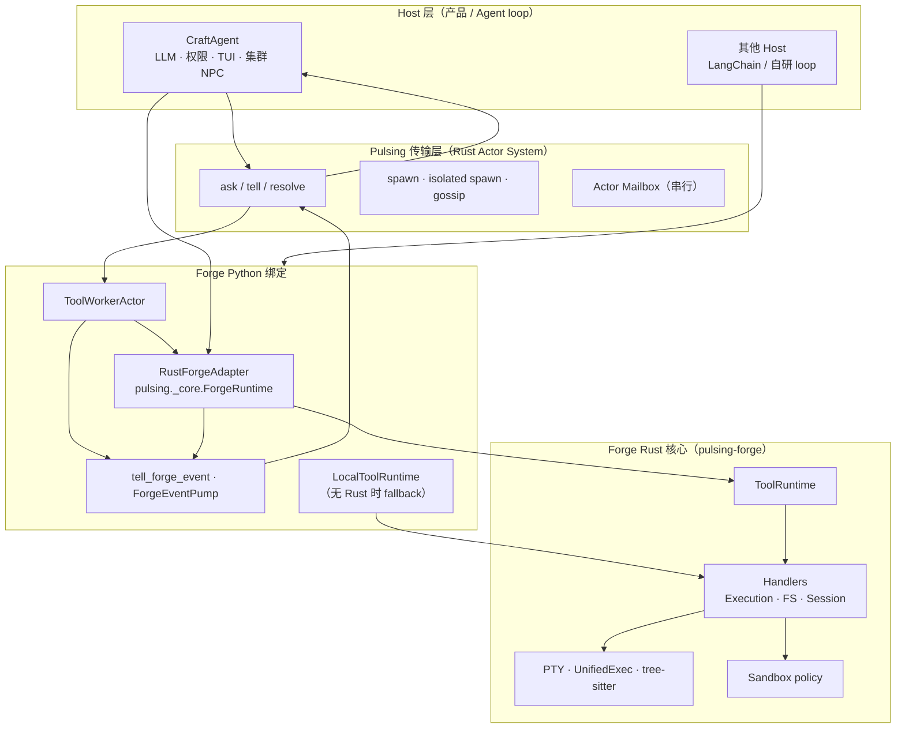
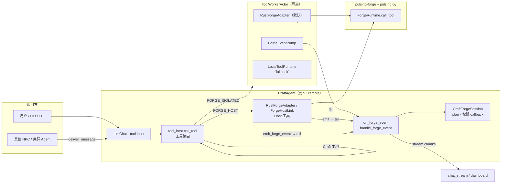
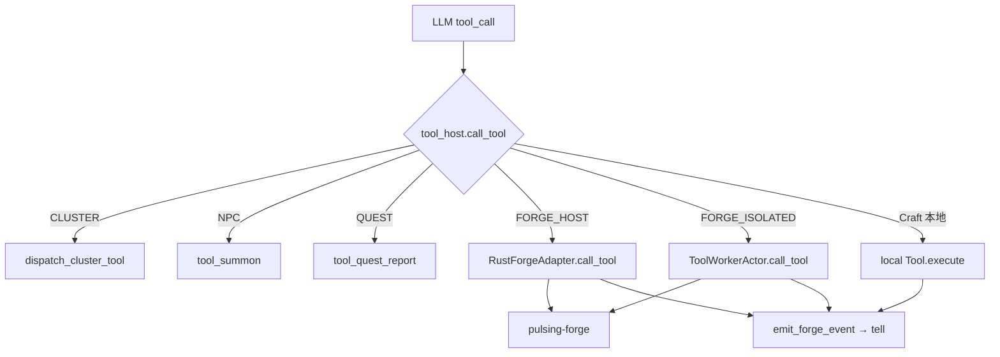
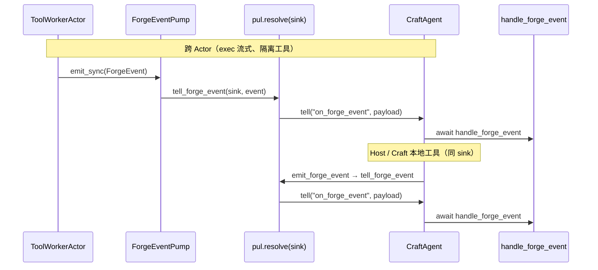
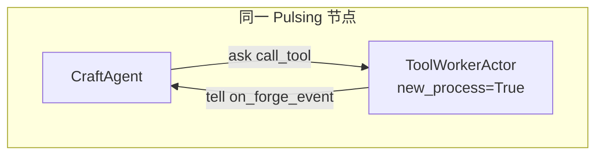
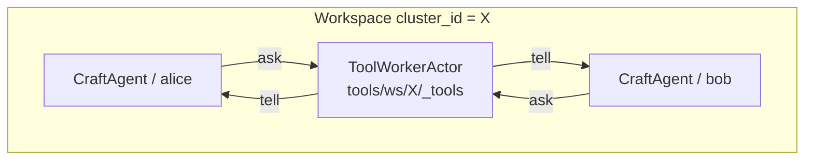
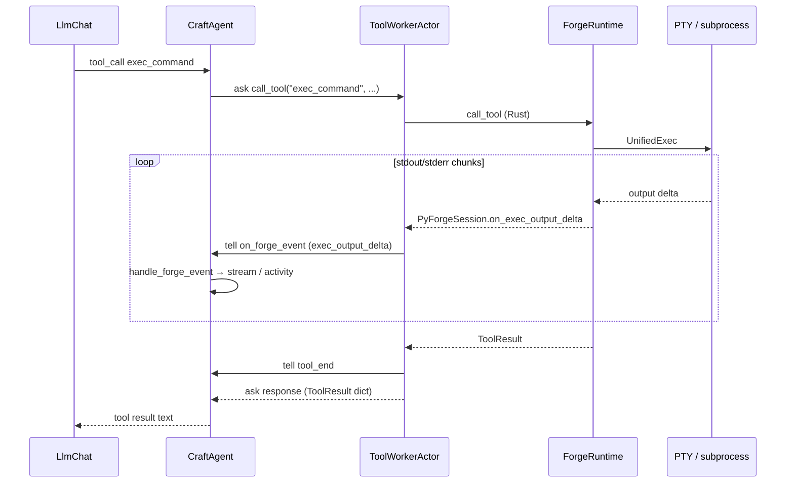

# Forge × Craft 一体化架构设计

> **状态**：历史实现 / 参考 Host 集成（2026-05）
> **读者**：架构 review、贡献者、Craft / Forge 集成开发
> **关联**：[engineering.md](./engineering.md) · [../../forge/index.md](../../forge/index.md) · [do../../forge/abstractions.md](../../forge/abstractions.md)
> **目标架构**：[Forge 核心架构](core-architecture.zh.md)。其中 Forge 拥有 Session、Agent loop 与 Evolution 语义，Craft/Agent 不再作为独立状态所有者。

---

## 1. 摘要

Pulsing Forge 提供 Agent **工具与环境运行时**；Craft 是消费 Forge 的 **Multi-Agent 参考应用**。当前架构目标：

1. **执行下沉 Rust**：工具 handler、PTY、tree-sitter bash、流式 exec 在 `pulsing-forge`；Python 仅薄绑定与 fallback。
2. **传输统一 Pulsing Actor**：RPC（`ask`/`tell`）、隔离 spawn、gossip 命名解析 — 整条链路在 Pulsing 体系内。
3. **事件统一 P2P tell**：Forge 生命周期与 exec 流式输出经 `tell("on_forge_event", …)` 投递，同进程与跨进程语义一致（替代进程内直调 `schedule_forge_event`）。

**设计原则**：Host 管 LLM / UI / 产品工具；Forge 管 sandbox 内执行；Pulsing 管消息与部署边界。

---

## 2. 生态分层



| 层 | 包 / Crate | 职责 | 不应包含 |
|----|------------|------|----------|
| **Pulsing** | `pulsing-actor`, `pulsing-py` | 分布式 Actor、mailbox、集群 | 工具实现、LLM |
| **Forge** | `pulsing-forge`, `pulsing.forge` | 工具执行、沙箱、ToolSession 协议 | LLM、对话 UI |
| **Craft** | `pulsing.craft` | NPC、Workspace、LLM 编排、产品向工具 | 重复实现 shell/patch |

---

## 3. 整体架构图



**命名约定（Workspace Agent）**：

- Agent gossip 名：`craft/ws/<workspace_id>/<short_name>`
- 事件 sink（`_event_sink_name`）：与 Agent 全名相同
- 共享工具 worker：`tools/ws/<workspace_id>/_tools`（可选）

---

## 4. 工具路由矩阵

Craft 将所有 LLM 暴露的工具按执行位置分为四类：

| 类别 | 工具名 | 执行位置 | 运行时 |
|------|--------|----------|--------|
| **Forge 隔离** | `Read`, `Glob`, `Grep`, `Edit`, `Write`, `Bash`, `shell_command`, `exec_command`, `write_stdin`, `apply_patch`, `view_image` | `ToolWorkerActor`（子进程 / 共享 worker） | `RustForgeAdapter` → `ForgeRuntime` |
| **Forge Host** | `update_plan`, `new_context`, `get_context_remaining`, `request_user_input` | CraftAgent 进程内 | `RustForgeAdapter` + `PyForgeSession` |
| **Craft 本地** | `FetchUrl`, `Summon`, `QuestReport`, … | CraftAgent 进程内 | Python `Tool.execute` |
| **集群** | `ListClusterAgents`, `MessageClusterAgent` | 跨 Agent RPC | `dispatch_cluster_tool` |

定义来源：`python/pulsing/forge/integrated.py`、`python/pulsing/craft/runtime/constants.py`。



---

## 5. 执行路径（Rust 优先）

### 5.1 Rust 栈

```
pulsing._core.ForgeRuntime          # PyO3，crates/pulsing-py/src/forge.rs
    └── pulsing_forge::ToolRuntime
            ├── handlers/           # execution, filesystem, session, plan
            ├── unified_exec/       # exec_command 会话 + 流式
            ├── pty_session/        # portable-pty
            └── patch/heredoc/      # tree-sitter bash
```

### 5.2 Python 适配

| 组件 | 文件 | 行为 |
|------|------|------|
| `RustForgeAdapter` | `python/pulsing/forge/rust_runtime.py` | 包装 `ForgeRuntime`；`event_callback` 转发为 `ForgeEvent` |
| `ToolWorkerActor` | `python/pulsing/forge/worker.py` | `on_start` 初始化 Rust；`call_tool` 优先 Rust |
| `ForgeHostLink` | `python/pulsing/forge/integrated.py` | 无 Rust 时的 Python Host fallback |
| `init_forge_host` | `python/pulsing/craft/agent/forge_runtime.py` | Craft 启动时挂 Host runtime |

### 5.3 Fallback 策略

```
if RUST_FORGE_AVAILABLE:
    使用 RustForgeAdapter
else:
    LocalToolRuntime + Python handlers（开发 / 未 maturin 构建）
```

构建要求：`uv run maturin develop` 安装含 `ForgeRuntime` 的 `pulsing._core`。

---

## 6. 事件架构（P2P tell）

Forge 不使用中心事件总线；所有通知走 **点对点 Actor tell**，绑定 Pulsing 语义。

### 6.1 事件信封

```python
@dataclass
class ForgeEvent:
    kind: str          # tool_begin | tool_end | exec_output_delta | plan_updated | ...
    payload: dict
    source: str | None # 通常为 tool 名
    ts: float
```

### 6.2 投递路径（统一）



**核心 API**（`python/pulsing/forge/p2p_transport.py`）：

```python
async def tell_forge_event(sink_name: str, event: ForgeEvent) -> None:
    proxy = await pul.resolve(sink_name)
    await proxy.as_any().tell("on_forge_event", event.to_dict())
```

**Host 侧 emit**（`python/pulsing/craft/agent/forge_events.py`）：

- `emit_forge_event` / `emit_forge_event_sync` → 内部调用 `tell_forge_event`
- `make_host_emit(agent)` → 供 Rust `PyForgeSession` 回调使用
- ~~`schedule_forge_event`~~ 已移除（进程内直调）

### 6.3 事件种类与消费

| kind | 来源 | Host 行为 |
|------|------|-----------|
| `tool_begin` / `tool_end` | Runtime 包装 | 记录 `_forge_events`；可选转发 TUI stream |
| `exec_output_delta` | UnifiedExec / PTY | 更新 activity；`forge_exec_delta` stream chunk |
| `plan_updated` | Session 工具 | 同步 `CraftForgeSession.plan` |
| `new_context` | Session 工具 | 置 `new_context_requested` |
| `user_input_request` | Session 工具 | 触发权限 / prompt callback |

### 6.4 Mailbox 串行性（Review 注意点）

CraftAgent mailbox **串行**：在 `call_tool` 处理完成前，tell 到自身的 `on_forge_event` 会排队。

| 场景 | 影响 |
|------|------|
| Worker → Host exec 流式 | ✅ 不同 Actor，实时 |
| Host 工具 `tool_begin/end` | ⚠️ 可能延迟到 call 结束 |
| Host 侧 exec（不应走 Host 路径） | N/A — exec 在隔离 worker |

若未来需要 Host 进程内实时 exec 流，可选方案：**独立 ForgeEventInbox Actor**（`{agent_name}/events`）。

---

## 7. 部署拓扑

### 7.1 单节点开发



### 7.2 Workspace 共享 Worker



配置：`NpcConfig.shared_tool_worker=True` → `resolve_shared_tool_worker(workspace_id)`。

### 7.3 多节点（Gossip）

- 命名 Actor 通过 SWIM/gossip 注册与解析
- `tell_forge_event` 与本地 `ask` 使用相同 `pul.resolve(name)` 路径
- 工具执行在 worker 所在节点；事件 tell 路由到 host 注册节点

---

## 8. 关键模块索引

| 模块 | 路径 | 说明 |
|------|------|------|
| Rust handlers | `crates/pulsing-forge/src/` | 工具实现 |
| PyO3 Forge | `crates/pulsing-py/src/forge.rs` | `ForgeRuntime` |
| Forge Python API | `python/pulsing/forge/` | 环境、worker、事件、Rust 适配 |
| Craft 工具路由 | `python/pulsing/craft/agent/tool_host.py` | `call_tool` 分发 |
| Craft Forge 集成 | `python/pulsing/craft/agent/forge_*.py` | Host runtime、事件处理 |
| 工具 Schema | `python/pulsing/craft/runtime/forge_tools.py` | LLM 工具定义 |
| 测试 | `tests/python/test_pulsing_forge.py`, `test_forge_*.py`, `craft/test_forge_events.py` | |

---

## 9. 设计取舍

| 能力 | 常见 agent runtime | Pulsing Forge + Craft |
|------|-------------------|------------------------|
| 工具执行 | 单进程 Rust core | `pulsing-forge` + PyO3 + 可选 Actor worker |
| 事件 | 进程内 event bus | **Actor tell（P2P）** |
| 隔离 | OS sandbox / 容器 | Sandbox policy + `ToolWorkerActor` spawn |
| 仍在推进 | 完整 hosted search、MCP 产品 UI | 见 §10 |

---

## 10. 路线图

| 阶段 | 内容 | 状态 |
|------|------|------|
| **P0** | Rust handlers MVP + Python 镜像 | ✅ |
| **P1** | PTY、exec 流式、`ExecOutputDelta` | ✅ |
| **P2** | PyO3 `ForgeRuntime` + Worker/Host 切 Rust | ✅ |
| **P3** | 事件统一 `tell_forge_event` | ✅ |
| **P4** | 移除 Python 双实现（仅 fallback） | 待做 |
| **P5** | Craft 本地工具注册进 Forge / Rust | 待做 |
| **P6** | TUI 接 `forge_exec_delta` / plan stream | 待做 |
| **P7** | OS 级 sandbox 集成测试（seatbelt/bwrap） | 待做 |
| **P8** | MCP、execpolicy、VirtualNamedActor | 待做 |

---

## 11. Review 检查清单

### 架构

- [ ] Host / Forge / Pulsing 边界是否清晰？产品逻辑是否只在 Craft？
- [ ] 隔离工具是否都在 Worker，Session 工具是否都在 Host？
- [ ] 事件是否全部可经 `tell_forge_event` 追踪（无隐藏直调）？

### 正确性

- [ ] Rust fallback 路径是否与 Rust 路径行为一致（测试覆盖）？
- [ ] 共享 worker 下 `_event_sink`  per-call 覆盖是否正确？
- [ ] `request_user_input` 在 Rust 路径是否调到 Craft `prompt_callback`？

### 性能与 UX

- [ ] exec 流式是否仅依赖 Worker→Host tell（不阻塞 Host mailbox）？
- [ ] Host 工具 begin/end 延迟是否可接受？

### 安全

- [ ] PTY / exec 是否 bypass sandbox？文档是否说明？
- [ ] 隔离 spawn 是否默认用于不可信代码路径？

### 运维

- [ ] `maturin develop` 是否为 Craft 开发文档中的必需步骤？
- [ ] 多节点 resolve 超时与 worker 重试策略是否足够？

---

## 12. 相关文档

| 文档 | 说明 |
|------|------|
| [../../forge/index.md](../../forge/index.md) | Forge 产品介绍 |
| [do../../forge/abstractions.md](../../forge/abstractions.md) | Environment / Session 抽象 |
| [design/engineering.md](./engineering.md) | Forge 工程说明与 vendor |
| [design/naming.md](./naming.md) | 包命名 |
| [design/craft-npc-refactor.md](./craft-npc-refactor.md) | Craft NPC 重构 |
| [包内 README](https://github.com/DeepLink-org/pulsing/blob/main/python/pulsing/forge/README.md) | API 速查 |
| [python/pulsing/craft/README.md](../../python/pulsing/craft/README.md) | Craft 使用说明 |

---

## 附录 A：端到端时序（隔离工具 + 流式 exec）



---

## 附录 B：目录结构（精简）

```
crates/
  pulsing-forge/          # Rust 工具运行时
  pulsing-py/src/forge.rs # PyO3 绑定

python/pulsing/
  forge/
    worker.py             # ToolWorkerActor
    rust_runtime.py       # RustForgeAdapter
    p2p_transport.py      # tell_forge_event
    events.py             # ForgeEvent
    integrated.py         # 工具分区 + ForgeHostLink
  craft/agent/
    tool_host.py          # 工具路由
    forge_events.py       # emit_forge_event
    forge_runtime.py      # init_forge_host
    forge_session.py      # CraftForgeSession
```
