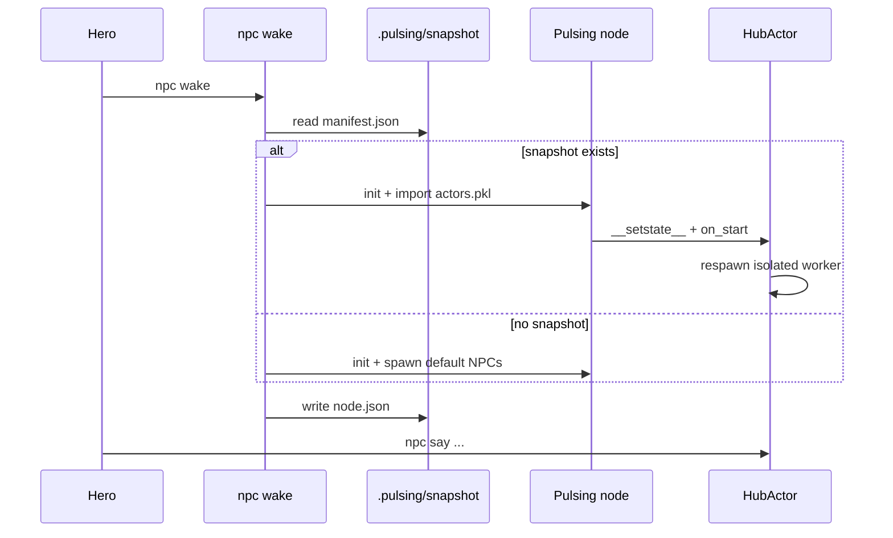

# Workspace 世界持久化与 Actor 快照

> **状态**: 草案（Draft，供同行审议）
> **关联**: [Pulsing CLI 设计](./pulsing-cli.md) · `python/pulsing/craft/` · `HubActor`
> **读者**: 分布式系统、Actor 运行时、Agent 平台工程师

---

## §0 CLI 摘要

命令结构见 [Pulsing CLI 设计](./pulsing-cli.md) §8（Craft）。本节仅列与持久化相关的概念：

| 概念 | 说明 |
|------|------|
| **Workspace** | 项目目录 + `.pulsing/` |
| **Operator** | CLI 操作者（`PLAYER` / `USER`） |
| **NPC** | 命名 public Agent |
| **Puzzle** | `cluster.json` 中的任务项 |
| **Cluster** | 执行 Puzzle 的 Pulsing 节点集合 |

```bash
pcraft init | wake | look
pcraft npc who | say | summon
pcraft puzzle list | show <id>
```

---

## 摘要

我们提出一种 **以 Workspace 为边界的世界模型**：每个项目目录对应一个可运行的 **Agent 集群（cluster）**，用于执行 Puzzle（测试、任务、目标）；整个 **World 的可恢复状态** 不依赖外部 DB，而由 **各 Pulsing 进程在 checkpoint 时将其持有的命名（全局）Actor 实例序列化** 到 Workspace 本地目录，并在 `wake` 时按快照重建 gossip 拓扑与 Actor 图。

该设计与 Pulsing 现有能力一致：Python Actor 已通过 pickle/`__getstate__` 跨进程传输；`pcraft init/wake/say` 已提供 shell 级入口。本文档明确 **语义、快照边界、一致性问题与分阶段路线**，供审议而非宣称已完全实现。

---

## 1. 背景与目标

### 1.1 问题

传统 Agent 产品（含 MuleRun 类「持久 Runtime」）常把「会话 + 环境 + 工具状态」绑在 VM 或专有控制平面上。Pulsing 的强项是 **分布式 Actor + gossip 发现 + 流式 RPC**；我们希望：

1. **Workspace = 世界**：与 git 式「目录即上下文」一致，不引入额外租户概念。
2. **Cluster 执行 Puzzle**：同一 Workspace 下可启动多个 NPC（Agent），协作完成声明式难题（单测、任务等）。
3. **World 可持久化、可恢复**：关闭节点或重启机器后，玩家仍能在同一目录 `pcraft wake` 回到「未完成的 world」，而非空白会话。

### 1.2 非目标（当前草案）

- 跨 Workspace 的集体智慧 / 联邦学习（MuleRun 式平台飞轮）
- 强一致分布式事务（快照为 **best-effort 检查点**，见 §6）
- 替代 K8s / VM 级隔离（进程 + Actor 隔离仍是 MVP 边界）

---

## 2. 核心概念

| 概念 | 定义 | 持久化载体（当前 / 规划） |
|------|------|---------------------------|
| **玩家** | 操作者（人或在 CI 中的自动化身份）。不在 World 内注册为 Actor。 | 无（环境变量 `PLAYER` / `HERO` / `$USER`） |
| **NPC** | Workspace 内的自主 Agent，运行时映射为 **命名 public Actor**（如 `HubActor`）。 | Actor 快照 + 可选 JSONL 会话 |
| **Workspace** | 一个项目根目录及其 `.pulsing/`。语义上等于 **World**；技术上等于 cluster 配置 + 快照存储根。 | `.pulsing/cluster.json`，`.pulsing/snapshot/` |
| **Puzzle** | 待解决的难题（`kind`: test / task / goal）。声明「要做什么」，不必然等于「怎么做」。 | `cluster.json` 的 `puzzles`；状态扩展见 §5.3 |
| **Cluster** | 执行 Puzzle 的 **Pulsing 进程集合**（单节点或多节点 gossip）。 | `node.json`（liveness）+ 每节点 snapshot |

**不变量**：同一 Workspace 路径 → 稳定 `cluster_id`（路径哈希）；所有 NPC 的 gossip 名前缀为 `craft/ws/<cluster_id>/`。

---

## 3. 架构总览

```
┌──────────────── Hero (shell) ─────────────────┐
│  pcraft init | wake | look | npc say | puzzle list │
└────────────────────┬──────────────────────────┘
                     │ RPC / resolve
┌────────────────────▼──────────────────────────┐
│  Workspace World (directory + .pulsing/)       │
│  ┌─────────────┐  ┌─────────────────────────┐ │
│  │ cluster.json│  │ snapshot/               │ │
│  │ puzzles,    │  │  node-<id>/             │ │
│  │ llm config  │  │    actors.pkl (规划)     │ │
│  └─────────────┘  │    manifest.json        │ │
│                   └─────────────────────────┘ │
│  Gossip cluster (1..N Pulsing nodes)            │
│    NPC: HubActor @ craft/ws/<cid>/guide         │
│    (+ isolated tool workers, 见 §4.2)         │
└───────────────────────────────────────────────┘
```

**执行路径**：Hero 在 shell 中 `npc wake` → 本地（或首个）节点绑定 Pulsing → spawn 默认 NPC → 其他 shell `npc say` 经 gossip `resolve` 投递消息 → NPC 内 LLM + 工具循环执行 Puzzle 相关任务。

**持久化路径（规划）**：集群运行中或 `sleep` 前 → 每个持有命名 Actor 的进程导出快照 → 写入 `.pulsing/snapshot/` → 下次 `wake` 先加载快照再注册 gossip。

---

## 4. Workspace Cluster 执行模型

### 4.1 生命周期

| 阶段 | 命令 / 事件 | 行为 |
|------|-------------|------|
| 初始化 | `pcraft init` | 写入 `cluster.json`（含 `cluster_id`、默认 `puzzles`、LLM 配置） |
| 唤醒 | `npc wake` | 启动 Pulsing 节点，写 `node.json`（addr, pid）；spawn 默认 NPC |
| 运行 | `npc say` / NPC 协作 | 跨进程 RPC；会话追加 JSONL（已有 `SessionStore`） |
| 休眠 | Ctrl+C / `npc sleep`（规划） | 触发 snapshot → 停止 Actor → 删 `node.json` |
| 恢复 | `npc wake`（有 snapshot 时） | 读 snapshot → 重建 Actor → 再 open gossip |

当前实现已覆盖 seed / wake / say / who；**snapshot _sleep 为规划接口**。

### 4.2 Actor 拓扑（以 NPC 为例）

一个 **NPC（HubActor）** 在运行期典型包含：

- **Hub 进程内**：`HubActor`（LLM runner、权限、协调器、cluster 工具）
- **可选子 OS 进程**：`FullToolWorker`（Read/Bash 等，经 `spawn(..., new_process=True)` + pickle 文件启动）

审议要点：**World 快照的边界** 应至少包含 **Hub 侧命名 Actor 的可序列化状态**；隔离 worker 建议 **不纳入同一 pickle**，而在 restore 时按 Hub 状态 **lazy respawn**（与现有 `on_start` / `_respawn_worker` 行为一致）。

### 4.3 多节点扩展

- 单 Workspace 可对应 **多个 Pulsing 节点**（`wake` 时 `--addr` / `--seeds`）。
- 每个节点只序列化 **本进程 registry 中持有的 Actor**（含本机 spawn 的 NPC、bridge actor 等）。
- Gossip 上 **命名 Actor 的 global 视图** 由 **manifest 合并** 重建（§5.2），而非假设单一全局 pickle。

---

## 5. World 持久化：按进程序列化全局 Actor

### 5.1 设计理念

> **World 的状态 ≡ 各节点上「可被全局 resolve 的 Actor 图」+ Workspace 静态配置。**

与「只存 LLM chat log」或「只存 VM 磁盘镜像」不同，我们选择：

- **以 Actor 为粒度**：Pulsing 原生单元是 Actor；pickle/`__getstate__` 已在 RPC 与 isolated spawn 中使用。
- **以进程为写入边界**：每个 Pulsing 进程最清楚自己 mailbox 里活着的对象；由 **进程导出、Workspace 目录汇聚**。
- **以 Workspace 为存储根**：快照随 repo 走（或 `.pulsing/` gitignore 下本地持久），符合「目录即 world」。

### 5.2 快照布局（提案）

```
.pulsing/
  cluster.json          # 静态：cluster_id, puzzles, provider, default_agents
  node.json             #  ephemera：当前 alive 节点的 dial addr（wake 时）
  snapshot/
    manifest.json       #  合并索引：版本、时间、节点列表、actor 名 → 文件
    nodes/
      <node_id>/
        actors.pkl      #  该进程导出的 { name: ActorSnapshotRecord, ... }
        meta.json       #  pulsing 版本、python 版本、导出时刻
```

**`ActorSnapshotRecord`（逻辑结构）**：

```json
{
  "gossip_name": "craft/ws/abc123/guide",
  "actor_type": "pulsing.craft.runtime.hub_actor.HubActor",
  "public": true,
  "payload": "<base64 pickle of __getstate__ or _WrappedActor>",
  "sidecars": {
    "session_id": "...",
    "session_path": ".config/pulsing-craft/sessions/..."
  }
}
```

- **`payload`**：Actor 实例状态，遵循 `remote.py` 中 `_reduce_pulsing_remote_user_instance` 约定；Actor 作者实现 `__getstate__`/`__setstate__` 控制字段。
- **`sidecars`**：不宜 pickle 的大对象（会话 JSONL、cost log）只存 **路径引用**，restore 时按路径重载。

**`manifest.json` 合并规则（草案）**：

1. 每个节点 wake 后注册自身 snapshot 文件路径（或 sleep 时上传至 Workspace）。
2. 对同一 `gossip_name`，取 **manifest 中 marked primary 的节点** 的记录；冲突时 **最后写入 wins** 或 **显式版本号**（审议项）。
3. Restore 时按 manifest 顺序 spawn：**先 system service，再 NPC**。

### 5.3 Puzzle 状态（扩展）

Puzzle 声明仍在 `cluster.json`；**运行态**建议独立文件，避免与 cluster 配置混写：

```json
// .pulsing/puzzle_state.json（规划）
{
  "unit-tests": { "status": "open", "updated_at": "...", "last_npc": "guide" }
}
```

Hero / CI 可在 pytest 通过后将其标为 `solved`。这与 Actor 快照 **正交**：Puzzle 是 World 级进度条，Actor 是执行者内存。

---

## 6. 一致性与限制

### 6.1 检查点语义

- **非事务**：snapshot 时点在运行中 Actor 之间 **无全局 freeze**；允许「guide 已写入一半任务、coder 未收到」的中间态。
- **建议用法**：在 **quiesce** 窗口导出（无 inflight `say`、或 Hub 层 `turn_lock` 空闲）；MVP 可接受 crash-consistent。
- **会话双写**：JSONL session 已是 append-only 审计 log；Actor snapshot 是 **内存加速恢复**，二者冲突时会话 log 优先。

### 6.2 可序列化性约束

| 类型 | 是否进入 payload | 策略 |
|------|------------------|------|
| 纯 Python 数据（prompt、计数器） | ✅ | `__getstate__` |
| `asyncio.Lock`、Task、LLM client | ❌ | restore 时重建 |
| 子进程 worker handle | ❌ | restore 后 `on_start` respawn |
| 打开的文件 / socket | ❌ | 不序列化 |

**HubActor 审议清单**：需显式 `__getstate__` 剔除 `_lock`、`_runner`、`_handle`、`_proxy`，保留 `_session_id`、`_system_prompt`、`_cluster_short_name` 等；restore 后走现有 `on_start` 路径重建 runner 与 isolated worker。

### 6.3 安全

- Pickle **不可加载不可信来源**；`.pulsing/snapshot/` 应视为 **与 repo 同信任域**。
- 审议：是否在 manifest 中加 **sha256**；是否支持 **仅导出 JSON 状态**（无 pickle）的 NPC 模式。

### 6.4 版本迁移

- `manifest.json` 含 `pulsing_version`、`schema_version`。
- 不兼容时 **降级为 cold start**：仅加载 `cluster.json` + session JSONL，不加载 `actors.pkl`。

---

## 7. 与现有实现的关系

| 已有机制 | 本文档中的角色 |
|----------|----------------|
| `@remote` + `copyreg.pickle` / `__getstate__` | Actor 快照 payload 格式 |
| `isolated_spawn` + pickle 文件 | 仅用于 **spawn 瞬态**；持久化后 restore 仍 lazy respawn worker |
| `SessionStore` JSONL | 会话审计与 cold restore；sidecar 引用 |
| gossip + `craft/ws/<id>/` 命名 | 全局 Actor 名与 Workspace 绑定 |
| `npc` CLI | Hero 接口；将扩展 `sleep`/自动 snapshot |
| Rust `pulsing.actors` memtable | 运行时索引；**不替代** Workspace 快照 |

---

## 8. 恢复流程（规划）



---

## 9. 分阶段路线

| 阶段 | 内容 | 验收 |
|------|------|------|
| **P0（现状）** | Workspace + gossip NPC + JSONL session + shell CLI | `pcraft init/wake/say` |
| **P1** | `HubActor.__getstate__` + 单节点 `actors.pkl` + `npc sleep` | wake 后保留 role/session |
| **P2** | manifest 合并 + puzzle_state + `say --puzzle` | 多 NPC、Puzzle 进度可见 |
| **P3** | 多节点 snapshot 协调 + quiesce API | 跨机 Workspace cluster |

---

## 10. 备选方案（为何未选为默认）

| 方案 | 优点 | 缺点 |
|------|------|------|
| 仅 JSONL 会话 | 简单、可读 | 无法恢复工具内存、coordinator 任务表、权限模式 |
| VM / 容器 checkpoint | 完整环境 | 与 Pulsing Actor 模型脱节；重 |
| 中心化 DB（etcd/Redis） | 强一致 | 违背 Pulsing「零外部依赖」原则 |
| 事件溯源（Event log only） | 理论优雅 | Agent 状态重放成本高、LLM 非确定 |

**按进程序列化 Actor** 在 **Pulsing 原生性** 与 **实现成本** 之间折中最好。

---

## 11. 待审议问题

1. **快照粒度**：仅 **public named Actor**，还是包含 private / 匿名 Actor？
2. **冲突策略**：多节点同名 NPC 同时 snapshot 时如何合并？
3. **Hero 身份**：是否写入 snapshot（audit），还是永远 ephemeral？
4. **Puzzle solved 判定**：人工、pytest hook、还是 NPC 自报？
5. **git 策略**：`.pulsing/snapshot/` 是否入库，还是仅本地 / 对象存储？
6. **隔离 worker**：是否 ever 直接 pickle 进 snapshot（审议倾向：**否**）？

---

## 12. 参考

- 概念与 CLI：`python/pulsing/craft/README.md`
- Workspace 配置：`python/pulsing/craft/workspace/config.py`
- Actor pickle：`python/pulsing/core/remote.py`（`_reduce_pulsing_remote_user_instance`）
- Isolated spawn：`python/pulsing/core/isolated_spawn.py`
- NPC 运行时：`python/pulsing/craft/runtime/hub_actor.py`

---

## 附录 A：术语对照

| 对外（npc） | 对内（Pulsing） |
|-------------|-----------------|
| Workspace / World | `cluster_id` + `.pulsing/` |
| NPC | 命名 `HubActor` |
| wake | `pul.init` + spawn / restore |
| cluster | 1..N `ActorSystem` 节点 gossip 互联 |

---

*请审议者在 PR / 设计评审中直接标注 §11 的选择或补充替代方案。*
