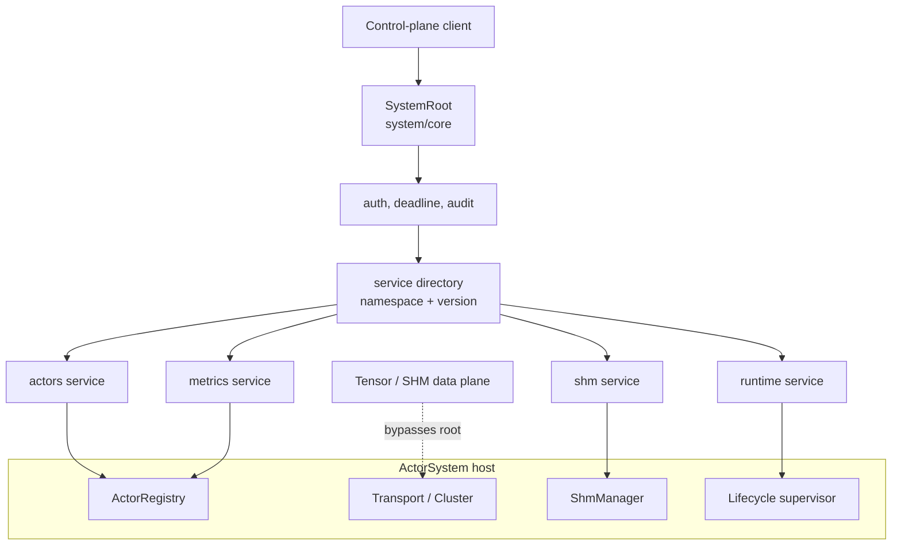
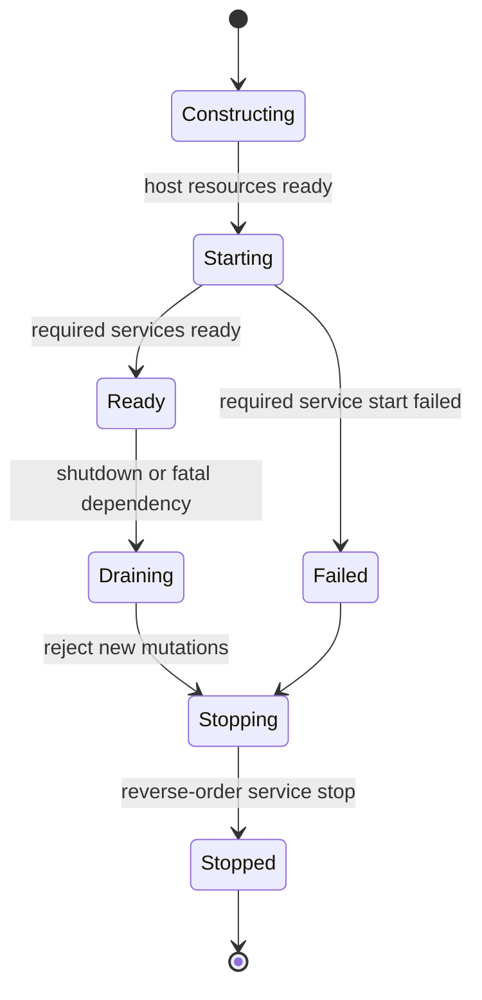

# System Actor Design

> Status: evolving. Authoritative host capabilities, the node state machine,
> service manifests, split component/handler roles, the typed legacy adapter,
> and SHM shutdown reclamation are implemented. The versioned external
> envelope, caller identity, and governed runtime installation remain target
> work.

## Problem and decision

Pulsing currently auto-starts `system/core`. It has gradually accumulated
actor queries, metrics, Python extension hooks, and SHM status. The result is
a growing enum plus an untyped `Extension { handler, payload }` escape hatch;
resource ownership is not always explicit, and some system state is represented
by startup snapshots.

This is not yet a system-actor mechanism. It makes versioning, authorization,
remote control, plugin isolation, and authoritative state increasingly hard.

**Decision:** system actors form the node control plane, not a general-purpose
business actor or a global singleton. They route small, auditable control
commands to lifecycle-managed system services. Data planes never copy payloads
through the control plane.

## Boundaries

| Term | Meaning |
|---|---|
| Host | `ActorSystem` and the resources it uniquely owns: registry, transport, cluster, SHM manager, and shutdown token. |
| SystemRoot | Stable node control-plane entry point. Its permanent standard path is `system/core`. |
| SystemService | A discoverable, governed, and upgradeable node control-plane capability. |
| Control plane | Metadata, commands, status, leases, and operation orchestration. |
| Data plane | Tensor bytes, raw TCP/HTTP2 bodies, or future SHM mappings. |
| Capability | The minimum host-owned resource granted to a service. |

The host owns resources and final shutdown. Services receive explicit
capabilities rather than an unrestricted `ActorSystem` reference. A SHM service
may create/revoke descriptors and leases; it must not transport tensor bytes in
the SystemRoot mailbox.

## Target architecture



`system/core` is the only required root entry point. The logical identity of a
service is `<namespace>@<major>` (`actors@1`, `shm@1`); future isolated service
actors may use `system/<namespace>`, but that path is not the discovery
contract.

## Formal service contract

The implementation separates static policy, lifecycle, and request semantics:

```rust
pub struct SystemServiceManifest {
    pub id: SystemServiceId,
    pub kind: Core | Extension,
    pub exposure: Exposure,
    pub operations: &'static [OperationManifest],
}

#[async_trait]
pub trait SystemComponent {
    async fn start(&self) -> Result<()>;
    async fn stop(&self) -> Result<()>;
}

#[async_trait]
pub trait SystemRequestHandler {
    async fn handle(&self, request: SystemRequest, ctx: RequestContext)
        -> Result<SystemReply>;
}

pub struct SystemServiceRegistration {
    pub manifest: SystemServiceManifest,
    pub component: Arc<dyn SystemComponent>,
    pub handler: Arc<dyn SystemRequestHandler>,
}
```

`SystemHost` injects minimum capabilities into each component/handler during
bootstrap; handlers do not receive the complete host at runtime. The actors
service holds an `ActorControl` capability backed by the authoritative host registry; the
legacy public `SystemActor::registry()` remains a compatibility projection but
is not a source of truth for built-in services. Registration is unique on
`(namespace, major)` and becomes available only after component start.

## Protocol

All external control requests use a stable envelope. Services may retain typed
Rust request/response values behind it.

```text
SystemRequest {
  protocol: "pulsing.system",
  version: "1.0",
  request_id: UUID,
  target: { namespace: "shm", major: 1 },
  operation: "stats",
  deadline_unix_ms: optional u64,
  body: bytes,
}
```

The fixed envelope allows SystemRoot to apply version validation, authorization,
body limits, deadlines, cancellation, rate limiting, tracing, and auditing
without knowing each service schema. Operation descriptors specify body
encoding; Rust/Python type names are never protocol identifiers.

Replies carry the request id and service version. Failures use stable codes:
`INVALID_ARGUMENT`, `NOT_FOUND`, `CONFLICT`, `UNAVAILABLE`,
`DEADLINE_EXCEEDED`, `PERMISSION_DENIED`, and `INTERNAL`. Long-running work
returns an `OperationHandle`; root must not wait without bound in one actor
turn.

## Lifecycle



Bootstrap constructs host resources, creates SystemRoot and the directory,
starts required services in dependency order, and only then advertises the node
as ready to the cluster. Shutdown enters `Draining`, cancels operations, stops
services in reverse order, reclaims local resources such as SHM leases,
withdraws availability, then closes transport.

Hosts requiring an actor-extension factory install it during bootstrap through
`ActorSystem::new_with_system_actor_factory(...)`; a factory must not replace
an already-running `system/core`.

System queries must read the authoritative host registry or a versioned
read-only projection. Startup snapshots such as the current `SystemRef` actor
list are caches only, never control-plane truth.

## Standard services

| Service | Example operations | Default exposure |
|---|---|---|
| `runtime@1` | node info, health, readiness, operation status | authenticated read-only remote |
| `actors@1` | list, get, stop, spawn | read-only remote; mutation requires admin |
| `metrics@1` | snapshot, recent history | authenticated remote |
| `shm@1` | stats, publish, open, release, reclaim | local only |

Future cross-process SHM requires peer capability negotiation, credential
binding, and mapping cleanup. The current `in_process` backend must not be
advertised as cross-process shared memory.

## Forge and self-evolving agents

High-frequency Forge tool execution remains in an in-process runtime or a
`ToolWorkerActor`; it does not pass through `system/core`. System services are
appropriate for the Forge control plane: runtime/worker creation, tool-schema
discovery, policy inspection, and diagnostics.

A self-evolving agent must not insert an arbitrary `Arc<dyn Service>` into the
active registry. Governed runtime installation follows:

```text
Propose → Validate → Stage → Health Check
        → Atomic Activate(generation) → Drain Old → Commit / Rollback
```

Extension manifests additionally declare dependencies, provenance, required
capabilities, and upgrade policy. Generated modules should normally run in an
actor subprocess, WASM runtime, or separate process; SystemRoot governs their
endpoint rather than granting unrestricted host access.

## Security

Remote control requires a transport-derived principal, per-operation `Read`,
`Operate`, or `Admin` permission, bounded request bodies, deadlines, and audit
records that omit payloads. Mutable remote operations are denied by default.
In-process plugins remain trusted code; capability injection reduces accidental
coupling, not same-process privilege.

## Permanent entry point and legacy compatibility

`system/core` is the permanent standard address of the node control plane, not
a legacy compatibility path. `ActorSystem::system()` and remote SystemRoot
resolution continue to target it as the protocol and service directory evolve.

Compatibility applies to the existing `SystemMessage`, `SystemResponse`, Python
proxy, and their legacy request shapes. Those messages are adapted to the
service model without changing the permanent root address.

Legacy mapping is straightforward: runtime messages (`Ping`, `GetNodeInfo`,
`HealthCheck`) target `runtime@1`; actor queries/mutations target `actors@1`;
`GetMetrics` targets `metrics@1`; and `GetShmStats` targets `shm@1`. New
features must not add variants to the legacy enum or use `Extension`.

## Open product decisions

- Whether remote callers may invoke `actors/stop`, spawn, or `shm/open`, and
  which layer supplies their identity.
- Whether Python/Forge extensions are trusted in-process plugins or require
  process isolation.
- Whether optional-service degradation is compatible with node readiness, or
  every built-in service must be ready before cluster publication.
