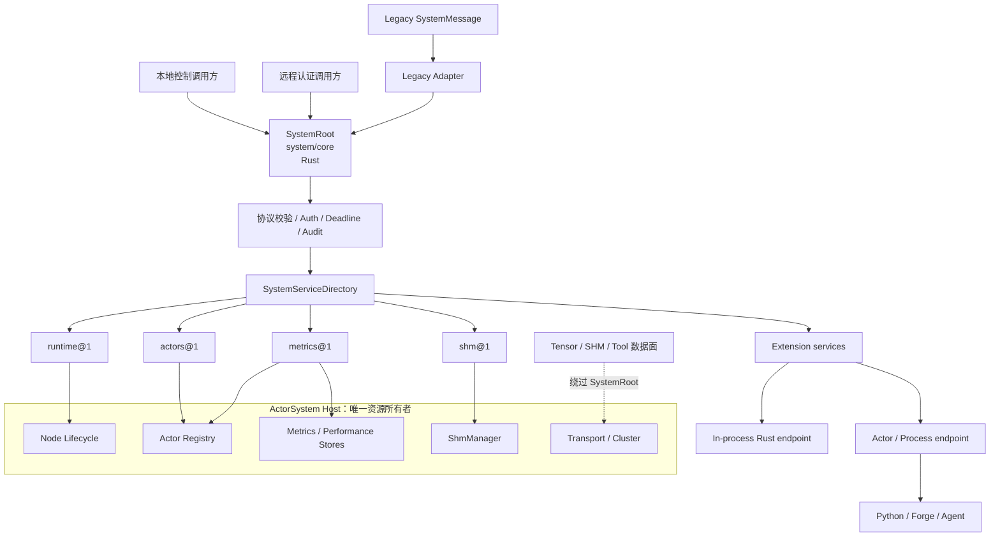
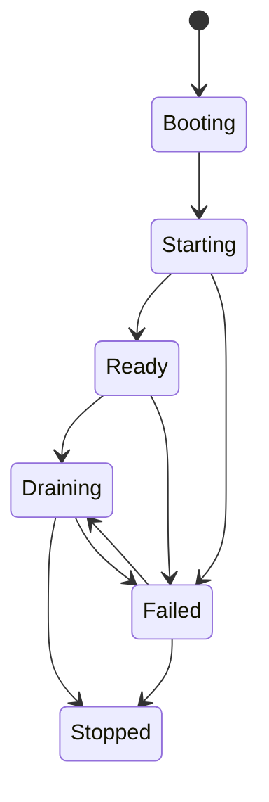
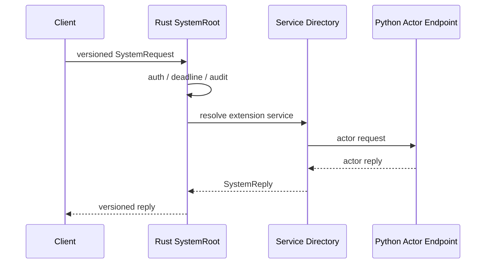

# System Actor 与 System Service 设计

> 本文定义 Pulsing 节点控制面的长期架构。文中的“当前实现”描述仓库现状，
> “正式契约”描述后续实现必须保持的稳定语义。本文不包含实施切分或验收计划。

## 1. 设计结论

Pulsing 将 **System Actor** 正式定义为承载节点基础设施职责的 actor，将
**System Service** 定义为由节点控制面发现、治理和调用的逻辑能力。二者不是同一个概念：

- **SystemRoot** 是每个节点唯一且必须存在的控制面入口，长期标准路径固定为
  `system/core`，由 Rust 实现；
- **System Service** 是挂载在 SystemRoot 后的逻辑能力，例如 `actors@1`、
  `metrics@1`、`shm@1`；
- **独立 System Actor** 是某个 service 可选的执行 endpoint，用于隔离状态、进程或语言
  runtime；默认情况下不要求“一个 service 对应一个 actor”；
- **数据面**不经过 SystemRoot。Tensor、SHM payload、工具执行结果和业务流量使用普通
  actor 通信或专用 transport。

Pulsing 默认只要求一个 Rust SystemRoot。Python、Forge 和自进化 Agent 可以提供
extension service 的实现 endpoint，但不能替换 SystemRoot，也不能直接取得完整
`ActorSystem` 的宿主权限。

## 2. 设计理念与出发点

### 2.1 为什么需要正式的 System Actor 机制

历史上的 `SystemActor` 同时承担 actor 查询、指标、健康检查、Python extension 和 SHM
状态查询。随着能力增加，它逐渐暴露出几个结构性问题：

- 新能力只能继续增加 `SystemMessage` enum 和中心化 `match`；
- 资源所有者、生命周期管理者和请求处理者混在同一个对象中；
- 控制面可能读取启动时快照，而不是 `ActorSystem` 的权威状态；
- 远程身份、权限、deadline、审计和稳定错误没有统一落点；
- Python/Forge 只能通过无类型的 `Extension { handler, payload }` 扩展；
- 控制面协商与大 payload 传输之间缺少明确边界。

System Actor 机制的目的不是增加一层通用 RPC 框架，而是把节点基础设施中本来就存在的
控制职责放入一个稳定、可治理的模型。

### 2.2 核心设计原则

#### 原则一：控制面与数据面分离

SystemRoot 只处理小型命令、元数据、状态查询和操作编排。大 payload 和高频业务消息始终
绕过 SystemRoot：

```text
控制面：publish/open/release descriptor、worker start/stop、policy query
数据面：tensor buffers、SHM mapping、tool execution、stream payload
```

SystemRoot 可以协商“如何传输”，但不亲自搬运数据。

#### 原则二：宿主拥有资源，service 只持有 capability

`ActorSystem` 是节点资源的唯一所有者，包括 actor registry、transport、cluster、
`ShmManager`、metrics store 和 shutdown token。

System service 不接收完整的 `ActorSystem`，而是在 bootstrap 时获得最小 capability：

- actors service 获得 `ActorControl`；
- metrics service 获得只读 actor 统计、metrics 与 performance store；
- SHM service 获得 `ShmManager`；
- runtime service 获得节点 identity 与 lifecycle。

capability 注入减少偶然耦合和权限误用，但它不是同一地址空间内的安全沙箱。

#### 原则三：入口稳定，能力可扩展

`system/core` 是唯一强制存在的根入口。service 使用
`<namespace>@<major>` 作为稳定逻辑身份，例如：

```text
runtime@1
actors@1
metrics@1
shm@1
forge.runtime@1
```

客户端依赖 service identity 和 operation contract，不依赖某个具体实现是否位于
SystemRoot 进程内、另一个 actor、Python 子进程或 WASM runtime。

#### 原则四：Rust 承载核心路径，动态语言承载受治理扩展

SystemRoot、目录、鉴权、生命周期和默认 core services 使用 Rust 实现，避免 GIL、跨语言
序列化和 Python runtime 故障进入节点关键路径。

Python 可以实现 extension service 的业务语义，但应通过独立 actor 或进程 endpoint
接入。高频 Python 工具执行和模型工作负载仍走普通 actor/data plane，不经过
`system/core`。

#### 原则五：扩展必须可治理，而不是任意注入

运行中的 Agent 不得直接向活动目录插入任意 `Arc<dyn Service>`，也不得获得完整 host
引用。扩展必须具有：

- 稳定 identity 和版本；
- 来源与完整 manifest；
- 明确的 capability 需求；
- health、deadline、drain 和失败语义；
- 可替换的 generation；
- 独立或受信任的执行边界。

#### 原则六：固定标准入口，兼容旧消息协议

`system/core` 是长期标准入口，不属于 legacy compatibility 范畴，也没有迁移到其他路径的
计划。需要兼容的是已有 `SystemMessage`、`SystemResponse` 和 Python proxy。旧消息通过
adapter 路由到 service；新增能力使用 versioned envelope，不再给 `SystemMessage`
增加无限分支。

### 2.3 非目标

- 不把所有内部模块都暴露为远程 RPC；
- 不把每个 system service 都强制实现成独立 actor；
- 不让 SystemRoot 承载长时间计算或无限等待；
- 不通过 service directory 实现分布式一致性或跨节点事务；
- 不把进程内 trait object 包装宣传成安全隔离；
- 不允许 Python 或 Agent 替换节点的 Rust SystemRoot。

## 3. 核心概念

| 概念 | 定义 | 典型实例 |
|---|---|---|
| **System Host** | `ActorSystem` 及其拥有的节点资源，是唯一事实源 | registry、transport、cluster、SHM |
| **SystemRoot** | 节点控制面入口 actor，只负责协议与治理 | `system/core` |
| **System Actor** | 承担节点基础设施职责的 actor | SystemRoot、Python actor creation endpoint |
| **System Service** | 可发现、带版本、受生命周期管理的逻辑能力 | `actors@1`、`shm@1` |
| **Service Directory** | 按 `(namespace, major)` 管理 service 的目录与路由 | core/extension registrations |
| **Manifest** | service 的静态身份、operation、暴露和依赖契约 | `SystemServiceManifest` |
| **Component** | service 的资源启动与停止语义 | SHM cleanup、worker process lifecycle |
| **Handler** | service 的请求处理语义 | list actors、query metrics |
| **Endpoint** | handler 的实际执行位置 | in-process Rust、actor、Python process、WASM |
| **Capability** | Host 授予 service 的最小操作接口 | `ActorControl`、`ShmCapability` |
| **RequestContext** | Root 验证后传给 handler 的调用上下文 | principal、deadline、trace、cancellation |
| **Operation** | 可能跨越一次 mailbox turn 的受管理控制操作 | drain worker、批量 stop、activate generation |

## 4. 总体架构



### 4.1 SystemRoot

当前代码中的 `SystemActor` 承担设计中的 SystemRoot 角色。它必须保持轻量，不实现具体
业务能力。每个请求依次经过：

1. 识别 legacy message 或 versioned envelope；
2. 校验协议、版本、大小和 deadline；
3. 从 transport 获得可信 caller principal；
4. 根据 manifest 检查 exposure 和 operation access；
5. 从 directory 解析一个 `Ready` service；
6. 构造 `RequestContext` 并调用 handler/endpoint；
7. 记录 trace、audit 和 metrics；
8. 返回稳定 reply 或 error。

SystemRoot 只持有 directory、节点生命周期和短期 operation registry，不持有长期业务资源。

### 4.2 System Host

System Host 是 bootstrap capability source，而不是运行时 service locator。它负责：

- 构造并最终释放节点资源；
- 为每个 service 注入最小 capability；
- 决定 required/optional service；
- 协调节点 readiness、draining 和 shutdown；
- 为 extension endpoint 提供受约束的 actor/process 创建能力。

service 不得在 handler 中反向取得完整 host。

### 4.3 Service Directory

Directory 同时承担注册表、生命周期状态表和路由表：

```rust
pub struct SystemServiceId {
    pub namespace: String,
    pub major: u16,
}

pub struct SystemServiceRegistration {
    pub manifest: SystemServiceManifest,
    pub component: Arc<dyn SystemComponent>,
    pub handler: Arc<dyn SystemRequestHandler>,
}
```

目录遵守以下规则：

- `(namespace, major)` 全局唯一；
- incompatible change 必须使用新的 major；
- 注册成功不代表可调用，只有 `Ready` service 才可 dispatch；
- required service 启动失败会使 SystemRoot 启动失败；
- optional service 失败不会阻止节点 Ready，但必须可观测；
- 停止顺序与依赖启动顺序相反；
- 运行时更新使用 generation activation，不直接修改活动 entry。

### 4.4 Manifest

Manifest 是静态治理契约，而不是普通 metadata：

```rust
pub struct SystemServiceManifest {
    pub id: SystemServiceId,
    pub kind: SystemServiceKind,       // Core | Extension
    pub exposure: Exposure,            // LocalOnly | AuthenticatedRemote
    pub operations: Vec<OperationManifest>,
    pub dependencies: Vec<ServiceDependency>,
    pub required_capabilities: Vec<CapabilityKind>,
    pub source: ServiceSource,
    pub upgrade_policy: UpgradePolicy,
}
```

operation 至少声明：

- 稳定名称；
- `Read`、`Operate` 或 `Admin` access class；
- draining 时是否允许；
- request/reply content type 和大小上限；
- 默认 timeout；
- 是否可能返回 `OperationHandle`。

### 4.5 Component 与 Handler

生命周期和请求处理必须分离：

```rust
#[async_trait]
pub trait SystemComponent {
    async fn start(&self) -> Result<()>;
    async fn stop(&self) -> Result<()>;
    async fn health(&self) -> ServiceHealth;
}

#[async_trait]
pub trait SystemRequestHandler {
    async fn handle(
        &self,
        request: SystemRequest,
        context: RequestContext,
    ) -> Result<SystemReply>;
}
```

无状态 service 可以复用 stateless component。有资源的 service 必须在 component 中实现
对称的 start/stop；start 部分失败时也必须回滚自身已创建的资源。

### 4.6 Endpoint Adapter

Handler 可以有两种主要实现：

| Endpoint | 适用场景 | 特性 |
|---|---|---|
| **In-process Rust** | core service、高频控制路径、宿主资源访问 | 延迟低；属于受信任代码 |
| **Actor/Process** | Python、Forge、自进化模块、强隔离 service | 可监督、可超时、可 drain；有一次消息边界 |

Actor endpoint adapter 将标准 `SystemRequest` 转换为普通 actor message，并把 actor reply
转换回 `SystemReply`。SystemRoot 不感知 endpoint 的编程语言。

## 5. 请求协议

### 5.1 Versioned Envelope

正式外部协议使用固定 envelope，service 的 request body 独立版本化：

```text
SystemRequest {
  protocol: "pulsing.system",
  protocol_version: "1.0",
  request_id: UUID,
  target: { namespace: "shm", major: 1 },
  operation: "stats",
  deadline_unix_ms: optional u64,
  content_type: "application/json",
  body: bytes
}
```

固定 envelope 让 Root 无需理解 service body，也能统一执行鉴权、限流、deadline、审计和
路由。service major 独立演进，不要求所有能力共同修改一个全局 enum。

### 5.2 RequestContext

`RequestContext` 只能由可信协议边界创建，至少包含：

```text
RequestContext {
  request_id,
  principal,
  origin: Local | Remote(node),
  deadline,
  cancellation,
  trace_context,
  granted_access
}
```

principal 来自 transport authentication，不能由 request body 自报。

### 5.3 Reply 与错误

成功 reply 回传相同 `request_id`、实际 service version、content type 和 body。错误使用
稳定 code：

| Code | 语义 |
|---|---|
| `INVALID_ARGUMENT` | envelope、schema、范围或状态非法 |
| `NOT_FOUND` | service、operation 或资源不存在 |
| `CONFLICT` | 名称冲突或状态转换冲突 |
| `UNAVAILABLE` | service 未 Ready、节点 draining 或依赖失败 |
| `DEADLINE_EXCEEDED` | deadline 到期 |
| `PERMISSION_DENIED` | caller 无权执行 |
| `RESOURCE_EXHAUSTED` | request、并发或资源额度超限 |
| `INTERNAL` | 非预期错误；只返回 trace id，不泄漏内部细节 |

超过一个合理 mailbox turn 的工作返回 `OperationHandle`，由 runtime service 查询或取消；
SystemRoot 不进行无界等待。

## 6. 生命周期

### 6.1 节点生命周期



节点只有在所有 required core services Ready 后才进入 Ready。cluster membership 可以先建立
连接，但不得在 Ready 前把节点宣告为可承载控制请求或新业务流量。

### 6.2 Service 生命周期

```text
Registered → Starting → Ready → Stopping → Stopped
                 └────→ Failed ←─────────┘
```

- `start()` 成功后才进入 Ready；
- start 失败必须回滚失败 component 自身，并逆序停止已 Ready 的依赖者；
- draining 时由 operation manifest 决定哪些只读请求仍可执行；
- `stop()` 失败记录为 service Failed，但不阻止其他 service 尝试停止；
- component health 可以在运行期使 service 降级或退出 Ready。

### 6.3 Endpoint 生命周期

Actor/process endpoint 的生命周期属于对应 component：

- component start 创建或解析 endpoint，并完成 health handshake；
- handler 只向已 Ready endpoint dispatch；
- component stop 先停止接收新请求，再等待 in-flight request；
- 超时后取消或终止 endpoint；
- endpoint generation 替换必须先激活新版本，再 drain 旧版本。

## 7. 默认 System Actors

Pulsing 不为每个 service 默认创建一个 actor。默认 actor 集保持最小：

| Path | 实现 | 启动条件 | 定位 |
|---|---|---|---|
| `system/core` | Rust `SystemActor` / SystemRoot | 每个 `ActorSystem` 必须启动 | 唯一控制面入口、service 路由与生命周期协调 |
| `system/python_actor_service` | Python `PythonActorService` | 使用 Python 全局 runtime 时启动 | Python actor 创建兼容 endpoint |

### 7.1 `system/core`

`system/core` 是唯一 required System Actor，也是永久标准入口：

- 必须由 Rust 实现；
- 不能被 Python、Forge 或用户 actor 替换；
- 不会在新协议成熟后更名或被其他 service path 取代；
- 不承载 tensor、SHM payload 或工具执行；
- Ready 前不发布自身 actor path；
- 对外契约是 system protocol，不是内部 Rust struct。

### 7.2 `system/python_actor_service`

当前 Python runtime 会启动 `system/python_actor_service`，用于远程创建 Python actor 和查询
Python class registry。它是条件性的兼容 System Actor，不属于 Rust core service directory。

长期设计中，它应作为 `actors@1` 的 Python actor-creation endpoint 被治理，而不是成为第二个
控制面根入口。保留现有路径用于兼容，客户端的新能力发现应通过 service contract 完成。

### 7.3 不默认启动的基础设施 Actors

下列 actor 可以由产品或 extension service 创建，但不属于每个 Pulsing 节点的默认集合：

- Forge `ToolWorkerActor`；
- Forge event inbox、MCP hub、code-cell registry；
- scheduler、diagnostic collector；
- Agent 生成的 worker、WASM host 或 sandbox process。

它们使用普通 actor supervision、placement 和 transport；只有生命周期管理、发现和策略查询
需要通过 System Service 控制面。

## 8. 默认 System Services

每个节点默认注册四个 required core services：

| Service | 主要职责 | 默认实现 | 默认暴露 |
|---|---|---|---|
| `runtime@1` | node identity、health、readiness、service/operation 状态 | In-process Rust | 本地；认证远程只读 |
| `actors@1` | actor 查询与受控生命周期操作 | In-process Rust + 可选语言 endpoint | 本地；远程默认只读 |
| `metrics@1` | 节点与 actor 指标快照、近期性能数据 | In-process Rust | 本地；认证远程只读 |
| `shm@1` | region/lease 控制面、统计与回收 | In-process Rust | `LocalOnly` |

### 8.1 `runtime@1`

稳定职责：

- `node_info`：node id、地址、版本和 uptime；
- `health`：节点及 required service 健康状态；
- `ready`：节点是否可接受新控制和业务请求；
- `services/list`、`services/get`：service manifest 与 runtime status；
- `operations/get`、`operations/cancel`：长操作状态；
- `ping`：兼容连通性探测。

runtime service 只读取权威 lifecycle 和 directory，不维护第二份节点状态。

当前实现已经提供 `node_info`、`health` 和 `ping`；service discovery 与 operation registry
属于正式契约但尚未落地。

### 8.2 `actors@1`

稳定职责：

- `list`、`get`：查询 host 权威 actor registry；
- `stop`：经策略授权后执行真实 actor stop；
- `spawn`：使用受控 spawn capability 创建 actor；
- `types/list`：查询可创建 actor 类型或 endpoint；
- 管理 Python actor creation endpoint。

远程 `list/get` 可以在认证后开放；`spawn/stop` 默认需要 `Admin/Operate` 权限，不能因为调用
到达 `system/core` 就自动获得授权。

现有 `Extension { handler, payload }` 只作为兼容 adapter；新增能力不得继续使用这一无类型
旁路。

### 8.3 `metrics@1`

稳定职责：

- `snapshot`：当前 actor、message、lifecycle 和 transport 指标；
- `recent`：从 performance store 读取有界历史；
- `service_health`：各 service 与 endpoint 健康状态；
- `transport`：普通消息、tensor route 与 fallback 指标。

metrics service 只做轻量查询和快照，不在 SystemRoot mailbox 中执行昂贵聚合或无界扫描。

### 8.4 `shm@1`

SHM service 是节点共享内存的控制面：

- `stats`：backend、region、lease 和 bytes；
- `publish/unpublish`：serve 风格的命名 region 生命周期；
- `offer`：message/MPI 风格的一次 rendezvous；
- `open/map-info`：签发映射 descriptor；
- `release`：释放 consumer lease；
- `reclaim`：回收过期 lease 和空 region；
- `capabilities`：报告 backend、locality 和 mapping 能力。

SHM payload 永远不经过 SystemRoot。descriptor 必须是不可猜、可撤销、绑定 generation 和
caller credential 的 capability；当前公开字段与顺序 ID 只适用于 in-process 语义原型，
不能直接作为跨进程安全协议。

当前实现提供 in-process `offer`、`publish/open`、`map/release`、机会性 `reclaim` 与
shutdown clear。System service 执行正常 drain，ActorSystem 作为资源所有者执行最终 clear
兜底；通过 `system/core` 暂时只暴露 `stats`。

## 9. System Actor 与 System Service 的关系

System Service 是逻辑契约，System Actor 是一种执行载体：

```text
一个 SystemRoot
  ├─ 多个 in-process services
  ├─ 多个 actor-backed services
  └─ 多个 process/WASM-backed services
```

选择原则：

- 需要直接访问 host capability、延迟敏感、状态简单：使用 in-process Rust service；
- 需要独立监督、故障隔离、动态升级：使用 actor/process endpoint；
- 需要 Python 或 Agent 生成代码：使用隔离 endpoint；
- 高频业务或大数据路径：不建 system service，使用普通 actor/data plane。

不应因为某个模块“很重要”就把它变成 System Actor，也不应因为某个能力叫 service 就给它
创建独立 mailbox。

## 10. Python、Forge 与自进化 Agent

### 10.1 Python

Python 支持的目标形态是“实现 extension endpoint”，不是“实现 SystemRoot”：



这使核心控制路径不受 GIL 影响。Python endpoint 卡住或崩溃时，Rust Root 仍可超时、熔断、
drain 或重启对应进程。

### 10.2 Forge

Forge 的高频工具执行继续由进程内 runtime 或 `ToolWorkerActor` 承载，不经过
`system/core`。适合作为 System Service 的是低频控制能力：

- runtime/worker 创建与停止；
- tool schema 与 capability 发现；
- sandbox、approval 和 execution policy 查询；
- worker health、diagnostic 与 generation 管理；
- plugin/extension 的受控激活。

`forge.runtime@1` 可以是 optional extension service，但不属于 Pulsing core 默认服务。

### 10.3 自进化 Agent

自进化模块采用受治理 generation，而不是原地修改活动 service：

```text
Propose → Validate → Stage → Health Check
        → Atomic Activate(generation)
        → Drain Old → Commit / Rollback
```

Agent 生成的实现优先运行在 actor 子进程、独立进程或 WASM 中。SystemRoot 保存 manifest、
generation 和受监督 endpoint，不向生成代码授予任意宿主指针。

## 11. SHM 的统一模型

serve 风格和 message/MPI 风格并不是两个独立 subsystem，它们共享同一个 region/lease
模型：

```text
Serve:
  publish(name, region) → open(name) → lease → map → release

Message:
  offer(region) → descriptor/lease → send descriptor → map → release
```

二者只在 region 的发现方式上不同：

- serve 通过稳定 name 发现；
- message 通过通信双方传递 descriptor 完成 rendezvous。

共同语义包括 generation、lease、TTL、revoke、drain、credential binding 和 cleanup。
因此 SHM 适合作为 `shm@1` service 管理的 host resource；真正的 mapping 与 tensor bytes
仍属于数据面 backend。

## 12. 安全与隔离

### 12.1 默认策略

- `LocalOnly` 是强制策略，不是文档标签；
- 远程只读请求必须经过 transport authentication；
- 远程 mutating operation 默认拒绝，除非明确授予 `Operate/Admin`；
- principal 来自 transport，不接受 body 自报；
- Root 为每个 operation 执行独立 request size、timeout 和 concurrency limit；
- audit 记录 principal、request id、target、operation、结果和 trace id，不记录敏感 payload。

### 12.2 信任边界

- Rust core service 是进程内受信任代码；
- capability 限制 API 面，但不能阻止恶意进程内代码读取内存；
- Python/Forge/self-evolving code 默认视为不受信任 extension，优先进程隔离；
- actor mailbox 是并发与故障边界，不自动等于安全沙箱；
- SHM descriptor 必须绑定调用方身份，不能依赖可猜的数字 ID。

当前实现已经声明 exposure/access，但在 versioned request context 和 transport principal
落地前，这些字段仍不能被视为完整安全保证。

## 13. 长期稳定入口与兼容性

### 13.1 长期标准入口

`system/core` 是 Pulsing 节点控制面的永久标准地址。`ActorSystem::system()` 和远程
SystemRoot resolve 始终解析到该路径。versioned envelope、service directory 或 endpoint
实现方式的演进均不会改变这一入口。

### 13.2 兼容层

以下接口作为已有用户 API 保持兼容：

- 已有 `SystemMessage`/`SystemResponse` shape；
- Python `SystemActorProxy`；
- `system/python_actor_service` 兼容路径；
- 普通 actor spawn、ask、tell 和 transport API。

### 13.3 Legacy Adapter

旧请求映射到默认 services：

| Legacy message | Service operation |
|---|---|
| `Ping` | `runtime@1/ping` |
| `GetNodeInfo` | `runtime@1/node_info` |
| `HealthCheck` | `runtime@1/health` |
| `ListActors` | `actors@1/list` |
| `GetActor` | `actors@1/get` |
| `CreateActor` | `actors@1/spawn` 或 Python endpoint |
| `StopActor` | `actors@1/stop` |
| `GetMetrics` | `metrics@1/snapshot` |
| `GetShmStats` | `shm@1/stats` |
| `Extension` | 临时 compatibility adapter |

Legacy adapter 只能映射旧能力，不能成为新增 service 的注册协议。

## 14. 当前实现与正式契约的边界

| 能力 | 当前状态 |
|---|---|
| Rust `system/core` | 已实现 |
| Host 权威 capability | 已实现 |
| 四个 core service 的内部 registry | 已实现 |
| Component/handler 分离 | 已实现 |
| Node/service lifecycle 基础状态机 | 已实现 |
| Ready 后发布 `system/core` actor path | 已实现 |
| Bootstrap 失败后的 leave/cancel/host cleanup | 已实现 |
| ActorSystem shutdown 的 SHM 最终回收兜底 | 已实现 |
| SHM 控制面操作时的机会性过期回收 | 已实现 |
| Legacy typed adapter | 已实现 |
| SHM in-process region/lease 语义 | 已实现 |
| Versioned external envelope | 尚未实现 |
| Transport principal 与强制 exposure/access | 尚未实现 |
| Service dependency、optional service、持续 health | 尚未实现 |
| Actor/process endpoint adapter | 尚未实现 |
| Python extension service registration | 尚未实现 |
| Runtime generation activation/rollback | 尚未实现 |
| 跨进程 SHM mapping backend | 尚未实现 |

该边界用于防止把“已经确定的设计”误写成“已经可用的能力”。

## 15. 架构约束

后续实现必须保持以下约束：

1. `ActorSystem` 始终是节点资源唯一所有者；
2. `system/core` 始终是唯一 required 控制面入口；
3. SystemRoot 始终由 Rust 实现，不允许动态语言替换；
4. core service 默认使用 Rust，extension 可以使用 actor/process endpoint；
5. service identity 不依赖 actor path 或语言类型名；
6. 控制面不传输大 payload；
7. manifest 中声明的 exposure/access 必须在 Root 强制执行；
8. service 只通过最小 capability 访问 host；
9. 动态扩展必须通过 generation 和受监督 endpoint；
10. legacy API 可以长期兼容，但新增能力不得扩大 legacy enum。
