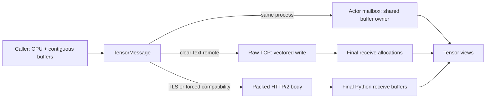

# TensorMessage Fast Transport

## Status and scope

This document describes the implemented CPU-to-CPU transport for
`TensorMessage`. It is the low-level data plane used by callers such as
PulsingQueue to move a TensorDict without first serializing all tensor payloads
into one Python or Rust byte string.

The responsibility boundary is deliberate:

| Layer | Responsibility |
|---|---|
| PulsingQueue or another caller | Move CUDA tensors to CPU, make non-contiguous tensors contiguous, define the TensorDict schema, and encode dtype, shape, stride, names, and byte order in metadata. |
| Pulsing | Route an opaque metadata blob plus ordered, contiguous CPU buffers; preserve buffer ownership; select the transport; and enforce wire limits. |
| Receiving application | Decode the metadata, construct tensor views over the received buffers, and define business-level completion or durability semantics. |

Pulsing does **not** inspect or convert tensor dtype, shape, stride, byte order,
or TensorDict structure. The `version` field is transported unchanged; it is
currently not capability-negotiated and unknown versions are not rejected by
the transport.

## Goals

- Avoid pickle for tensor payloads.
- Avoid a combined userspace payload allocation on the clear-text TCP path.
- Read each remote payload directly into the allocation later exposed to
  Python and downstream tensor views.
- Keep the local mailbox path copy-free for payloads by retaining the original
  Python buffer exporter.
- Support multiple ordered buffers and a small opaque metadata document.
- Preserve ordinary HTTP/2 operation as a compatibility path, including TLS.
- Give the receive allocation an explicit lifetime tied to Python objects.

## Non-goals

The current implementation does not provide:

- GPU Direct, CUDA IPC, or GPU-to-GPU transport;
- same-host shared memory transport (the transport abstraction reserves it);
- tensor schema encoding, dtype conversion, or byte-order conversion;
- checksum, compression, encryption on raw TCP, or durable storage semantics;
- raw protocol capability negotiation, request IDs, transparent retry, or
  automatic raw-to-HTTP/2 fallback;
- a streaming response made of `TensorMessage` frames.

## Public API

### Python

```python
import pulsing as pul

message = pul.TensorMessage(
    metadata=b"opaque schema bytes",
    buffers=[memoryview(first), memoryview(second)],
    version=1,
)

print(message.metadata)
print(message.buffers)
print(message.version)
print(message.total_bytes)  # payload buffers only; metadata is excluded
```

Every item in `buffers` must implement the Python buffer protocol, be
C-contiguous, and be castable to a one-dimensional byte view. Pulsing rejects a
non-contiguous buffer instead of silently materializing a copy. An empty buffer
list is valid for a metadata-only control message.

For an actor declared with `@pul.remote`, implement `receive_tensor()` and send
the value through the underlying actor reference:

```python
@pul.remote
class Sink:
    async def receive_tensor(self, message: pul.TensorMessage):
        # Decode metadata and consume message.buffers here.
        return {"ok": True, "received_bytes": message.total_bytes}

sink = await Sink.resolve(...)
ack = await sink.ref.ask(message)
```

Calling a generated proxy method such as `sink.put(message)` uses Pulsing's
ordinary method-call/pickle envelope. `sink.ref.ask(message)` and
`sink.ref.tell(message)` select the dedicated tensor message path.

A class derived directly from `pulsing.core.Actor` receives `TensorMessage` in
its normal `receive()` method.

### Rust

At the transport boundary, the representation is:

```rust
pub struct TensorMessage {
    pub version: u32,
    pub metadata: bytes::Bytes,
    pub buffers: Vec<bytes::Bytes>,
}
```

The public transport model distinguishes `DirectTcp`,
`PackedHttp2Compatibility`, and the reserved `SharedMemory` copy model. These
are Pulsing transport choices, not PulsingQueue storage backends. Both the
Python and Rust representations treat metadata as opaque.

## Data paths



### Same process

The Python binding acquires a `Py_buffer` lease and creates Rust `Bytes` backed
by that owner. A local mailbox message retains the same storage; it does not
materialize a payload copy. The receive-side memoryview is read-only, but it
still aliases the source allocation. Mutating the source through another
writable reference remains visible to the receiver. Clone before constructing
the message when snapshot semantics are required.

### Remote clear-text TCP

Clear-text connections use the raw data plane by default. It shares the actor
system's listening address with HTTP/2; the server peeks for the `PTR1` magic
and dispatches the connection to the raw tensor handler. Connections are
long-lived, pooled per remote address, and configured with `TCP_NODELAY`.

The sender uses vectored writes over the header, actor path, metadata, and the
original buffers. It does not first concatenate all payloads. A logical frame
may require multiple `write_vectored` calls, and TCP may split it into any
number of packets; vectored I/O does not imply one syscall or one packet.

The receiver validates advertised lengths and then calls `read_exact` for each
buffer into its final `Vec<u8>`. Moving those vectors into Rust `Bytes` and
exposing them as writable Python memoryviews does not make another payload
copy.

This is a **direct TCP payload copy model**, not kernel-bypass zero-copy. For
remote payload bytes, the intended model is:

1. application buffer to the sender's TCP/kernel buffer;
2. receiver's TCP/kernel buffer to the final userspace receive allocation.

Small headers and metadata have their own allocations/copies and are not part
of this two-payload-copy claim. In particular, Python-to-Rust and
Rust-to-Python metadata conversion copies the metadata.

### HTTP/2 compatibility path

TLS connections and `PULSING_TENSOR_TRANSPORT=http2` use the existing HTTP/2
transport. The sender packs the compatibility wire representation into one
body. The HTTP stack aggregates the body, and the Python binding copies each
decoded buffer into its final writable receive allocation. This path is
compatible but has more payload copies and must not be described as the direct
or zero-copy path.

## Buffer ownership and lifetime

| Path | Receive storage | Aliases sender? | Python view |
|---|---|---|---|
| Same-process mailbox | Original exported Python storage retained through `Bytes` | Yes | Read-only alias |
| Remote raw TCP | One final allocation per received buffer | No | Writable |
| Remote HTTP/2 | Final writable allocation copied from the packed body | No | Writable |

The sender-side `TensorMessage` retains each Python buffer export. The caller
must not mutate or resize the source while `ask()` or `tell()` is in progress.
After a remote call completes, the peer has independent storage. For a local
call, aliasing continues for as long as either side retains a reference.
Because local `tell()` returns after enqueue rather than actor completion, it
does not provide a safe point for reusing mutable source storage; keep the
source immutable or use `ask()` for an explicit application completion point.

On receive, the memoryview owns a private Python object that owns the Rust
buffer. A downstream `torch.frombuffer()` view retains that owner, so the
allocation remains alive after the `TensorMessage` object itself is released.

An upstream PyTorch preparation step can look like this:

```python
cpu_tensor = tensor.detach().to("cpu").contiguous()
byte_view = memoryview(cpu_tensor.view(torch.uint8).numpy()).cast("B")
message = pul.TensorMessage(metadata, [byte_view])
```

Pulsing deliberately does not call `.cpu()` or `.contiguous()` internally.

## Request, response, and ACK semantics

`ask(TensorMessage)` waits for actor handling and accepts either:

- a `TensorMessage` response on the dedicated data plane; or
- a normal single response, useful for a small application ACK.

It does not accept a streaming response on the raw path.

Remote raw `tell(TensorMessage)` waits for a protocol ACK, but the server sends
that ACK after the message has been enqueued in the actor mailbox. It does not
mean the actor finished processing, wrote a storage bucket, replicated data, or
made data durable. Local `tell()` has the same enqueue-only semantic.

When a producer must know that a storage actor has completed its write, use
`ask()` and have the actor return an empty or small application ACK only after
the write is complete. Pulsing supplies transport completion; transaction,
visibility, idempotency, and durability remain application responsibilities.

The raw connection executes one request followed by one response while it is
checked out of the pool. The whole exchange uses the configured stream timeout.
A failed connection is discarded. Pulsing does not transparently replay the
message; retry and idempotency must be defined by the caller.

## Wire formats

All integer fields below use little-endian encoding. Tensor payload byte order
is not converted and must be declared by the caller's metadata schema.

### Raw TCP frame (`PTR1`)

```text
magic[4] = "PTR1"
kind: u8
reserved[3]
version: u32
actor_path_len: u32
metadata_len: u64
buffer_count: u32
buffer_lengths[buffer_count]: u64[]
actor_path[actor_path_len]
metadata[metadata_len]
buffers...
```

Frame kinds are `Ask`, `Tell`, `TensorResponse`, `Ack`, `Error`, and
`SingleResponse`. A `SingleResponse` uses the path slot for the ordinary message
type and the metadata slot for its serialized data.

### HTTP/2 compatibility body (`PTM1`)

```text
magic[4] = "PTM1"
version: u32
metadata_len: u64
buffer_count: u32
buffer_lengths[buffer_count]: u64[]
metadata[metadata_len]
buffers...
```

HTTP/2 carries the actor route and request mode separately, so they are not in
the compatibility body.

## Selection and deployment compatibility

| Configuration | Selected path |
|---|---|
| Clear-text connection; variable unset or `auto`/`raw` | Raw TCP |
| `PULSING_TENSOR_TRANSPORT=http2`, `legacy`, or `off` | HTTP/2 compatibility |
| TLS enabled | HTTP/2 compatibility |

There is no raw protocol handshake and no automatic downgrade if a peer does
not understand `PTR1`. Deploy raw mode with compatible Pulsing versions on both
ends. Force HTTP/2 during a mixed-version migration.

## Limits and validation

The receiver validates counts and total sizes before allocating large payload
buffers:

| Environment variable | Default | Meaning |
|---|---:|---|
| `PULSING_MAX_TENSOR_WIRE_BYTES` | 64 GiB | Maximum complete tensor frame/body |
| `PULSING_MAX_TENSOR_METADATA_BYTES` | 64 MiB | Maximum opaque metadata size |
| `PULSING_MAX_TENSOR_BUFFERS` | 65,536 | Maximum buffers per message |

Raw actor paths also have a fixed 64 KiB limit. These controls bound allocation
but do not authenticate metadata or validate a caller-defined schema.

## Observability

`pulsing.tensor_transport_stats()` returns process-global cumulative counters:

- `raw_frames_sent`, `raw_frames_received`;
- `raw_bytes_sent`, `raw_bytes_received`;
- `http2_fallback_frames`, `http2_fallback_bytes`;
- `raw_connections_accepted`;
- `active_copy_model`.

`active_copy_model` is the last path recorded by the process, with values
`unused`, `direct_tcp`, or `packed_http2_compatibility`. It is not a per-message
label and can change when concurrent traffic uses different paths.

## Performance guidance

- Prepare CPU-contiguous buffers before creating `TensorMessage`.
- Keep metadata compact and version its schema explicitly.
- Preserve tensor order in metadata because Pulsing only preserves buffer order.
- Merge very many small tensors upstream when header processing and many small
  I/O slices dominate payload transfer.
- Prefer a small normal ACK rather than echoing tensor payloads for storage PUT.
- Benchmark raw and HTTP/2 separately and inspect transport stats to confirm the
  path under test.

## Runnable example and tests

Run the [TensorMessage fast-path example](../../../examples/python/tensor_message_fast_path.py):

```bash
python examples/python/tensor_message_fast_path.py
python examples/python/tensor_message_fast_path.py --transport http2
```

The example creates two ActorSystems in one process, forces actor resolution to
the remote node ID, sends one `float32-native` buffer over TCP, and waits for a
small application-level ACK. The implementation tests additionally cover local
aliasing, source lifetime, raw/HTTP2 selection, writable remote buffers, tell
ACK, pooled reconnect, size validation, and the `receive_tensor()` hook.

## Future work

The `TensorTransport` abstraction reserves a `SharedMemory` copy model. A
same-host transport can add shared-memory registration and lease/release
semantics without changing `TensorMessage` or the PulsingQueue schema. Capability
negotiation, checksums, request IDs, and explicit retry policy should be added
together so fallback and failure semantics remain observable rather than
silently replaying a non-idempotent storage operation.
