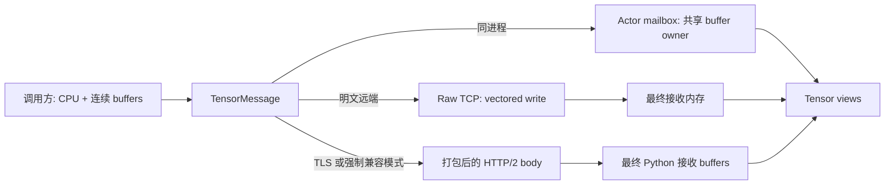

# TensorMessage 快速传输设计

## 状态与范围

本文描述 Pulsing 已实现的 CPU 到 CPU `TensorMessage` 传输。它是供
PulsingQueue 等上层调用者传输 TensorDict 的底层数据面，目标是避免先把所有 Tensor
payload 序列化并拼接成一个 Python 或 Rust 大字节串。

职责边界如下：

| 层 | 职责 |
|---|---|
| PulsingQueue 或其他调用方 | 把 CUDA Tensor 搬到 CPU；将非连续 Tensor 转为连续；定义 TensorDict schema；把 dtype、shape、stride、名称和字节序写入 metadata。 |
| Pulsing | 路由不透明 metadata 和有序的连续 CPU buffers；维持 buffer 所有权；选择传输后端；执行 wire size 限制。 |
| 接收应用 | 解析 metadata；基于接收 buffer 创建 Tensor view；定义业务完成和持久化语义。 |

Pulsing **不解析也不转换** Tensor 的 dtype、shape、stride、字节序或 TensorDict
结构。`version` 只会原样传递；当前协议不会协商版本，也不会因为未知版本而拒绝消息。

## 目标

- Tensor payload 不走 pickle。
- 明文 TCP 主路径不创建合并后的 userspace payload 大包。
- 远端接收时直接读入最终暴露给 Python 和下游 Tensor view 的内存。
- 同进程 mailbox 路径通过持有原 Python buffer exporter，避免 payload copy。
- 支持一段小型不透明 metadata 和多段有序 buffer。
- TLS 等场景保留 HTTP/2 兼容路径。
- 接收内存拥有明确且由 Python 引用链管理的生命周期。

## 非目标

当前实现不提供：

- GPU Direct、CUDA IPC 或 GPU 到 GPU 传输；
- 同节点共享内存传输（传输抽象中已经预留）；
- Tensor schema 编解码、dtype 转换或字节序转换；
- checksum、压缩、raw TCP 加密或持久化存储语义；
- raw 协议能力协商、request ID、透明重试或 raw 到 HTTP/2 自动 fallback；
- 由 `TensorMessage` frame 组成的流式响应。

## 公开 API

### Python

```python
import pulsing as pul

message = pul.TensorMessage(
    metadata=b"opaque schema bytes",
    buffers=[memoryview(first), memoryview(second)],
    version=1,
)

print(message.metadata)
print(message.buffers)
print(message.version)
print(message.total_bytes)  # 只统计 payload buffers，不含 metadata
```

`buffers` 中每一项都必须实现 Python buffer protocol、保持 C-contiguous，并且能够
cast 成一维 byte view。遇到非连续 buffer，Pulsing 会直接报错，不会静默补一次 copy。
空 buffer list 是合法的，可用于只携带 metadata 的控制消息。

使用 `@pul.remote` 声明 actor 时，实现 `receive_tensor()`，并通过底层 actor
reference 发送：

```python
@pul.remote
class Sink:
    async def receive_tensor(self, message: pul.TensorMessage):
        # 在这里解析 metadata 并消费 message.buffers。
        return {"ok": True, "received_bytes": message.total_bytes}

sink = await Sink.resolve(...)
ack = await sink.ref.ask(message)
```

调用 `sink.put(message)` 之类的生成代理方法，会使用 Pulsing 普通方法调用的 pickle
envelope。只有 `sink.ref.ask(message)` 和 `sink.ref.tell(message)` 会选择专用 Tensor
消息路径。

直接继承 `pulsing.core.Actor` 的类，则在普通 `receive()` 中收到 `TensorMessage`。

### Rust

传输边界的数据表示为：

```rust
pub struct TensorMessage {
    pub version: u32,
    pub metadata: bytes::Bytes,
    pub buffers: Vec<bytes::Bytes>,
}
```

公开传输模型区分 `DirectTcp`、`PackedHttp2Compatibility` 和预留的
`SharedMemory` 后端。Python 与 Rust 表示都把 metadata 当作不透明数据。

## 数据路径



### 同进程

Python binding 获取 `Py_buffer` lease，并创建由该 owner 支撑的 Rust `Bytes`。本地
mailbox 消息保留相同 storage，不会物化一份 payload copy。接收端 memoryview 是只读
的，但仍与源内存 alias；通过其他可写引用修改源数据，接收方仍能看到变化。如果需要
snapshot 语义，调用方必须在构造消息前 clone。

### 远端明文 TCP

明文连接默认使用 raw 数据面。它与 HTTP/2 共用 ActorSystem 的监听地址；服务端通过
peek `PTR1` magic 将连接分发给 raw Tensor handler。连接按远端地址长期池化，并启用
`TCP_NODELAY`。

发送端对 header、actor path、metadata 和原始 buffers 使用 vectored write，不会先把
所有 payload 拼接起来。一个逻辑 frame 可能需要多次 `write_vectored`，TCP 也可以把它
拆成任意数量的 packet；vectored I/O 不等于一次 syscall 或一个 TCP packet。

接收端先验证声明的长度，再对每个 buffer 调用 `read_exact`，直接写入最终 `Vec<u8>`。
随后把这些 vector move 给 Rust `Bytes` 并暴露为可写 Python memoryview，不会再产生一份
payload copy。

这是一种 **direct TCP payload copy model**，不是绕过内核的 zero-copy。远端 payload
数据的目标模型是：

1. 应用 buffer 到发送端 TCP/kernel buffer；
2. 接收端 TCP/kernel buffer 到最终 userspace 接收内存。

小型 header 和 metadata 有自己的分配/copy，不属于上述“两次 payload copy”的统计口径。
尤其是 Python 到 Rust、Rust 到 Python 的 metadata 转换会复制 metadata。

### HTTP/2 兼容路径

TLS 连接以及 `PULSING_TENSOR_TRANSPORT=http2` 使用原有 HTTP/2 传输。发送方先把兼容
wire 表示打包成一个 body；HTTP stack 会聚合 body；Python binding 再把每个解码后的
buffer 复制进最终可写接收内存。该路径具有兼容性，但 payload copy 更多，不能称为 direct
或 zero-copy 路径。

## Buffer 所有权和生命周期

| 路径 | 接收 storage | 是否与发送端 alias | Python view |
|---|---|---|---|
| 同进程 mailbox | 通过 `Bytes` 保留的原 Python export | 是 | 只读 alias |
| 远端 raw TCP | 每个 buffer 一块最终接收内存 | 否 | 可写 |
| 远端 HTTP/2 | 从打包 body 复制出的最终可写内存 | 否 | 可写 |

发送端 `TensorMessage` 会保留每一项 Python buffer export。在 `ask()` 或 `tell()` 尚未
完成时，调用方不得修改或 resize 源 buffer。远端调用完成后，对端已经持有独立 storage；
本地调用则会持续 alias，直到双方都释放引用。
本地 `tell()` 在 enqueue 后而不是 actor 处理完成后返回，因此它不能提供安全复用可变源内存
的时刻；调用方应保持源数据不可变，或改用 `ask()` 获得明确的应用完成点。

接收端 memoryview 持有一个私有 Python owner，而该 owner 持有 Rust buffer。下游
`torch.frombuffer()` view 会继续保留这个 owner，因此释放 `TensorMessage` 本身后，内存
依然有效。

上层的 PyTorch 准备逻辑可以类似：

```python
cpu_tensor = tensor.detach().to("cpu").contiguous()
byte_view = memoryview(cpu_tensor.view(torch.uint8).numpy()).cast("B")
message = pul.TensorMessage(metadata, [byte_view])
```

Pulsing 内部不会调用 `.cpu()` 或 `.contiguous()`。

## Request、response 与 ACK 语义

`ask(TensorMessage)` 会等待 actor 处理完成，并允许 actor 返回：

- 走专用数据面的 `TensorMessage`；或
- 普通 single response，适合用作小型应用层 ACK。

raw 路径不允许返回 streaming response。

远端 raw `tell(TensorMessage)` 会等待一个协议 ACK，但服务端在消息进入 actor mailbox 后
就会发送该 ACK。它不表示 actor 已经处理完成、storage bucket 已写完、数据已复制或已经
持久化。本地 `tell()` 同样只有 enqueue 语义。

如果 producer 必须确认 storage actor 已经写完，应使用 `ask()`，并让 actor 在写入完成后
才返回空 ACK 或小型应用 ACK。Pulsing 提供传输完成能力；事务性、可见性、幂等和持久化
仍由应用定义。

raw 连接从连接池 checkout 后，严格执行一次 request 和一次 response。整个交换使用配置的
stream timeout。失败连接会被丢弃；Pulsing 不会透明重放消息，重试和幂等必须由调用方定义。

## Wire format

下面的所有整数都使用 little-endian 编码。Tensor payload 的字节序不会被转换，必须由调用方
在 metadata schema 中声明。

### Raw TCP frame（`PTR1`）

```text
magic[4] = "PTR1"
kind: u8
reserved[3]
version: u32
actor_path_len: u32
metadata_len: u64
buffer_count: u32
buffer_lengths[buffer_count]: u64[]
actor_path[actor_path_len]
metadata[metadata_len]
buffers...
```

frame kind 包括 `Ask`、`Tell`、`TensorResponse`、`Ack`、`Error` 和
`SingleResponse`。`SingleResponse` 使用 path 字段保存普通 message type，使用 metadata
字段保存其序列化数据。

### HTTP/2 兼容 body（`PTM1`）

```text
magic[4] = "PTM1"
version: u32
metadata_len: u64
buffer_count: u32
buffer_lengths[buffer_count]: u64[]
metadata[metadata_len]
buffers...
```

HTTP/2 会单独携带 actor route 和 request mode，因此兼容 body 不包含这两项。

## 路径选择与部署兼容性

| 配置 | 使用的路径 |
|---|---|
| 明文连接；环境变量未设置或为 `auto`/`raw` | Raw TCP |
| `PULSING_TENSOR_TRANSPORT=http2`、`legacy` 或 `off` | HTTP/2 兼容路径 |
| 启用 TLS | HTTP/2 兼容路径 |

raw 协议没有握手；对端不识别 `PTR1` 时也不会自动降级。使用 raw 模式时，两端必须部署兼容
版本；混合版本迁移期间应显式强制 HTTP/2。

## 限制与校验

接收端会在分配大 payload buffer 前校验数量和总长度：

| 环境变量 | 默认值 | 含义 |
|---|---:|---|
| `PULSING_MAX_TENSOR_WIRE_BYTES` | 64 GiB | 单个完整 Tensor frame/body 的最大值 |
| `PULSING_MAX_TENSOR_METADATA_BYTES` | 64 MiB | 不透明 metadata 最大值 |
| `PULSING_MAX_TENSOR_BUFFERS` | 65,536 | 单消息最大 buffer 数量 |

raw actor path 另有固定 64 KiB 上限。这些限制只约束内存分配，不负责认证 metadata 或验证
调用方定义的 schema。

## 可观测性

`pulsing.tensor_transport_stats()` 返回进程级累计统计：

- `raw_frames_sent`、`raw_frames_received`；
- `raw_bytes_sent`、`raw_bytes_received`；
- `http2_fallback_frames`、`http2_fallback_bytes`；
- `raw_connections_accepted`；
- `active_copy_model`。

`active_copy_model` 表示该进程最后一次记录的路径，可取 `unused`、`direct_tcp` 或
`packed_http2_compatibility`。它不是每条消息独立的标签；并发流量走不同路径时会变化。

## 性能建议

- 创建 `TensorMessage` 前准备好 CPU-contiguous buffers。
- metadata 应保持紧凑，并显式维护 schema 版本。
- Pulsing 只保证 buffer 顺序，因此 Tensor 顺序必须记录在 metadata 中。
- 小 Tensor 数量非常多时，在上层合并它们，避免 header 处理和大量小 I/O slice 成为瓶颈。
- storage PUT 建议只返回小型普通 ACK，不要回传整份 Tensor payload。
- raw 与 HTTP/2 应分别 benchmark，并通过 transport stats 确认实际使用的路径。

## 可运行示例与测试

运行 [TensorMessage fast-path 示例](../../../examples/python/tensor_message_fast_path.py)：

```bash
python examples/python/tensor_message_fast_path.py
python examples/python/tensor_message_fast_path.py --transport http2
```

示例在同一进程创建两个 ActorSystem，指定远端 node ID 完成 actor resolve，通过 TCP 发送一段
`float32-native` buffer，并等待小型应用层 ACK。实现测试还覆盖本地 alias、源数据生命周期、
raw/HTTP2 路径选择、远端可写 buffer、tell ACK、连接池重连、size 校验和
`receive_tensor()` 分发入口。

## 后续工作

`TensorTransport` 抽象已经预留 `SharedMemory` copy model。后续可在不改变
`TensorMessage` 和 PulsingQueue schema 的前提下，增加同节点共享内存注册及 lease/release
语义。能力协商、checksum、request ID 和明确的 retry 策略应配套设计，避免系统静默重放
非幂等 storage 操作。
